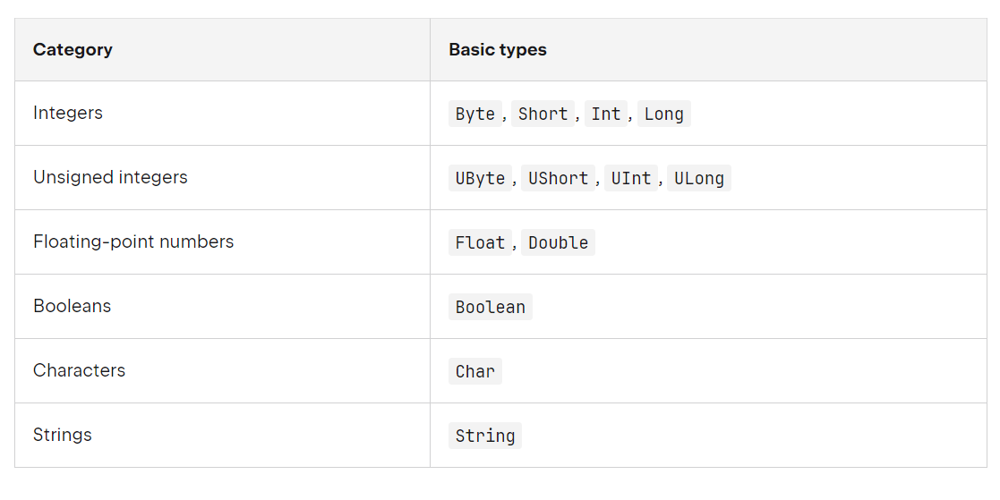
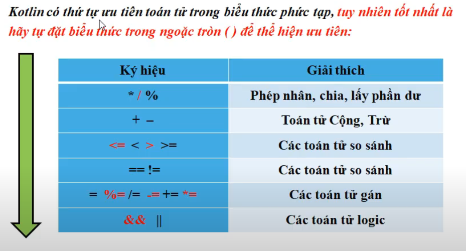
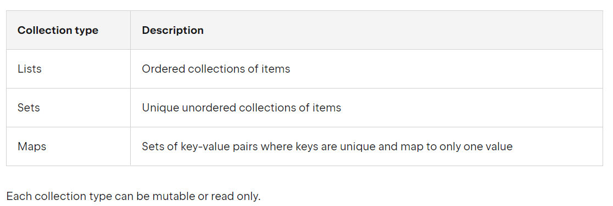

- [Syntax Kotlin](#syntax-kotlin)
  - [Biến, kiểu dữ liệu](#biến-kiểu-dữ-liệu)
    - [Kiểu dữ liệu](#kiểu-dữ-liệu)
    - [Ép kiểu](#ép-kiểu)
    - [Các phép toán](#các-phép-toán)
    - [Mảng](#mảng)
  - [Câu lệnh rẽ nhánh](#câu-lệnh-rẽ-nhánh)
  - [Loop](#loop)
  - [Break, Continue, Return](#break-continue-return)
    - [Break, Continue labels](#break-continue-labels)
  - [Collection](#collection)
    - [List](#list)
    - [Set](#set)
    - [Map](#map)
  - [Null Safety](#null-safety)
    - [Nullable types and non-nullable types](#nullable-types-and-non-nullable-types)
    - [Safe Calls](#safe-calls)
    - [The !! operator](#the--operator)
    - [Safe casts](#safe-casts)
    - [Collections of a nullable type](#collections-of-a-nullable-type)


# Syntax Kotlin
## Biến, kiểu dữ liệu
- Nhập dữ liệu từ bàn phím dùng hàm `readln()` or `readLline()!!`
- Read standard input safely: `readln().to<dt>orNull()`

- biến `val` Chỉ đọc, không thể thay đổi (Hằng số), `var` biến có thể thay đổi
> **Nên sử dụng val để khai báo biến, chỉ dùng var khi cần thiết**
- Chuyển 1 kiểu dữ liệu bất kì thành string template sử dụng `${tên biến}` thay vì sử dụng print("string" + tên biến + "string")
### Kiểu dữ liệu


> Lưu ý khai báo kiểu `Float` cần thêm `f` (5.6f)
>
> Khai báo kiểu `Long` cần thêm `L` (19L)
>
> Nếu khai báo 1 đoạn String có thể dùng """ string """

- khai báo `var (val) <tên biến>: <kiểu dữ liệu> = <giá trị>` hoặc `var (val) <tên biến> <giá trị>` (khai báo trực tiếp sẽ nhận kdl (int cho số nguyên, double cho số thực))
- `const val` sử dụng như biến toàn cục và phải khai báo giá trị trước (compile) `val` không cần (runtime)
### Ép kiểu
- Có 2 dạng ép kiểu
    - Ép kiểu rộng: Ép kiểu từ kdl bé -> lớn
    - Ép kiểu hẹp: Ép kiểu từ kdl lớn -> bé (có thể xảy ra hiện tượng mất dữ liệu)
> toByte() -> Byte
>
> toShort() -> Short
>
> toInt() -> Int
>
> toLong() -> Long
>
> toFloat() -> Float
>
> toDouble() -> Double
>
> toChar() -> Char
- **Ép kiểu rộng**
```kotlin
val a: Int = 20
val B: Long = a.toLong()
///
val a= 20
val b = a.toLong()
```
- **Ép kiểu hẹp**
```kotlin
val a = 10.5f
val b = a.toInt() // b = 10
```
### Các phép toán
- Thay vì chỉ sử dụng các toán tử thông thường thì Kotlin có thêm các phương thức để biểu diễn toán tử

| Toán tử | Phương thức |
| ------- | ----------- |
| +       | a.plus(b)   |
| -       | a.minus(b)  |
| *       | a.times(b)  |
| /       | a.div(b)    |
| %       | a.rem(b)    |



### Mảng
- Khai báo mảng: var <name>: typeArry = typeArrayOf<giá trị>
- val <name> = arrayOf()
- val <name>: Array<T?> = arrayOfNull(size)// mảng null
- val <name> = emtyArray<T>() // mảng empty
- val <name> = Array<T>(size) // khởi tạo mảng với kích thước size
- val asc = Array(5) { i -> (i * i).toString() } //Khởi tạo array bằng hàm lambda với ptu là i * i

## Câu lệnh rẽ nhánh
- Giống như các ngôn ngữ đã được học
- if - else hoạt động như 1 biểu thức trả về
```kotlin
val a = 5
val b = 10
println (if (a > b) a else b)
```
- When giống switch: case

```kotlin
when(expression){ 
    <giá trị 1> -> <câu lệnh 1>
    else -> <câu lệnh>
}
```
- Có thể sử dụng các biểu thức tùy ý (không chỉ hằng số) làm điều kiện nhánh
- Có thế kiểm tra giá giá trị in or !in trong 1 khoảng hoặc 1 collection
- `when` có thể thay thế `if - else if` khi không có expression

## Loop
- `for (item in collection)` print(item): giống forEach
- `for (i in range)` // lặp qua 1 dãy
- `for (i in a dowTo b step c)`// for ngược từ a -> b bước nhảy c
- `for (in in arr.indices)` //
- Hoặc sử dụng `withIndex` trong thư viện for ((index, value) in array.withIndex) (index: 1, 2 ,3 ..; value Array[index])
- `while`, `do-while` giống như các ngôn ngữ đã học
- `repeat(n){}`
## Break, Continue, Return
- `return` trả về giá trị khi kết thúc hàm hoặc anonymous function
- `break` dừng loop
- `continue` next step
### Break, Continue labels
- Mọi biểu thức trong kotlin đều có thể được đánh nhãn. Nhãn có nhận dạng là theo sau @
```kotlin
loop@ for(i in 1..100){
    //....
}
```
- Break, Continue label:
```kotlin
loop@for(i in 1..100){
    if (i == 2){
        continue@loop
    } else if (i == 3){
        break@looop
    }
}
```
- Return label dừng hàm tại một hàm con nào đó
```kotlin
fun foo() {
    listOf(1, 2, 3, 4, 5).forEach {
        if (it == 3) return // non-local return directly to the caller of foo()
        print(it)
    }
    println("this point is unreachable")
}

fun main() {
    foo()
}
//12 do gọi return sẽ dừng hàm foo() mà không dừng local tại forEach 

fun foo() {
    listOf(1, 2, 3, 4, 5).forEach lit@{
        if (it == 3) return@lit // local return to the caller of the lambda - the forEach loop
        print(it)
    }
    print(" done with explicit label")
}

fun main() {
    foo()
}
// 12 done with explicit label do return@lit dừng local tại hàm lambda của forEach
```
## Collection


- Có 2 loại: Chỉ đọc và có thể thay đổi
### List
- - Lưu các ptu theo thứ tự và cho phép trùng lặp
- Để tạo read-only `List` và sử dụng `listOf()`
- Để tạo list có thể thay đổi `MutableList` và sử dụng `mutableListOf()`
- Để khai báo tường minh sử dụnh: `val <name>: List<T> or MutableList<T> = listOf() or mutableListOf()` //T generic
- Để chuyển từ mutable -> read-only ta có thể thay đổi bằng cách gán nó bằng 1 dsach mới
```kotlin
val name: MutableList<String> = mutableListOf("Trần Đức Chính", "Trần Đức Chính", "Trần Đức Chính")
val lockedName: List<String> = name
name[0] = "a";
println(name[0]) // a
lockedName[0] = "b";// Lỗi do lockedName read-only
```
- List có thể truy cập trực tiếp qua idx
- Sử dụng `.first()` hoặc `.last()` để lấy ptu đầu hoặc cuối
- `.count()` để lấy số ptu
- Để ktra ptu có trong list hay không dùng `in` operator
- Đối với mutableList dùng `.add()` và `.remove()` để thêm hoặc xóa ptu
- Chuyển từ mutable -> read-only giống list

### Set
- Set sắp xếp không có thứ tự nên không thể truy cập trực tiếp quá idx
- Chỉ lưu các phần từ duy nhất
- 2 loại read-only và mutable set và khai báo tương tự list
### Map
- Lưu dưới dạng k-v. Truy cập giá trị bằng cách tham chiếu đến key của nó
- Mỗi khóa là duy nhất, value có thể trùng lặp
- 2 loại là read-only và mutable map
- Khai báo `val <name> = mapOf(key to value) // read-only` or `val <name> = mutableMapOf(key to value) // mutable map`
- Khai báo tường minh `val <name>: Map<K, V> = mapOf(k to v) or MutableMap<K,V> = mutableMapOf(k to v)`
- Chuyển từ mutable -> read-only giống list
- Khác vs list và set sử dụng `.put (k, v)` để thêm phần tử vào map
- Kiểm tra xem key đã có trong map hay chưa `.containsKey()`
## Null Safety
### Nullable types and non-nullable types
- Các nguyên nhân gây NPE (NullPointerException) trong Kotlin:
    - Gọi tới hàm sử dụng `throw NullPointerException()`
    - Sử dụng toán tử `!!`
    - Không nhất quán trong việc khởi tạo:
        - Chưa khởi tạo giá trị cho `this` nhưng lại sử dụng ở một chỗ nào đó
        - Super class contructor gọi tới 1 thuộc tính hoặc phương thức chưa được khởi tạo
- Trong kotlin, hệ thống phân biệt giữa các tham chiếu có thể chứa null và không thể chứa null (String không thể chứa null)
```kotlin
var a: String = "abc"
a = null // compilation error
```
- Để cho phép giá trị null, cần khai báo chuỗi giỗng bằng cách `String?`
```kotlin
var b: String? = "abc" // can be set to null
b = null // ok
print(b)
```
- Khi truy cập phương thức hay thuộc tính của a, nó được đảm bảo không gây NPE còn khi gọi tới b sẽ lỗi do b có thể null (không an toàn)
### Safe Calls
- Cuộc gọi an toàn rất hữu ích trong chuỗi. Ví dụ: Bob là nhân viên có thể được phân công vào một bộ phận (hoặc không). Bộ phận đó có thể lần lượt có một nhân viên khác làm trưởng bộ phận. Để có được tên trưởng bộ phận của Bob (nếu có), bạn viết như sau: `bob?.department?.head?.name` Chuỗi như vậy trả về null nếu bất kỳ thuộc tính nào trong đó là null.
- Để thực hiện một thao tác nhất định chỉ với các giá trị khác null -> sử dụng toán tử let
```kotlin
val nameWithNulls: List<String?> = listOf("Trần Đức Chính", null)
for (name in nameWithNulls){
    name?.let { println("Hello $it !")}
}
// in ra Hello Trần Đức Chính ! và bỏ qua null
```
### The !! operator
- Toán tử `!!` biến đổi giá trị bất kì nào thành loại không thể rỗng và đưa ra 1 Exception nếu nó null
### Safe casts
- Việc truyền thông thường có thể dẫn đến `ClassCastException`
### Collections of a nullable type
- Sử dụng `.filterNotNull()` để lọc các phần tử null