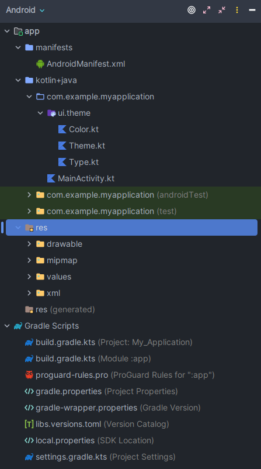
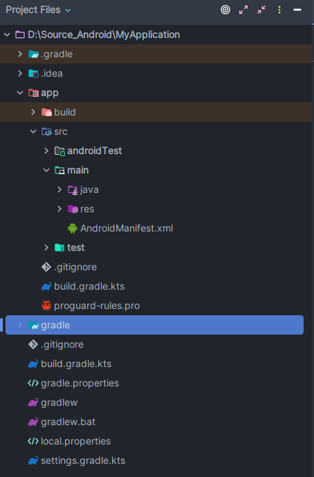
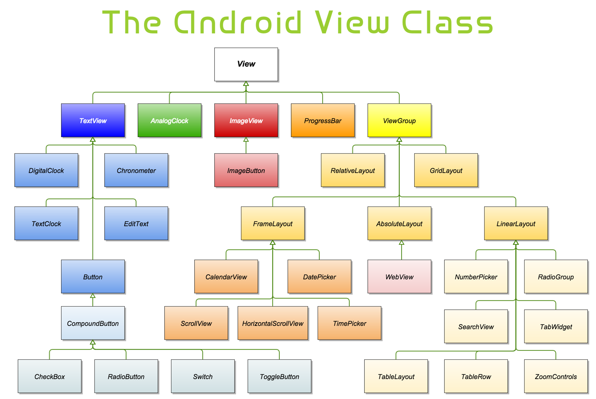
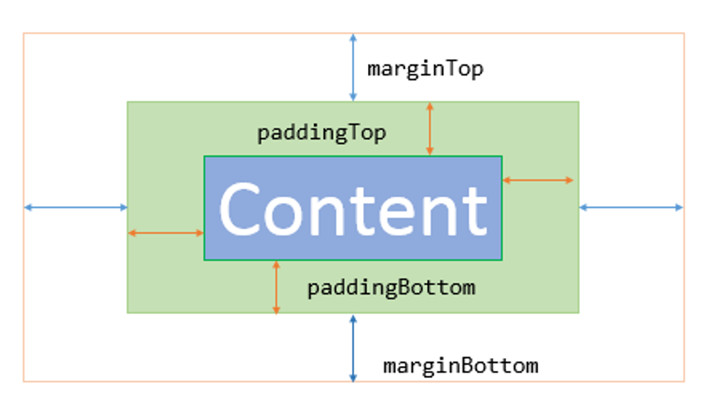

- [Android Overview \& Basic Layout](#android-overview--basic-layout)
  - [Android Overview](#android-overview)
    - [Giới thiệu hệ điều hành android và IDE Android Studio](#giới-thiệu-hệ-điều-hành-android-và-ide-android-studio)
    - [Android Folder Project Structure (Cấu trúc dự án)](#android-folder-project-structure-cấu-trúc-dự-án)
      - [Module (Tham Khảo)](#module-tham-khảo)
        - [Các loại module](#các-loại-module)
      - [Project files](#project-files)
        - [Android View](#android-view)
        - [Project View](#project-view)
    - [XML](#xml)
    - [Các view cơ bản trong Android](#các-view-cơ-bản-trong-android)
      - [Widget \& View](#widget--view)
      - [Android Layout](#android-layout)
        - [TextView](#textview)
        - [Buton](#buton)
        - [ImageView](#imageview)
      - [EditText](#edittext)
  - [Basic Layout](#basic-layout)

# Android Overview & Basic Layout
## Android Overview
### Giới thiệu hệ điều hành android và IDE Android Studio
- **`Android`** là một hệ điều hành dựa trên nền tảng `Linux` được thiết kế dành cho các thiết bị di động có màn hình cảm ứng như điện thoại thông minh và máy tính bảng. Ban đầu, `Android` được phát triển bởi `Android` Inc. với sự hỗ trợ tài chính từ Google và sau này được chính Google mua lại vào năm 2005.
- **`Android Studio`** là một IDE chính thức của Google, được thiết kế đặc biệt để hỗ trợ các nhà phát triển ứng dụng `Android`. Nó cung cấp môi trường phát triển tích hợp đầy đủ, cho phép tạo, kiểm thử và triển khai ứng dụng `Android` dễ dàng trên các thiết bị `Android` khác nhau.
### Android Folder Project Structure (Cấu trúc dự án)
- Mỗi dự án trong `Android Studio` chứa mọi thông tin giúp xác định không gian làm việc cho ứng dụng, từ mã nguồn và tài sản, cho đến mã kiểm thử và cấu hình bản dựng.
- Khi bạn bắt đầu một dự án mới, `Android Studio` sẽ tạo cấu trúc cần thiết cho tất cả các tệp của bạn và hiển thị các cấu hình đó trong cửa sổ Dự án trong `Android Studio`. Để mở cửa sổ, hãy chọn `View > Tool Windows > Project`
#### Module [(Tham Khảo)](https://developer.android.com/studio/projects)
- `Module` là tập hợp các tệp nguồn và cài đặt bản dựng cho phép bạn chia dự án của mình thành các đơn vị chức năng riêng biệt. 
- Dự án có thể có một hoặc nhiều `module` và một `module` có thể sử dụng `module` khác làm phần phụ thuộc.
-  Có thể build, test và debug từng `module` một cách độc lập.
-  Module rất hữu hiệu khi muốn tạo code/resources khác nhau cho các loại thiết bị khác nhau nhưng vẫn muốn tất cả các files đều nằm chung trong một project và chia sẻ một số code cho nhau.
##### Các loại module 
**`Android app module`**
- Cung cấp một container cho source code, resource files và app-level settings cho app : module-level build file, Android Manifest file. Khi tạo project mới, mặc định module sẽ tên `app`
- Android Studio cung cấp các loại app module sau:
  - Phone & Tablet
  - Automotive
  - Wear OS
  - Television
  - Baseline Profile Generator
  - Benchmark
- Chứa các folder:
  - **`manifests:`** chứa AndroidManifest.xml file.
  - **`java:`** chứa source code Java và Kotlin, bao gồm cả JUnit test code.
  - **`res:`** chứa tất cả non-code resources: XML layouts, UI strings, bitmap images
**`Library module`**
- Cung cấp một container cho reusable code (code mà sử dụng một cách độc lập ở trong app modules khác và có thể import vào projects khác..)
- Về mặt cấu trúc thì khá giống `app module` nhưng khi build thì sẽ tạo ra code archive file (Tập tin lưu trữ) thay cho APK và nó không thể cài đặt vào thiết bị
- Trong cửa sổ Create New Module, Android Studio cung cấp các loại library module sau:
  - **`Android Library`**: Chứa tất cả các loại tệp được hỗ trợ trong dự án Android ngoại trừ mã C++ gốc, bao gồm mã nguồn Java và Kotlin, resources và manifest files. Kết quả build là tệp Lưu trữ Android (AAR) mà bạn có thể thêm cho Android app module.
  - **`Android Native Library`**:Chứa tất cả các loại tệp được hỗ trợ trong dự án Android, tương tự như Thư viện Android. Tuy nhiên, Android Native Library cũng có thể chứa mã nguồn C++ gốc. Kết quả xây build là tệp Lưu trữ Android (AAR) mà bạn có thể thêm Android app module.
  - **`Java or Kotlin Library: `**: Chứa các file Java or Kotlin. Kết quả build là Java Archive (JAR) file, có thể thêm cho Androi app module or Kotlin or Java project.

- Các modules đôi khi đc gọi là các dự án con (subproject) vì Gradle coi các modules như 1 dự án
- Khi tạo `library module` và muốn thêm nó vào Android app module, cần khai báo module như sau:
```Kotlin
dependencies {
    implementation(project(":my-library-module"))
}
```
- **`Google App Engine modules`**
#### Project files
- Măc định Android Studio hiển thị project dưới dạng **`Android View`**. Không phản ánh cấu trúc thực tế trên ở đĩa.
##### Android View
- Sắp xếp các modules và loại tệp để đơn giản hóa việc điều hướng giữa các tệp. Ẩn các tệp hoặc thư mục nhất định ít được sử dụng
  - `manifests` : gồm `AndroidManifest.xml` ****file**.**
  - `kotlin+java` : gồm **Kotlin** và **Java** source code files.
  - `res` : gồm tất cả non-code resources : XML layouts, UI strings, bitmap images.
  - `Gradle Scripts` : Bao gồm các build files


##### Project View


- Giúp xem được cấu trúc tổ chức file thực tế của project, bao gồm cả những hidden files ở Android View.
`*module-name/*`
- `build/`  : gồm các build outputs.
- `libs/` : gồm các private libraries.
- `src/` : chứa tất cả các source code và resource files của module.
    - `androidTest/` : chứa code cho các test chạy trên Android device.
    - `main/` : Android code và resources
        - `Android manifest.xml` : mô tả bản chất của app và từng thành phần của nó.
        - `java/` : bao gồm cả Kotlin và Java code sources.
        - `res/` : bao gồm app resources : drawable files, layout files, UI string files.
    - `test/` :  bao gồm các local test mà chạy trên JVM.
### XML
- XML là từ viết tắt của từ (Extensible Markup Language) là ngôn ngữ đánh dấu mở rộng. XML có chức năng truyền dữ liệu và mô tả nhiều loại dữ liệu khác nhau. Tác dụng chính của XML là đơn giản hóa việc chia sẻ dữ liệu giữa các nền tảng và các hệ thống được kết nối thông qua mạng Internet.
- XML dùng để cấu trúc, lưu trữ và trong trao đổi dữ liệu giữa các ứng dụng và lưu trữ dữ liệu. Ví dụ khi ta xây dựng một ứng dụng bằng Php và một ứng dụng bằng Java thì hai ngôn ngữ này không thể hiểu nhau, vì vậy ta sẽ sử dụng XML để trao đổi dữ liệu. Chính vì vậy, XML có tác dụng rất lớn trong việc chia sẻ, trao đổi dữ liệu giữa các hệ thống.
- Trong Android gần như ứng dụng nào cũng cần phải có một activity cùng với một giao diện (Interface). Các file XML trong Android thì đóng vai trò tạo nên các giao diện với các view khác nhau trên màn hình để người dùng có thể tương tác.
### Các view cơ bản trong Android
#### Widget & View
- Widget là một thành phần của Giao Diện Người Dùng, Widget giúp hiển thị các thông tin được sắp xếp, và có thể chỉnh sửa được tới người dùng. Mỗi Widget sẽ mang một kiểu thông tin nhất định, tập hợp chúng lại với nhau chúng ta tạo nên một Giao Diện Người Dùng.
- View được hiểu như là các cấu tạo giống nhau, hay nói cách khác nó là các khuôn mẫu cơ bản để làm nền tảng tạo nên Widget.
#### Android Layout
- **Android Layout** là một lớp điều khiển việc sắp xếp các thành phần con của nó xuất hiện trên màn hình. Bất cứ thành phần nào trong Layout đó là một **View** (hoặc kế thừa từ View). Tất cả các lớp Layout đều **mở rộng** từ lớp **ViewGroup** (mà ***kế thừa* từ View**)

Dưới đây ta có một sơ đồ phân cấp View



- Một View sẽ luôn bao gồm các thuộc tính sau

|Thuộc tính|Chức năng
|---|---|
|layout_height|Quy định chiều cao của view|
|layout_width|Quy định chiều rộng của view|
|id|Xác định id của view, được khai báo ở file XML và sử dụng lại trong code để ánh xạ đối tượng.|
|background|Xác định màu nền của view|
|margin|Khoảng từ các cạnh của view hiện tại tới các view khác|
|padding|Khoảng cách từ các cạnh của view tới phần content của nó|
- Ta có thể phân biệt margin và padding bảng hình sau:


##### TextView
- Là một View cho phép hiện thị các dòng chữ (text) trên màn hình, nó có nhiều thuộc tính tùy mục đích sử dụng mà áp dụng, như thiết lập cỡ chữ, font chữ, màu chữ ...
- Sử dụng  thẻ `<TextView/>`
TextView sẽ có các thuộc tính hay sử dụng sau:

| Thuộc tính | Chức năng | Ví dụ: |
| --- | --- | --- |
| android:text | Xác định text hiển thị của TextView | android:text="Hello" |
| android:textColor | Xác định màu chữ của TextView | android:textColor="#19b698" |
| android:textSize | Xác định size chữ của TextView | android:textSize="18sp" |
| android:textStyle | Xác định style chữ TextView, có ba giá trị là normal, bold (in đậm), ilalic (nghiêng) | android:textStyle="bold" |
| android:drawableLeft | Xác định drawable nằm bên trái text. (Tương tự cũng có bên phải, trên, dưới) | android:drawableLeft="@drawable/icon" |
Ví dụ:
```xml
<TextView
  android:layout_width="wrap_content"
  android:layout_height="wrap_content"
  android:background="@color/purple_200"
  android:text="Hello World!"
  android:textStyle="bold"

  app:layout_constraintHorizontal_bias="0.456"
  app:layout_constraintVertical_bias="0.7"
  app:layout_constraintBottom_toBottomOf="parent"
  app:layout_constraintEnd_toEndOf="parent"
  app:layout_constraintStart_toStartOf="parent"
  app:layout_constraintTop_toTopOf="parent" />
```
##### Buton
- Đây là một view để tạo một nút có thể nhấn. Khi người dùng nhấn vào nút, bạn có thể thực hiện một hành động nào đó, chẳng hạn như chuyển đến một màn hình khác hoặc thực hiện một xử lý nào đó.
- Sử dụng thẻ `<Button/>`
- Một số thuộc tính của Button:

|Thuộc tính|Chức năng|Ví dụ|
|---|---|---|
|android:id|Xác định id cho Button|android:id="@+id/btnMenu"|
|android:text|Xác định text hiển thị trên Button|android:text="Hello"|
|android:textColor|Xác định màu chữ của Button|android:textColor="#19b698"|
|android:background|Xác định màu nền của Button|android:background="@color/Primary"|

Ví dụ:
```XML
<Button
  android:id="@+id/btn_Click"
  android:text="Click Me"
  android:textStyle="italic"
  android:textColor="@color/colorAccent"
  android:layout_width="wrap_content"
  android:layout_height="wrap_content" />
```
##### ImageView
- Đây là một view để hiển thị hình ảnh. Bạn có thể sử dụng ImageView để hiển thị hình ảnh từ tài nguyên hoặc từ một nguồn dữ liệu khác.
- Sử dụng thẻ `<ImageView>`

|Thuộc tính|Chức năng|Ví dụ|
|---|---|---|
|android:id|Xác định id cho ImageView|android:id="imgLogo"|
|android:src|Xác định source hình ảnh hoặc drawable|android:src="@drawable/logo"|

```Xml
<ImageView
  android:scaleType="centerCrop"
  android:src="@drawable/ic_launcher_foreground"
  android:layout_gravity="center_horizontal"
  android:layout_width="wrap_content"
  android:layout_height="wrap_content" />
```
#### EditText
- Dùng để lấy giá trị từ người dùng nhập vào. EditText được định nghĩa bởi thẻ `<EditText>` trong xml.
- EditText sẽ có các thuộc tính hay sử dụng sau:

|Thuộc tính|Chức năng|Ví dụ|
|---|---|---|
|android:text|Xác định text hiển thị của EditText|android:text="Hello"|
|android:textColor|Xác định màu chữ của EditText|android:textColor="#19b698"|
|android:textSize|Xác định size chữ của EditText|android:textSize="18sp"|
|android:textStyle|Xác định style chữ EditText|android:textStyle="bold"|
|android:inputType|Xác định phương thức nhập của Edittext, có các giá trị như sau: text, number, textPassword, phone, textUrl,…|android:inputStyle="text"|

Ví dụ:
```Xml
<EditText
  android:id="@+id/txtSub"
  android:layout_width="match_parent"
  android:layout_height="wrap_content"
  android:hint="Subject"
  android:inputType="text" />
```
## Basic Layout