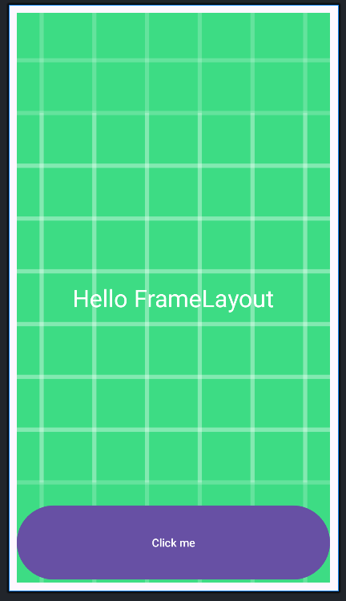

- [Basic Layout](#basic-layout)
  - [FrameLayout](#framelayout)
    - [Thuộc tính android:layout\_gravity trong các View con](#thuộc-tính-androidlayout_gravity-trong-các-view-con)
  - [Constrain Layout](#constrain-layout)
    - [Sự ràng buộc](#sự-ràng-buộc)
    - [Phần tử Guideline](#phần-tử-guideline)
    - [Bias](#bias)
    - [Tỷ lệ các cạnh của View](#tỷ-lệ-các-cạnh-của-view)
    - [Chain - xích các view lại](#chain---xích-các-view-lại)
  - [RelativeLayout](#relativelayout)
    - [Định vị và mối liên hệ các View con trong RelativeLayout](#định-vị-và-mối-liên-hệ-các-view-con-trong-relativelayout)
      - [Định vị mặc định](#định-vị-mặc-định)
      - [Định vị View con bằng liên hệ với View cha RelativeLayout](#định-vị-view-con-bằng-liên-hệ-với-view-cha-relativelayout)
      - [Định vị View con bằng liên hệ giữa chúng với nhau](#định-vị-view-con-bằng-liên-hệ-giữa-chúng-với-nhau)
  - [ViewBinding](#viewbinding)
    - [Cách cài đặt](#cách-cài-đặt)
    - [Cách sử dụng](#cách-sử-dụng)
      - [Activity](#activity)
      - [Fragments](#fragments)

# Basic Layout
## [FrameLayout](https://xuanthulab.net/su-dung-framelayout-trong-lap-trinh-android.html)
- `FrameLayout` là loại layout đơn giản mà các View con chứa bên trong xếp chồng nên nhau và định vị bằng thuộc tính `layout_gravity`
- `FrameLayout` là loại View cơ sở, nó là loại `Layout` đơn giản nhất. Mặc dù nó có thể chứa nhiều View con bên trong, nhưng mục đích chính thiết kế ra nó để chứa một View, từ đó nó trở thành cơ sở để tạo ra các View khác phức tạp hơn. Khi thiết kế Layout chứa nhiều View thì không nên sử dụng layout này, vì nó quá đơn giản việc bố cục các View con trong nó rất khó khăn (nó không có các tính năng điều khiển vị trí View con sao cho việc độc lập về màn hình được đảm bảo).
- Nếu bạn vẫn sử dụng **`FrameLayout`** để thiết kế layout, thì cần lưu ý: Các View con đặt vào FrameLayout nằm chồng nên nhau theo thứ tự cái nào đưa vào sau thì hiện thị ở lớp trước, mỗi View con chỉ có thể điều chỉnh vị trí nó thông qua thuộc tính `android:layout_gravity` gán cho View con
- Và có thể tinh chỉnh khoảng cách theo hướng cách cánh bằng các thuộc tính liên quan đến margin như: `android:layout_margin`, `android:layout_marginTop`, `android:layout_marginBottom`, `android:layout_marginLeft`, `android:layout_marginRight`, `android:layout_marginStart`, `android:layout_marginEnd`, `android:layout_marginHorizontal`, `android:layout_marginVertical`
### Thuộc tính android:layout_gravity trong các View con
- Khi các View nằm trong `FrameLayout` thì khi gán thuộc tính `android:layout_gravity` gán các giá trị ở bảng sau vị trí của nó thay đổi tương ứng: Các giá trị có thể kết hợp bằng ký hiệu `|`

|giá trị|	Vị trí của View con|
|---|---|
|bottom	|Nằm dưới FrameLayout|
|center	|Nằm giữa FrameLayout|
|center_horizontal	|Giữa theo chiều ngang|
|center_vertical|	Giữa theo chiều đứng|
|end	|Cuối FrameLayout|
|left	|Bên trái|
|right	|Bên phải|
|start	|Bắt đầu FrameLayout|
|top	|Trên FrameLayout|

```XML
<?xml version="1.0" encoding="utf-8"?>
<FrameLayout xmlns:android="http://schemas.android.com/apk/res/android"
    android:layout_width="match_parent"
    android:layout_height="match_parent"
    android:padding="10dp">
    <!--Ảnh kín FrameLayout-->
    <ImageView
        android:layout_width="match_parent"
        android:layout_height="match_parent"
        android:scaleType="centerCrop"
        android:src="@drawable/ic_launcher_background" />
    <!--Nội dung FrameLayout-->
    <TextView
        android:layout_width="wrap_content"
        android:layout_height="wrap_content"
        android:layout_gravity="center"
        android:text="Hello FrameLayout"
        android:textColor="#FFFFFF"
        android:textSize="30sp" />
    <!--Button FrameLayout-->
    <Button
        android:layout_width="match_parent"
        android:layout_height="100dp"
        android:layout_gravity="bottom"
        android:text="Click me" />
    
</FrameLayout>
```


## [Constrain Layout](https://xuanthulab.net/su-dung-constraintlayout-trong-android.html)
- `ConstraintLayout` là một layout mạnh, khuyến khích bạn dùng nếu có thể vì nó giúp tạo ra các giao diện phức tạp, mềm dẻo (hạn chế tối đa sử dụng các layout lồng nhau). Nó giúp định vị, sắp xếp các View con dựa trên sự ràng buộc liên hệ của các View con với View cha và sự liên hệ ràng buộc giữa các View con với nhau, với cơ chế tạo xích các View, gán trọng số hay sử dụng trợ giúp giao diện với Guideline.
### Sự ràng buộc
- Mỗi view trong `ConstraintLayout` để định vị được chính xác cần tối thiếu 2 ràng buộc, một theo phương ngang (X) và một theo phương đứng (Y)

- Khái niệm ràng buộc giữa các phần tử ở đây ám chỉ sự liên kết với nhau của các phần tử với nhau (kể cả với phần tử cha ConstraintLayout), sự căn chỉnh phần tử theo phần tử khác, hoặc với những đường thẳng ẩn thêm vào. Mỗi ràng buộc của phần tử View sẽ hoặc hưởng đến vị trí của nó theo trục X hoặc trục Y. Các View không có ràng buộc sẽ định vị ở góc trái - trên (tọa độ 0,0).

|Ràng buộc	|Ý nghĩa ràng buộc|
|---|---|
|layout_constraintLeft_toLeftOf	|Rang buộc cạnh trái của phần tử tới phần tử chỉ ra trong giá trị (gán ID)|
|layout_constraintLeft_toRightOf	|Bên trái với bên phải của phần tử chỉ ra|
|layout_constraintRight_toLeftOf	|Bên phải với bên trái|
|layout_constraintRight_toRightOf	|Phải với phải|
|layout_constraintTop_toTopOf	|Cạnh trên với cạnh trên|
|layout_constraintTop_toBottomOf	|Cạnh trên nối với cạnh dưới|
|layout_constraintBottom_toTopOf	|Dưới với trên|
|layout_constraintBottom_toBottomOf	|Dưới với dưới|
|layout_constraintBaseline_toBaselineOf	|Trùng Baseline|
|layout_constraintStart_toEndOf	|Bắt đầu - Kết húc|
|layout_constraintStart_toStartOf	|Bắt đầu - Bắt đầu|
|layout_constraintEnd_toStartOf	|Cuối với bắt đầu|
|layout_constraintEnd_toEndOf	|Cuối với cuối|

- Cạnh nào của `View`con có ràng buộc thì có thể thiết lập thêm thuộc tính `Margin` để điều chỉnh thêm khoảng cách các cạnh tới điểm nối ràng buộc.

### Phần tử Guideline
- Ta có thể một đường kẻ ẩn trong ConstraintLayout nằm ngang hoặc đứng nó như là một View con để các View khác ràng buộc đến nếu muốn. Thêm vào bằng cách:
```XML
<android.support.constraint.Guideline
    android:id="@+id/guideline_1"
    android:layout_width="wrap_content"
    android:layout_height="wrap_content"
    android:orientation="vertical" //Đứng (horizontal - ngang)
    app:layout_constraintGuide_percent="0.3" />
```
- Có thể sử dụng `app:layout_constraintGuide_begin=""` or `app:layout_constraintGuide_end=""` để cách cạnh bắt đầu hoặc kết thúc
### Bias
- Khi hai cạnh đối diện nhau của View có ràng buộc, thì hai ràng buộc này ứng xử như một liên kết lò xo mặc định, nó có độ mềm (độ cứng) bằng nhau dẫn đến View sẽ nằm giữa 2 điểm neo của ràng buộc. Nếu muốn điều chỉnh độ cứng này thì sử dụng thuộc tính:
    - `app:layout_constraintVertical_bias` thiết lập độ mềm của ràng buộc đầu (đứng). Với tổng độ mềm là 1 thì khi `app:layout_constraintVertical_bias="0.1"` thì độ mềm ràng buộc thứ hai sẽ là `0.9`
    - `layout_constraintHorizontal_bias` để thiết lập độ mềm hai ràng buộc theo phương ngang
### Tỷ lệ các cạnh của View
- Khi View con có thiết lập tối thiểu một kích thước là `"0dp"` thì kích thước đó có thể tự động điều chỉnh bằng cách lấy theo tỷ lệ với cạnh còn lại, thuộc tính `app:layout_constraintDimensionRatio` cho phép gán tỷ lệ giữa chiều rộng và chiều cao, ví dụ: `app:layout_constraintDimensionRatio="2:1" chiều rộng gấp đôi chiều cao`

### Chain - xích các view lại
- Các View ràng buộc qua lại các cạnh tiếp giáp nhau sẽ tạo thành một xích các View. Có hai loại xích các phần tử theo phương ngang và theo phương đứng. Lúc đó, phần tử đầu tiên có chức năng thiết lập chung một số thông số về xích.

- Một xích theo phương ngang
- Phần tử đầu của xích thiết lập kiểu xích bằng thuộc tính: `app:layout_constraintHorizontal_chainStyle` và `app:layout_constraintVertical_chainStyle` tùy theo xích đứng hay ngang, mặc định xích có kiểu `spread`
- **xích"spread"**: *`app:layout_constraintHorizontal_chainStyle="spread"`* hoặc *`app:layout_constraintVertical_chainStyle="spread"`*
    
- **xích"packed"**: *`app:layout_constraintHorizontal_chainStyle="packed"`* hoặc *`app:layout_constraintVertical_chainStyle="packed"`*
- **xích"spread_inside"**: *`app:layout_constraintHorizontal_chainStyle="spread_inside"`* hoặc *`app:layout_constraintVertical_chainStyle="spread_inside"`*
- Với loại **spread_inside** và **spread** theo phương của xích các phần tử có thể gán kích thước bằng 0 và điều chỉnh lại theo trọng số **weight** với ý nghĩa tương tự như `LinearLayout`, thuộc tính thiết lập trọng số là: `app:layout_constraintHorizontal_weight` và `app:layout_constraintVertical_weight`

## [RelativeLayout](https://xuanthulab.net/su-dung-relativelayout-trong-android.html)
- `RelativeLayout` là layout mà nó hiện thị các view con nó chứa ở các vị trí trong mối liên hệ của chúng với nhau (như View con này nằm dưới một View con khác, View con này nằm bên trái một View con khác ...), kể cả mối liên hệ của chúng với chính phần tử cha `RelativeLayout` (như căn thẳng theo cạnh đấy của phần tử cha, nằm giữa phần tử cha, nằm bên trái phần tử cha ...).

- `RelativeLayout` là một layout hết sức mạnh mẽ về độ tiện lợi và hiệu quả, nếu giao diện không ở mức quá phức tạp việc chọn `RelativeLayout` mạng lại hiệu suất còn tốt hơn `ConstraintLayout`. `RelativeLayout` dùng khi đơn giản, `ConstraintLayout` khi giao diện phức tạp.
### Định vị và mối liên hệ các View con trong RelativeLayout
#### Định vị mặc định
- Khi các View con đưa vào `RelativeLayout` nếu chưa có thiết lập mối liên hệ qua lại nào với phần tử cha hay với phần tử View con khác thì nó sẽ được định vị ở góc trên - trái của `RelativeLayout`. Như trường hợp dưới đây cả 3 View con không có thiết lập mối liên hệ nào, nên nó đều định vị ở góc trên / trái và vẽ chồng nên nhau, View con nào xếp sẽ ở lớp trên của màn hình.

```XML
<RelativeLayout xmlns:android="http://schemas.android.com/apk/res/android"
    xmlns:android="http://schemas.android.com/apk/res/android"
    xmlns:app="http://schemas.android.com/apk/res-auto"
    xmlns:tools="http://schemas.android.com/tools"
    android:layout_width="match_parent"
    android:layout_height="match_parent"
    tools:context=".MainActivity">


    <Button
        android:id="@+id/b1"
        android:layout_width="wrap_content"
        android:layout_height="wrap_content"
        android:layout_marginStart="40dp"
        android:text="B1 - HEAD"
        android:textColor="#1eb729" />

    <Button
        android:id="@+id/b2"
        android:layout_width="wrap_content"
        android:layout_height="wrap_content"
        android:layout_marginTop="8dp"
        android:layout_marginBottom="8dp"
        android:text="B2" />

    <Button
        android:id="@+id/b3"
        android:layout_width="wrap_content"
        android:layout_height="wrap_content"
        android:layout_marginTop="8dp"
        android:layout_marginBottom="8dp"
        android:text="B3" />

    <Button
        android:id="@+id/b4"
        android:layout_width="wrap_content"
        android:layout_height="wrap_content"
        android:text="B4 - HEAD"
        android:textColor="#cf3131" />

    <Button
        android:id="@+id/b5"
        android:layout_width="wrap_content"
        android:layout_height="wrap_content"
        android:text="B5" />


</RelativeLayout>
```

- Các View con khi đã định vị xong trong `RelativeLayout`, giả sử coi như tất cả các View con nằm vừa trong một đường biên chữ nhật, thì cả khối các View con này có thể dịch chuyển tới những vị trí nhất định trong `RelativeLayout` bằng thuộc tính: `android:gravity`, nó nhận các giá trị (c`ó thể tổ hợp lại với ký hiệu | giống với LinearLayout`)


|Giá trị|	Ý nghĩa|
|---|---|
|center	|Căn ở giữa|
|top	|Ở phần trên|
|bottom	|Phần dưới|
|center_horizontal	|Ở giữa theo chiều ngang|
|center_vertical	|Ở giữa theo chiều đứng|
|left	|Theo cạnh trái|
|right	|Theo cạnh phải|
|bottom	|Cạnh dưới|

- `RelativeLayout` có hỗ trợ chỉ ra một View con tách khỏi khối biên chữ nhật chứa các View con để phần tử đó không bị ảnh hưởng bởi gravity bằn thuộc tính `android:ignoreGravity="id-view-con"`
#### Định vị View con bằng liên hệ với View cha RelativeLayout
- Vị trí của View con trong `RelativeLayout` có thể thiết lập bằng cách chỉ ra mối liên hệ vị trí với view cha như căn thẳng cạnh trái View cha với View con, căn thẳng cạnh phải View cha với View con ... Các thuộc tính thực hiện chức năng này như sau:

|Thuộc tính|	Ý nghĩa|
|---|---|
|android:layout_alignParentBottom|	true căn thẳng cạnh dưới view con với cạnh dưới View cha|
|android:layout_alignParentLeft|	true căn thẳng cạnh trái view con với cạnh trái View cha|
|android:layout_alignParentRight	|true căn thẳng cạnh phải view con với cạnh phải View cha|
|android:layout_alignParentTop|	true căn thẳng cạnh trên view con với cạnh trên View cha
|android:layout_centerInParent|	true căn view con vào giữa View cha|
|android:layout_centerHorizontal|	true căn view con vào giữa View cha theo chiều ngang|
|android:layout_centerVertical	|true căn view con vào giữa View cha theo chiều đứng|

#### Định vị View con bằng liên hệ giữa chúng với nhau
- View con trong `RelativeLayout` ngoài mối liên hệ với View cha như trên, chúng có có thể thiết lập liên hệ với nhau ví dụ như View con này nằm phía trên một View con khác, nằm phía dưới một view con khác …


|Thuộc tính|	Ý nghĩa|
|---|---|
|android:layout_below|	Nằm phía dưới View có ID được chỉ ra|
|android:layout_above	|Nằm phía trên View có ID được chỉ ra|
|android:layout_toLeftOf|	Nằm phía trái View có ID được chỉ ra|
|android:layout_toRightOf|	Nằm phía phải View có ID được chỉ ra|
|android:layout_alignBottom	|Căn thẳng cạnh dưới với cạnh dưới của View có ID được chỉ ra|
|android:layout_alignLeft	|Căn thẳng cạnh trái với cạnh trái của View có ID được chỉ ra|
|android:layout_alignRight|	Căn thẳng cạnh phải với cạnh phải của View có ID được chỉ ra|
|android:layout_alignTop|	Căn thẳng cạnh trên với cạnh trên của View có ID được chỉ ra|

## ViewBinding
- `View binding` là một tính năng giúp cho việc tương tác với các View trở nên dễ dàng hơn. Khi `view binding` được kích hoạt trong một `module`, nó sẽ tạo ra một lớp binding cho mỗi tệp layout XML có trong module đó. Một instance của một binding class chứa các tham chiếu trực tiếp đến tất cả các view có ID trong layout tương ứng.
- Trong hầu hết trường hợp, có thể thay thế `findViewById`

### Cách cài đặt
```Kotlin
android {
    ...
    buildFeatures {
        viewBinding = true
    }
}
```
- Ví dụ, giả sử bạn có một tệp layout XML có tên là **`activity_main.xml`**. Sau khi kích hoạt View Binding, Android Studio sẽ tạo ra một lớp binding tương ứng với tệp layout này (trong trường hợp này, là **`ActivityMainBinding`**).
- Sau khi đã kích hoạt `View Binding`, Android Studio sẽ tự động tạo ra các binding classes cho các tệp layout XML. Nếu không muốn tự động tạo binding class trong một file layout nào đó thì thêm thuộc tính **`tools:viewBindingIgnore="true"`** vào view gốc của file layout đó.
### Cách sử dụng
- Tên của Binding Class được tạo bằng cách chuyển đổi tên của tệp `.xml` thành Pascal case và thêm từ `Binding` vào cuối.
- Ví dụ có một file là `activity_main.xml:`
```XML
<?xml version="1.0" encoding="utf-8"?>
<RelativeLayout xmlns:android="http://schemas.android.com/apk/res/android"
    xmlns:android="http://schemas.android.com/apk/res/android"
    xmlns:app="http://schemas.android.com/apk/res-auto"
    xmlns:tools="http://schemas.android.com/tools"
    android:layout_width="match_parent"
    android:layout_height="match_parent"
    tools:context=".MainActivity">


    <Button
        android:id="@+id/b1"
        android:layout_width="wrap_content"
        android:layout_height="wrap_content"
        android:layout_marginStart="40dp"
        android:text="B1 - HEAD"
        android:textColor="#1eb729" />

    <Button
        android:id="@+id/b2"
        android:layout_width="wrap_content"
        android:layout_height="wrap_content"
        android:layout_marginTop="8dp"
        android:layout_marginBottom="8dp"
        android:text="B2" />

    <Button
        android:id="@+id/b3"
        android:layout_width="wrap_content"
        android:layout_height="wrap_content"
        android:layout_marginTop="8dp"
        android:layout_marginBottom="8dp"
        android:text="B3" />

    <Button
        android:id="@+id/b4"
        android:layout_width="wrap_content"
        android:layout_height="wrap_content"
        android:text="B4 - HEAD"
        android:textColor="#cf3131" />

    <Button
        android:id="@+id/b5"
        android:layout_width="wrap_content"
        android:layout_height="wrap_content"
        android:text="B5" />


</RelativeLayout>
```

- Binding class được tạo ra sẽ tên là **`ActivityMainBinding`** . Tất cả các binding class đều có phương thức `getRoot()`, tham chiếu trực tiếp đến **`root view`** của layout file tương ứng. Trong ví dụ trên, phương thức `getRoot()` trong class **`ActivityMainBinding`** returns `RelativeLayout` root view.

#### Activity
- Để tạo một `instance` của **Binding Class** để sử dụng với một activity, thực hiện các bước sau trong phương thức `onCreate()` :
    - Gọi hàm `inflate()` để tạo ra `instance` để sử dụng
    - Tham chiếu tới view gốc bằng cách gọi hàm `getRoot()` hoặc dùng `Kotlin property syntax` .
    - Truyền view gốc vào `setContentView()` để biến nó thành active view trên màn hình.
- Sau đó có thể thêm tham chiếu vào `view` :
```Kotlin
class MainActivity : AppCompatActivity() {

    override fun onCreate(savedInstanceState: Bundle?) {
        super.onCreate(savedInstanceState)
        enableEdgeToEdge()
        val binding = ActivityMainBinding.inflate(layoutInflater)
        val view = binding.root
        setContentView(view)
    }
}
```
- Sau đó thì ta có thể tham chiếu tới bất kì view nào:
```Kotlin
binding.b1.setOnClickListener {    }
```
#### Fragments
- `Mảnh (fragment)` là một phần giao diện người dùng có thể sử dụng lại và nhúng vào một hoặc nhiều hoạt động.
- Tương tự như đối với activity, ta thực hiện các bước sau rong phương thức `onCreateView()` của `fragment`
    - Gọi `hàm static inflate()` có trong binding class. Nó sẽ tạo ra instance của binding class để sử dụng
    - Tham chiếu tới root view bằng cách gọi hàm `getRoot()` hoặc dùng `Kotlin property syntax` .
    - Truyền view gốc vào `setContentView()` để biến nó thành active view trên màn hình.
```Kotlin
private var _binding: ResultProfileBinding? = null
// This property is only valid between onCreateView and
// onDestroyView.
private val binding get() = _binding!!

override fun onCreateView(
    inflater: LayoutInflater,
    container: ViewGroup?,
    savedInstanceState: Bundle?
): View? {
    _binding = ResultProfileBinding.inflate(inflater, container, false)
    val view = binding.root
    return view
}

override fun onDestroyView() {
    super.onDestroyView()
    _binding = null
}

binding.name.text = viewModel.name
binding.button.setOnClickListener { viewModel.userClicked() }
```