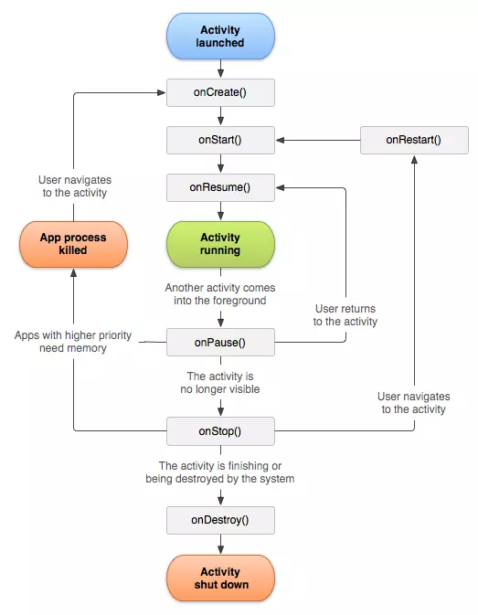
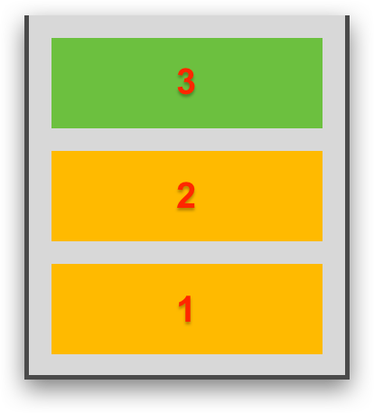
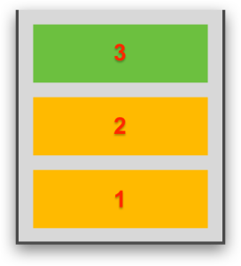
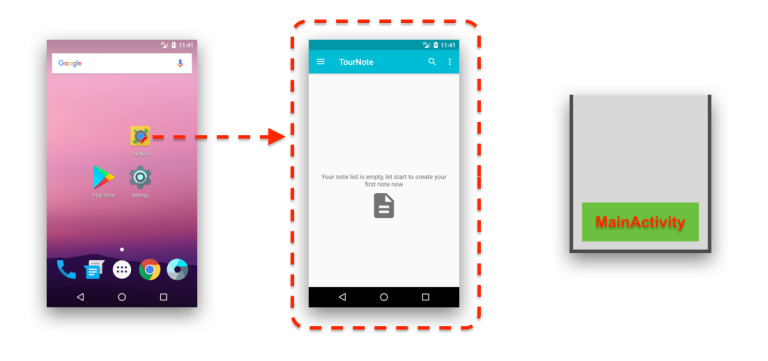
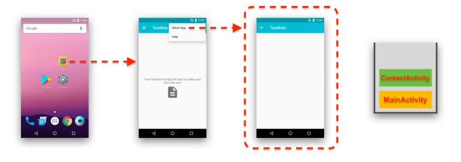
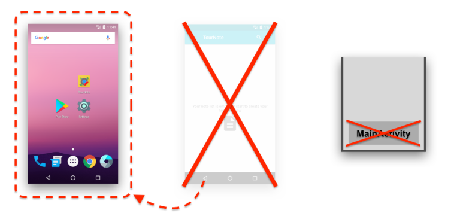
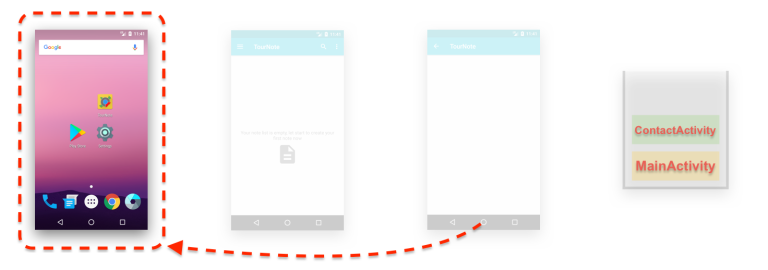

- [Activity](#activity)
  - [Foreground, background application trong android](#foreground-background-application-trong-android)
  - [Activity, Context](#activity-context)
    - [Activity](#activity-1)
    - [Context](#context)
  - [Vòng đời của Activity](#vòng-đời-của-activity)
  - [Back Stack](#back-stack)
    - [Task](#task)
    - [Back Stack](#back-stack-1)
  - [Intent](#intent)
  - [Truyền dữ liệu giữa 2 Activity](#truyền-dữ-liệu-giữa-2-activity)
    - [putExtra](#putextra)
    - [putExtras](#putextras)
    - [ActivityForResult](#activityforresult)
  - [Multi-resume, onTopResumedActivityChanged()](#multi-resume-ontopresumedactivitychanged)

# Activity
## Foreground, background application trong android
- **`Foreground Application (Ứng dụng nền trước)`**: Đây là những ứng dụng đang hiển thị trên màn hình và người dùng đang tương tác trực tiếp với nó. (Tức là đang mở ứng dụng :P)
- Đặc điểm:
  - Ứng dụng nền trước có quyền truy cập vào nhiều tài nguyên hệ thống hơn, như CPU và RAM.
  - Nó có thể tiếp tục xử lý các tác vụ ngay lập tức vì nó đang chiếm sự chú ý của người dùng.
  - Thường có ưu tiên cao nhất trong việc duy trì hoạt động liên tục, ví dụ như phát nhạc hoặc cuộc gọi video.
- **`Background Application (Ứng dụng nền sau - Ứng dụng chạy nền)`**: Đây là những ứng dụng vẫn đang chạy nhưng không hiển thị trên màn hình, hoặc người dùng không tương tác trực tiếp với nó.
- Đặc điểm:
    - Ứng dụng nền sau thường bị hạn chế quyền truy cập tài nguyên hệ thống để tiết kiệm pin và tối ưu hiệu suất hệ thống.
    - Hệ điều hành Android có thể tạm dừng hoặc thậm chí đóng các ứng dụng nền sau khi cần thiết để giải phóng tài nguyên.
    - Tuy nhiên, các ứng dụng có thể sử dụng dịch vụ nền (background service) để thực hiện các tác vụ như cập nhật dữ liệu, đồng bộ hóa thông tin hoặc xử lý thông báo.
- **`Chuyển đổi giữa Foreground và Background`**
  - Khi người dùng mở một ứng dụng, nó sẽ chuyển sang trạng thái `foreground`. Nếu người dùng chuyển sang một ứng dụng khác hoặc trở về màn hình chính, ứng dụng trước đó sẽ chuyển sang trạng thái `background`.
  - Android quản lý vòng đời ứng dụng rất chặt chẽ và có các cơ chế để bảo vệ tài nguyên, ví dụ như các `Service` để chạy tác vụ nền, `BroadcastReceiver` để lắng nghe sự kiện hệ thống, hoặc `WorkManager` để quản lý các tác vụ nền dài hạn.
## Activity, Context
### Activity
- Các ứng dụng được tạo ra bằng sự hòa hợp với một hay nhiều thành phần được gọi là `Activity`. Một `Activity` có thể là một module, thành phần chức năng độc lập của ứng dụng mà mỗi `Activity` thường tương ứng với một giao diện người dùng (UI) và các chức năng đáp lại sự tương tác với người dùng. Một ứng dụng có thể có một hay nhiều `Activity`
- Các `Activity` được xây dựng để có thể sử dụng lại và tương tác, chia sẻ giữa các ứng dụng. Ví dụ có một ứng dụng với `Activity` để hiển thị hình ảnh, thì trong ứng dụng khác thay vì xây dựng mới `Activity` có chức năng này thì có thể gọi từ ứng dụng khác.
- Một `Activity` được xây dựng bằng cách kế thừa lớp `Activity`, một `Activity` không thể gọi trực tiếp các phương thức hay truy cập vào dữ liệu của một `Activity` khác. Thay vào đó, phải dùng tới thành phần gọi là `Intent từ Activity` này kích hoạt `Activity` khác và `Content Provider`. Mặc định thì một `Activity` không trả về kết quả cho một `Activity` khác gọi đến nó
- Đặc điểm:
    - Một ứng dụng Android thường có nhiều `Activity`, và các `Activity` này có thể liên kết với nhau thông qua i`ntents`.
    - Vòng đời của một `Activity` được quản lý bởi `Android`, bao gồm các trạng thái như `onCreate(), onStart(), onResume(), onPause(), onStop(), onDestroy()`. Mỗi trạng thái tương ứng với một giai đoạn trong vòng đời của `Activity`.
    - `Activity` cũng là nơi mà bạn thiết lập giao diện người dùng thông qua `setContentView()` và quản lý các sự kiện tương tác từ người dùng.
### Context
- `Context` là một lớp trong Android cung cấp thông tin về môi trường chạy của ứng dụng. Nó cung cấp quyền truy cập đến tài nguyên và các dịch vụ hệ thống, cũng như thông tin về môi trường ứng dụng như quyền, thư mục, và thông tin cấu hình.
- Đặc điểm:
    - Context thường được sử dụng để khởi tạo các thành phần như `Activity, Service, ContentProvider, và BroadcastReceiver`.
    - Có hai loại chính của `Context`:
      - `Application Context:` Được cung cấp bởi lớp `Application`, nó tồn tại trong toàn bộ vòng đời của ứng dụng và có thể được sử dụng bất cứ đâu trong ứng dụng. Tuy nhiên, nó không có khả năng tương tác với giao diện người dùng.
      - `Activity Context:` Được cung cấp bởi một `Activity` cụ thể, nó chỉ tồn tại trong vòng đời của `Activity` đó và có thể sử dụng để tương tác với giao diện người dùng hoặc hiển thị `Toast, Dialog.`
    - Context cũng thường được truyền vào các lớp khác như Adapter, Service hoặc các thành phần giao diện để truy cập tài nguyên hoặc thực hiện các thao tác hệ thống.
## Vòng đời của Activity




- Các `activity` được quản lý dưới dạng `activity stack`. Khi một `activity` bắt đầu nó được đưa lên đỉnh của `stack` - `running`.Có thể có một hoặc nhiều `activity stacks` hoạt động hiển thị trên màn hình
- `Activity` có 4 trạng thái chính:
    - `Running:`  đang hiển thị trên màn hình (đỉnh `stack`) - được người dùng tương tấc
    - `Visible:` bị che bởi một thành phần nào đó (`dialog`, …), người dùng có thể nhìn thấy nhưng không tương tác được
    - `Stop - Hidden`: Bị che phủ hoàn toàn bởi thành phần nào đó
    - `Destroyed`: Bị loại ra khỏi hệ thống

|Method|Mô tả|Trạng thái tiếp theo|
|---|---|---|
|onCreate(Bundle savedInstanceState)|Được gọi khi Activity được khởi tạo lần đầu. Đây là nơi (nên) thực hiện các setup mặc định như: tạo các View, liên kết dữ liệu,... Phương thức này còn cung cấp cho ta 1 Bundle chứa trạng thái của Activity trước đó (Nếu có) Luôn gọi onStart() ngay sau khi thực hiện xong.|onStart()|
|onRestart()|Được gọi sau khi Activity bị dừng (stopped) trước khi Activity được bắt đầu trở lại. Luôn gọi onStart ngay sau khi thực hiện xong.|onStart()|
|onStart()|Được gọi khi Activity hiển thị với người dùng. Gọi onResume nếu Activity xuất hiện ở nền trước của máy hoặc gọi onStop nếu nó bị ẩn.|onResume() / onStop()|
|onResume()|Được gọi khi Activity bắt đầu tương tác với người dùng. Tại thời điểm này Activity đang ở trên cùng của Activity Stack.|onPause()|
|onPause()|Được gọi khi Activity mất trạng thái nền trước (bị thay thế bởi Activity khác) hoặc được gọi trước khi Activity dừng hoặc ẩn với người dùng. Gọi onResume nếu Activity được mang ra nền trước (người dùng back trở lại Activity) Gọi onStop nếu Activity bị ẩn đối với người dùng (không bao giờ được hiển thị lại nữa). Gọi onCreate nếu Activity bị hủy (do hệ thống) nhằm mục đích giải phóng tài nguyên máy.|onResume() / onStop() /onCreate()|
|onStop()|Được gọi khi Activity không còn được hiển thị lại với người dùng nữa. Gọi onRestart nếu Activity bị hủy (do hệ thống) nhằm mục đích giải phóng tài nguyên máy. Gọi onDestroy nếu Activity dừng hoạt động.|onRestart() / onDestroy()
|onDestroy()|Được gọi khi Activity dừng hoạt động hoặc lập trình viên gọi finish() hoặc vì hệ thống hủy Activity để giải phóng bộ nhớ.|nothing|
- Lưu ý: trong một số trường hợp nếu ta thay xoay màn hình, thay đổi ngôn ngữ,… thì activity đó sẽ bị huỷ ngay lập tức và bắt đầu lại một activity mới
## Back Stack
### Task
- Task hay Tác vụ trong một hệ thống Android sẽ cần rất nhiều mô tả. Nhưng bạn có thể hiểu một cách trực quan như ví dụ mở ứng dụng trên đây. Mỗi một ứng dụng được khởi chạy trong Android sẽ được hệ thống xem là một Task.



- Trong `Task` của mỗi ứng dụng sẽ chứa đựng thông tin về `Back Stack`. Chính `Back Stack` này sẽ nói cho hệ thống biết nên hiển thị Activity nào của ứng dụng.

### Back Stack
- Bạn cứ tưởng tượng `Back Stack` là một ngăn đựng đồ. Khi bạn để một món đồ vào ngăn, nó sẽ nằm ở đáy ngăn (như món số 1 trong hình dưới). Món kế tiếp và kế tiếp nữa sẽ đè lên các món ban đầu (món số 2 và 3). Và món đồ được để vào cuối cùng sẽ là món được lấy ra trước nhất, vì nó nằm trên cùng của ngăn đựng đồ (chính là món số 3).



- `Back Stack` chứa các Activtiy mà chúng ta đã nói đến. Việc hệ thống quản lý xem một `Activity` nào được hiển thị, và `Activity` nào phải nhường chỗ cho `Activity` khác, đều chỉ dựa vào cái ngăn chứa này 
- Quay lại ví dụ trên kia. Giả sử vẫn chưa có `Task` nào của `TourNote` được tạo. Thì khi bạn nhấn vào icon app TourNote ở màn hình chính. Hệ thống sẽ tạo ra một `Task` cho `TourNote`, trong `Task` này có một `Back Stack`, trong `Back Stack` chứa đựng sẵn một `Activity` ban đầu được khai báo là launcher, chính là `MainActivity`. Bạn có thể nhìn vào minh họa Back Stack đang chứa Activity nào như bên phải của hình dưới đây.



- Sau đó, với việc gọi phương thức `startActivity()` từ `MainActivity`, sẽ dẫn đến việc ContactActivity được kích hoạt.
- Việc kích hoạt này sẽ đặt thêm `ContactActivity` vào `Back Stack`. Và hệ thống cũng căn cứ vào `Back Stack` mà cho `MainActivity` về background (không bị hủy nhé) vì nó đã không còn nằm trên cùng của ngăn chứa. Còn `ContactActivity` vì nằm ở trên cùng của Back Stack nên được hiển thị.



- Nếu người dùng nhấn nút `Back` hoặc gọi phương thức `finish()` bằng nút `Back` trên `action bar` thì `ContactActivity` cũng sẽ bị lấy ra khỏi `Back Stack`. Và `ContactActivity` lúc này mới chính thức bị hủy. Màn hình lúc này cũng sẽ nhường chỗ lại cho `Activity` trên cùng của `Back Stack` lúc bấy giờ, chính là `MainActivity`.
- Nếu người dùng tiếp tục nhấn `Back`. `MainActivity` bị hủy. Và khi đã hủy `Activity` cuối cùng ra khỏi `Back Stack`, hệ thống sẽ xem như ứng dụng đã thoát.



- Nếu bạn đang ở bất kỳ `Activity` nào, chẳng hạn như ở `ContactActivity` mà nhấn `Home`. Thì sẽ không có gì bị xóa khỏi `Back Stack` cả. Tất cả thông tin trong `Task` được giữ lại và hệ thống chỉ là chuyển tất cả `Task` của ứng dụng về background để nhường chỗ cho một `Task` khác, chính là `Task` của màn hình chính. Sau này khi bạn mở lại ứng dụng, nếu `Task` không bị xóa (Task có thể sẽ bị xóa nếu ở background quá lâu và chiếm dụng hiệu năng của hệ thống), thì `Back Stack` sẽ được hệ thống nhìn vào và tái hiện lại `Activity` đang ở trên cùng của Stack.



## Intent
- `Intent` trong Android là một đối tượng (object) được sử dụng để gửi thông điệp giữa các thành phần của ứng dụng (như Activity, Service, BroadcastReceiver). Nó đóng vai trò như một cách để yêu cầu một hành động cụ thể, chẳng hạn như mở một Activity mới, bắt đầu một Service, hoặc phát sóng một thông báo.
- `Intents` sẽ giúp tương tác giữa các component từ cùng một ứng dụng cũng như với các component của ứng dụng khác.

| Component | Mô tả |
| --- | --- |
| Bắt đầu một Activity | Khi dùng một đối tượng Intent thông qua phương thức startActivity(), chúng ta có thể bắt đầu một Activity mới hoặc Activity hiện có. |
| Bắt đầu một Service | Khi dùng một đối tượng Intent thông qua phương thức startService(), chúng ta có thể bắt đầu một Service mới hoặc gửi các hướng dẫn đến một Service hiện có. |
| Truyền đi một Broadcast | Khi dùng một đối tượng Intent thông qua phương thức sendBroadcast() , chúng ta có thể gửi tin nhắn đến các broadcast receiver khác. |

- Các thành phần của Intent
    - Action: Hành động ta muốn thực hiện
        - **ACTION_VIEW**: Mở một dữ liệu URI (Uniform Resource Identifier) bằng cách sử dụng ứng dụng mặc định cho loại dữ liệu đó. Ví dụ: mở trang web, xem hình ảnh, v.v.
        - **ACTION_EDIT**: Yêu cầu chỉnh sửa dữ liệu đã cho. Ví dụ: chỉnh sửa thông tin liên hệ trong ứng dụng liên hệ.
        - **ACTION_DIAL**: Mở màn hình điện thoại với số điện thoại đã cho trong dấu hiệu chuỗi. Điều này cho phép người dùng gọi số điện thoại đó.
        - **ACTION_SEND**: Gửi dữ liệu đến một ứng dụng mục tiêu. Dữ liệu có thể là văn bản, hình ảnh, âm thanh, v.v.
        - **ACTION_PICK**: Yêu cầu người dùng chọn một mục từ danh sách. Ví dụ: chọn một liên hệ từ danh bạ.
        - **ACTION_SEARCH**: Thực hiện một tìm kiếm dựa trên một truy vấn được cung cấp.
        - **ACTION_CALL**: Gọi số điện thoại đã cho mà không cần xác nhận từ người dùng.
        - **ACTION_CAMERA**: Mở ứng dụng máy ảnh để chụp ảnh.
        - **ACTION_GET_CONTENT**: Lấy nội dung từ nguồn đã cho, ví dụ như lấy hình ảnh từ thư viện hình ảnh.
        - **ACTION_BATTERY_LOW**: Gửi thông báo khi pin của thiết bị yếu đi.
        - **ACTION_POWER_CONNECTED**: Gửi thông báo khi thiết bị được kết nối với nguồn điện.
        - **ACTION_BOOT_COMPLETED**: Gửi thông báo khi hệ thống đã khởi động xong.
    - Data: Dữ liệu của hành động (.data / setData(Uri.parse(""))) `            phone_intent.data = Uri.parse("tel:$phone_number")
`
    - Một số ví dụ :
        - **ACTION_VIEW content://contacts/people/1** -- Show thông tin của person có id 1
        - **ACTION_DIAL content://contacts/people/1** -- Mở chế độ quay số điện thoại với thông tin của person có id 1
        - **ACTION_DIAL tel:123** -- Mở chế độ quay số điện thoại với số "123"
        - **ACTION_VIEW tel:123** -- Mở chế độ quay số điện thoại với số "123". Trong trường hợp chung chung như thế này, VIEW sẽ lựa chọn một hành động nào đó mà được coi là hợp lí nhất: ACTION_DIAL
        - **ACTION_EDIT content://contacts/people/1** -- Sửa thông tin của person có id 1
        - **ACTION_VIEW content://contacts/people/** -- Hiển thị một list các liên lạc trong danh bạ
    - Ngoài ra còn một sô thuộc tính khác: **category, type, component, extras**

- Phân loại:
    - **Explicit Intents:** intent được cung cấp chính xác tên component/class phụ trách xử lý Intent.
      - Mục đích: Dùng để khởi chạy một Activity hoặc Service trong cùng một ứng dụng.
      - Cách sử dụng: Bạn sẽ xác định rõ thành phần (component) mục tiêu thông qua lớp (class) của nó.
      - Thông thường thì explicit sẽ không cần thông tin cụ thể hơn (ngoài tên class), do nó chỉ có nhiệm vụ bắt đầu một activity khi người dùng tương tác. 
        
      ```kotlin
        Intent intent = new Intent(ActivityA.this, ActivityB.class);
        startActivity(intent);
      ```
        
    - **Implicit Intents:** intent không chỉ đích danh một component hay class nào. Thay vì đó, nó sẽ chứa một số cờ phụ và hệ thống sẽ tự lựa ra đâu là component nên được sử dụng.
      - Mục đích: Dùng để yêu cầu hệ thống Android xử lý một hành động cụ thể (như mở trang web, gửi email, v.v.) mà không chỉ định thành phần nào sẽ xử lý hành động đó. Android sẽ xác định thành phần phù hợp để thực hiện.
      - Cách sử dụng: Bạn sẽ không chỉ định rõ lớp mục tiêu, mà thay vào đó sử dụng một hành động (action) hoặc loại dữ liệu (data).

      ```Kotlin
        intent = Intent(Intent.ACTION_VIEW)
        intent.setData(Uri.parse("https://facebook.com"))
        startActivity(intent)
      ```
## Truyền dữ liệu giữa 2 Activity
### putExtra
- Sử dụng hàm `putExtra(Key, Value)`

```Kotlin
val intent = Intent(this, MainActivity2::class.java)
intent.putExtra("name", "Nguyen Van A")
startActivity(intent)
```
- Bên nhận

```Kotlin
  
    val name = intent.getStringExtra("name")
```

### putExtras
- Gói hết dữ liệu vào `Bundle`

```Kotlin
  val intent = Intent(this, MainActivity2::class.java)
  val bundle = Bundle()
  bundle.putString("name", "Dung")
  bundle.putString("age", "18")
  intent.putExtras(bundle)
  startActivity(intent)
```

- Bên nhận

```Kotlin
  val bundle = intent.extras
  val name = bundle?.getString("name")
  val age = bundle?.getString("age")

```
### ActivityForResult
- ActivityForResult
  Phương thức `startActivity(Intent)` được sử dụng để bắt đầu một Activity mới và sẽ được đặt lên trên đỉnh của Activity Stack, trong đó ta phải truyền vào 1 tham số `Intent` để mô tả “công việc” của Activity đó.
    
  Ngoài ra ta còn có phương thức `startActivityForResult(Intent, int)` sẽ có thể lấy được kết quả từ Activity với tham số thứ 2 là để xác định “mục đích” gọi đến. Kết quả sẽ được trả về thông qua `onActivityResult(int, int, Intent)`.
    
  Khi thoát khỏi một Activity, ta có thể gọi hàm `getResult(int)` để trả về dữ liệu cho Activity cha, nhưng nó phải luôn cung cấp một **mã kết quả (result code)**. Một số **result code** tiêu chuẩn là `RESULT_CANCELED`, `RESULT_OK` hoặc ta có thể tự định nghĩa một mã riêng.
    
  Nếu chẳng may Activity con chúng ta bị thoát đột ngột (có thể là crash) thì Activity cha sẽ nhận được kết quả là `RESULT_CANCELED`

## Multi-resume, onTopResumedActivityChanged()
- `Multi-resume` là một tính năng cho phép nhiều `Activity` cùng tồn tại trong trạng thái `Resumed` đồng thời. Điều này đặc biệt hữu ích trong chế độ `multi-window (nhiều cửa sổ)` trên Android, khi có nhiều hơn một `Activity` hiển thị và tương tác với người dùng cùng lúc.
- Trước Android Q, chỉ có một `Activity` được ở trạng thái `Resumed` tại một thời điểm, các `Activity` khác trong chế độ `multi-window` sẽ bị Paused.
- Với sự xuất hiện của tính năng `multi-resume`, nhiều `Activity` có thể ở trạng thái `Resumed`, cho phép chúng hoạt động và tương tác đầy đủ với người dùng.

- **`onTopResumedActivityChanged()`**
  -` onTopResumedActivityChanged(boolean isTopResumedActivity)` là một callback mới được giới thiệu trong Android Q. Callback này được sử dụng để quản lý trạng thái của Activity khi tính năng multi-resume được kích hoạt.
  - Callback này được gọi bất cứ khi nào `Activity Resumed` cao nhất trong một task thay đổi.
  - Tham số `isTopResumedActivity` cho biết liệu Activity có phải là Activity Resumed cao nhất (topmost resumed activity) (true) hay không (false).

```Kotlin
  override fun onTopResumedActivityChanged(isTopResumedActivity: Boolean) {
    super.onTopResumedActivityChanged(isTopResumedActivity)
    if (isTopResumedActivity) {
        // Activity hiện đang là top resumed activity.
        // Xử lý chuyển đổi (ví dụ: bắt đầu animation, tiếp tục phát nhạc, v.v.)
    } else {
        // Activity không còn là top resumed activity.
        // Xử lý chuyển đổi (ví dụ: dừng animation, tạm dừng phát nhạc, v.v.)
    }
  }
```
- Các lưu ý thực tiễn
  - Use Cases: Callback này đặc biệt hữu ích cho các Activity cần phản ứng khi trở thành trọng tâm chính của người dùng, chẳng hạn như trình phát nhạc, game, hoặc bất kỳ Activity nào mà tương tác người dùng là rất quan trọng.
  - Quản lý vòng đời: Mặc dù nhiều Activity có thể được Resumed, nhưng Activity nào là top resumed activity sẽ có mức độ ưu tiên cao hơn. Callback này có thể được sử dụng để quản lý các thay đổi UI, animation hoặc các tác vụ tiêu tốn tài nguyên mà chỉ nên diễn ra khi Activity của bạn là trọng tâm chính.

- Tương thích
  - Đối với các thiết bị chạy phiên bản Android thấp hơn Android Q, tính năng multi-resume không có sẵn, vì vậy bạn cần sử dụng các phương thức vòng đời Activity truyền thống (onResume, onPause, v.v.) để quản lý trạng thái của Activity.