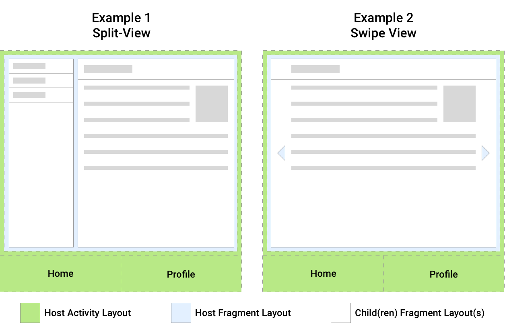
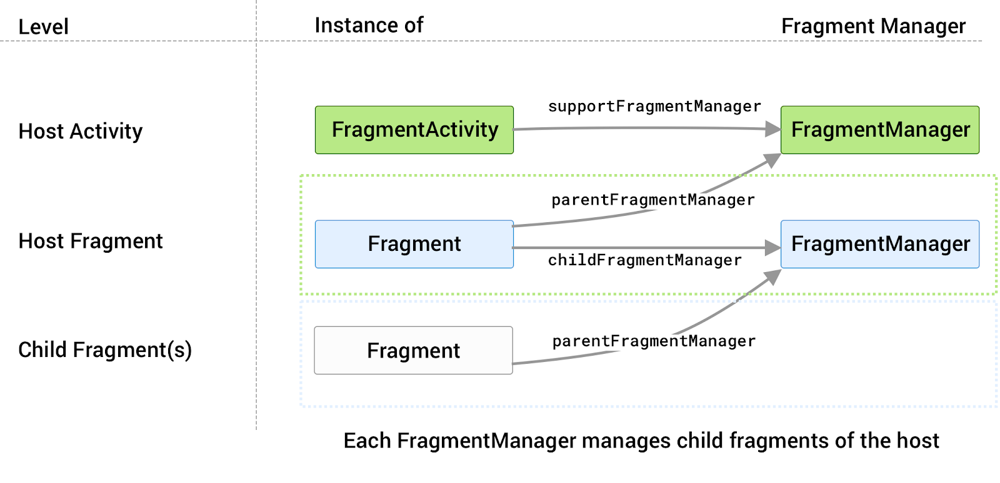

- [Fragment](#fragment)
  - [Fragment, FragmentManager, FragmentTransaction](#fragment-fragmentmanager-fragmenttransaction)
    - [Fragment](#fragment-1)
    - [Fragment manager](#fragment-manager)
    - [FragmentTransaction](#fragmenttransaction)
  - [Fragment Lifecycle](#fragment-lifecycle)
  - [Giao tiếp Fragment với Fragment, Activity với Fragment](#giao-tiếp-fragment-với-fragment-activity-với-fragment)
    - [Chia sẻ dữ liệu bằng ViewModel](#chia-sẻ-dữ-liệu-bằng-viewmodel)
      - [Chia sẻ dữ liệu với Host Activity](#chia-sẻ-dữ-liệu-với-host-activity)
      - [Chia sẽ giữ liệu giữa các Fragment](#chia-sẽ-giữ-liệu-giữa-các-fragment)
      - [Chia sẻ dữ liệu giũa parent fragment và child fragment](#chia-sẻ-dữ-liệu-giũa-parent-fragment-và-child-fragment)
    - [Nhận kết quả sử dụng Fragment Result API](#nhận-kết-quả-sử-dụng-fragment-result-api)
      - [Truyền dữ liệu giữa các Fragment](#truyền-dữ-liệu-giữa-các-fragment)
      - [Truyền dữ liệu giữa parent fragment và child fragment](#truyền-dữ-liệu-giữa-parent-fragment-và-child-fragment)
      - [Chia sẻ dữ liệu với Activity chứa Fragment hiện tại](#chia-sẻ-dữ-liệu-với-activity-chứa-fragment-hiện-tại)

# Fragment
## Fragment, FragmentManager, FragmentTransaction
### Fragment
- Đại diện cho 1 phần UI có thể tái sử dụng
- Có layout riêng, có `life cycle` riêng và xử lý sự kiên riêng biệt
- `Fragment` không thể tồn tại độc lập, nó phải thiết lập dựa trên 1 Activity hoặc là 1 fragment cha.
- Ưu điểm khi sử dụng **Fragment**:
    - **Module hóa(Modularity):** Với các **Activity** phức tạp thì code sẽ được implement ở các **Fragment**. Mỗi **Fragment** là một module độc lập. Điều này sẽ làm cho code dễ tổ chức và bảo trì tốt hơn.
    - **Tái sử dụng(Reusability):** Viết code implement các tương tác với người dùng hoặc các phần UI vào **Fragment** để có thể chia sẻ chúng với các **Activity** khác.
    - **Hỗ trợ đa màn hình**: **Fragment** cung cấp cách để trình bày giao diện người dùng (UI) phù hợp và tối ưu cho các loại thiết bị Android có kích thước màn hình và mật độ điểm ảnh khác nhau.


### Fragment manager
- **`Fragment manager`** là 1 class chịu trách nhiệm các hành động trên fragments: Thêm, sửa, xóa hoặc thay thế và thêm vào backstack
- Có thể truy cập **`Fragment manager`** từ 1 activity hoặc 1 fragment
- **`FragmentActivity`** và subclasses như **`AppCompatActivity`** có thể truy cập **`FragmentManager`** bằng phương thức **` getSupportFragmentManager()`**
- **`Fragments`** có thể lưu trữ một hoặc nhiều **`Fragment`** con. Bên trong một **`Fragment`**, bạn có thể nhận được một tham chiếu đến **`FragmentManager`** để quản lý các phần tử con của **`Fragment`** đó thông qua **`getChildFragmentManager()`**. Nếu bạn cần truy cập **`FragmentManager`** của `fragment` chứa nó, bạn có thể sử dụng phương thức **`getParentFragmentManager()`**.





- Một số phương thức quan trọng của FragmentManager:

|Phương thức |Chức năng|
|---|---|
|beginTransaction() |Bắt đầu một giao dịch (transaction) cho việc thêm, thay thế hoặc loại bỏ Fragment.|
|add(int containerViewId, Fragment fragment, String tag) |Thêm một Fragment vào một View (container) xác định trong giao diện người dùng.|
|replace(int containerViewId, Fragment fragment, String tag) |Thay thế một Fragment hiện tại bằng một Fragment mới, thường được sử dụng để thay thế một Fragment trong quá trình thực thi ứng dụng.|
|remove(Fragment fragment) |Loại bỏ một Fragment đã được thêm vào trước đó.|
|findFragmentByTag(String tag) |Tìm kiếm một Fragment dựa trên thẻ (tag) đã được xác định trước đó.|
|popBackStack() |Loại bỏ Fragment trên cùng khỏi ngăn xếp giao dịch, trả về trạng thái trước đó của Fragment nếu có.|

- **`FragmentManager`** quản lý ngăn xếp các `Fragment`. Trong runtime, `FragmentManager` có thể thực hiện các thao tác backstack như thêm hoặc xóa các `Fragment` để phản hồi tương tác của người dùng. 
- Mỗi tập hợp thay đổi được cam kết cùng nhau dưới dạng một đơn vị duy nhất được gọi là `FragmentTransaction`. 
- Khi người dùng chạm vào nút `Back`trên thiết bị của họ hoặc khi bạn gọi `FragmentManager.popBackStack()`, giao dịch `Fragment` trên cùng sẽ bật ra khỏi ngăn xếp. Nếu không còn giao dịch `Fragment` nào trên ngăn xếp và nếu bạn không sử dụng các `Fragment` con thì sự kiện `Back` sẽ truyền vào `activity`. Nếu bạn đang sử dụng các mảnh con, hãy xem những điều cần cân nhắc đặc biệt đối với các mảnh con và mảnh anh em.
- Khi bạn gọi `addToBackStack()` trên một giao dịch, giao dịch đó có thể bao gồm bất kỳ số lượng thao tác nào, chẳng hạn như thêm nhiều `Fragment` hoặc thay thế các `Fragment` trong `multiple containers`.

### FragmentTransaction
- Trong runtime, `FragmentManager` có thể thực hiện các hành động thêm, xóa, thay thế liên quan đến `Fragment` và mỗi lần thực hiện một thao tác thay đổi đó gọi là một `transaction`, và chúng ta có thể quản lý chúng thông qua `FragmentTransaction`. Trong một `transaction`, ta có thể sử dụng các phương thức như `add()` hay `replace()`

>**`Khác nhau giữa add() và replace()`**
>- add () 
Chức năng: Phương thức add thêm một Fragment mới vào một ViewGroup (chẳng hạn như FrameLayout) mà không thay thế bất kỳ Fragment nào đã có trước đó.
Ứng dụng: Thường được sử dụng khi bạn muốn hiển thị nhiều Fragment cùng một lúc hoặc khi bạn muốn thêm một Fragment mới mà vẫn giữ các Fragment cũ.
Back Stack: Nếu bạn thêm Fragment vào back stack, khi nhấn nút "Back", Fragment sẽ bị xóa, và các Fragment trước đó sẽ vẫn còn hiển thị.
>- replace()
Chức năng: Phương thức replace xóa bỏ tất cả các Fragment đang được gắn vào ViewGroup và thay thế bằng một Fragment mới.
Ứng dụng: Thường được sử dụng khi bạn muốn thay đổi toàn bộ nội dung của ViewGroup bằng một Fragment khác, thường trong các trường hợp như chuyển đổi giữa các màn hình khác nhau.
Back Stack: Nếu replace được thêm vào back stack, khi nhấn nút "Back", Fragment mới sẽ bị xóa và các Fragment đã được thay thế sẽ không quay lại (nếu chúng không được giữ trong back stack trước đó).
**`add: Thêm Fragment mới, không thay thế các Fragment hiện có.
replace: Thay thế tất cả các Fragment hiện có bằng Fragment mới.`**


- Một số hàm
    - add(): Thêm fragment mới vào FragManager
    - attach(): Attach lại một fragment sau khi nó bị detach() khỏi UI.
    - commit(): Submit hợp đồng Transaction này.
    - detach(): Detach fragment ra khỏi UI. Toàn bộ các View của nó(fragment bị detached) bị destroyed, tuy nhiên state của nó thì vẫn nằm trong sự quản lý của FragMananger
    - remove(): Xoá một Fragment ra khỏi FragManager
    - replace(): Xoá toàn bộ Fragment có trong FragManager và gọi add() với Fragment là tham số được truyền vào trong replace

```Kotlin
class FirstFragment : Fragment() {
    override fun onCreateView(
        inflater: LayoutInflater, container: ViewGroup?,
        savedInstanceState: Bundle?
    ): View? {
        // Inflate the layout for this fragment
        return inflater.inflate(R.layout.fragment_first, container, false)
    }
}
```
- Thêm fragment vào activity có 2 cách: XML or code

```XML
 <fragment
        android:id="@+id/firstFragment"
        android:layout_width="match_parent"
        android:layout_height="match_parent"
        android:tag="FirstFragment"
        class="com.proptit.homework_b9.FirstFragment" />
```

```Kotlin
class MainActivity : AppCompatActivity() {
    override fun onCreate(savedInstanceState: Bundle?) {
        super.onCreate(savedInstanceState)
        enableEdgeToEdge()
        setContentView(R.layout.activity_main)
        val fragment = FirstFragment()
        val fragmentManager = supportFragmentManager
        val fragmentTransaction = fragmentManager.beginTransaction()
        fragmentTransaction.add(R.id.root, fragment)
        fragmentTransaction.commit()

    }
}
```

## Fragment Lifecycle
- Nói chung, **Fragment** trong **Android** phải được đưa vào một **Activity** do vòng đời của **Fragment** đó sẽ luôn luôn bị ảnh hưởng bởi vòng đời của **Activity**. Trong trường hợp nếu chúng ta tạm dừng một **Activity** thì tất cả các **Fragment** liên quan đến **Activity** đó cũng sẽ bị dừng lại.
- Vòng đời của Fragment gắn với Activity:


- Vòng đời riêng của Fragment: Cũng giống như activity, vòng đời của một fragment xảy ra khi trạng thái của nó thay đổi.


Trong sơ đồ trên, ta có thể hiểu các hàm callback như sau:

- **onAttach()**: Fragment được đính kèm vào activity. Mỗi Fragment muốn chạy được thì nó phải thuộc vào một activity nào đó.
- **onCreate()**: Khi một fragment mới được khởi tạo (hàm này luôn được gọi sau khi fragment được attach vào Activity)
- **onCreateView()**: Thực hiện tạo giao diện (View), trả về View là giao diện file xml tương ứng Fragment. Ta không nên tương tác với Activity trong hàm này bởi vì Activity chưa được khởi tạo đầy đủ.
- **onActivityCreated()**: Khi activity của fragment đã xong bước khởi tạo và attach vào Activity.
- **onStart()**: Khi fragment hiển thị. Một fragment chỉ start sau khi Activity start và thường là nó start ngay lập tức khi Activity start xong
- **onResume()**: Khi fragment hiển thị và có thể tương tác
- **onPause()**: Khi fragment không còn tương tác (Có thể vẫn hiển thị). Điều này xảy ra ngay cả khi fragment bị gỡ bỏ hoặc bị thay thế, hoặc là khi activity của fragment bị tạm dừng.
- **onStop()**: Khi fragment không còn hiển thị. Điều này xảy ra ngay sau khi fragment bị gỡ bỏ hoặc thay thế, hoặc là khi activity của fragment bị tạm dừng.
- **onDestroyView()**: Khi các view hay resource được tạo trong onCreateView bị remove khỏi activity và destroy
- **onDestroy()**: Khi fragment kết thúc việc dọn dẹp.
- **onDetach()**: Khi fragment bị tách khỏi Activity của nó.

Bạn có thể thấy vòng đời của fragment được đan xen với **vòng đời của activity**. Tuy nhiên, Fragment Lifecycle có nhiều sự kiện trong vòng đời hơn so với Activity.

## Giao tiếp Fragment với Fragment, Activity với Fragment

[Thao khảo](https://developer.android.com/guide/fragments/communicate#host-activity)

- `Fragment` cung cấp cho chúng ta 2 cách để giao tiếp: 
    - **`Shared ViewModel`:**  Để chia sẻ dữ liệu với các Fragment khác mà không chung **FragmentManager.**
    - **`Fragment Result API`:**  Sử dụng cho **Fragment** có chung **FragmentManager** muốn gửi và nhận dữ liệu 1 lần thông qua "Bundle".
### Chia sẻ dữ liệu bằng ViewModel
#### Chia sẻ dữ liệu với Host Activity
- Trong 1 số trường hợp mà bạn muốn chia sẻ dữ liệu giữa nhiều `Fragment` có chung `host activity` nhưng lại khác `FragmentManager` thì các bạn có thể dụng S`hareViewModel` mà vòng đời của `ViewModel` phụ thuộc vào vòng đời của `Activity`
- Định nghĩa file `ItemViewModel`
```Kotlin
class ItemViewModel : ViewModel() {
    private val mutableSelectedItem = MutableLiveData<Item>()
    val selectedItem: LiveData<Item> get() = mutableSelectedItem

    fun selectItem(item: Item) {
        mutableSelectedItem.value = item
    }
}
```
- Dữ liệu chưa trong `MutableLiveData` (có thể thay đổi giá trị mà nó chứa)
- `Fragment` của bạn và `Activity` đều truy cập đến cùng 1 instance của `ViewModel` (cùng phạm vi hoạt động - phạm vi hoạt động của `ViewModel` được khởi tạo bằng cách truyền activity vào constructor của `ViewModelProvider`). `ViewModelProvider` xử lý việc khởi tạo `ViewModel` hoặc truy xuất đến nó nếu nó đã tồn tại. Cả `Fragment và Activity` đều có thể quan sát và sửa đổi dữ liệu trong ViewModel:

```Kotlin
// Kotlin Code
class MainActivity : AppCompatActivity() {
    // Using the viewModels() Kotlin property delegate from the activity-ktx
    // artifact to retrieve the ViewModel in the activity scope
    private val viewModel: ItemViewModel by viewModels()
    override fun onCreate(savedInstanceState: Bundle?) {
        super.onCreate(savedInstanceState)
        viewModel.selectedItem.observe(this, Observer { item ->
            // Perform an action with the latest item data
        })
    }
}

class ListFragment : Fragment() {
    // Using the activityViewModels() Kotlin property delegate from the
    // fragment-ktx artifact to retrieve the ViewModel in the activity scope
    private val viewModel: ItemViewModel by activityViewModels()

    // Called when the item is clicked
    fun onItemClicked(item: Item) {
        // Set a new item
        viewModel.selectItem(item)
    }
}
```
#### Chia sẽ giữ liệu giữa các Fragment
- Cả hai `fragment` dưới đều sử dụng `activity` của chúng làm phạm vi cho `ViewModelProvider`. Bởi vì các `fragment` sử dụng cùng 1 phạm vi, chúng cùng nhận được một `instance của ViewModel` sẽ cho phép chúng giao tiếp qua lại.

```Kotlin
// Kotlin code
class ListViewModel : ViewModel() {
    val filters = MutableLiveData<Set<Filter>>()

    private val originalList: LiveData<List<Item>>() = ...
    val filteredList: LiveData<List<Item>> = ...

    fun addFilter(filter: Filter) { ... }

    fun removeFilter(filter: Filter) { ... }
}

class ListFragment : Fragment() {
    // Using the activityViewModels() Kotlin property delegate from the
    // fragment-ktx artifact to retrieve the ViewModel in the activity scope
    private val viewModel: ListViewModel by activityViewModels()
    override fun onViewCreated(view: View, savedInstanceState: Bundle?) {
        viewModel.filteredList.observe(viewLifecycleOwner, Observer) { list ->
            // Update the list UI
        }
    }
}

class FilterFragment : Fragment() {
    private val viewModel: ListViewModel by activityViewModels()
    override fun onViewCreated(view: View, savedInstanceState: Bundle?) {
        viewModel.filters.observe(viewLifecycleOwner, Observer ){ set ->
            // Update the selected filters UI
        }
    }

    fun onFilterSelected(filter: Filter) = viewModel.addFilter(filter)

    fun onFilterDeselected(filter: Filter) = viewModel.removeFilter(filter)
}
```
#### Chia sẻ dữ liệu giũa parent fragment và child fragment
- Khi làm việc với các `child fragment`, `parent fragment` và `child fragments`của nó có thể cần chia sẻ dữ liệu với nhau. Để chia sẻ dữ liệu giữa các phân đoạn này, hãy sử dụng phân đoạn gốc làm phạm vi `ViewModel`, như trong ví dụ sau:
```Kotlin
class ListFragment: Fragment() {
    // Using the viewModels() Kotlin property delegate from the fragment-ktx
    // artifact to retrieve the ViewModel.
    private val viewModel: ListViewModel by viewModels()
    override fun onViewCreated(view: View, savedInstanceState: Bundle?) {
        viewModel.filteredList.observe(viewLifecycleOwner, Observer) { list ->
            // Update the list UI.
        }
    }
}

class ChildFragment: Fragment() {
    // Using the viewModels() Kotlin property delegate from the fragment-ktx
    // artifact to retrieve the ViewModel using the parent fragment's scope
    private val viewModel: ListViewModel by viewModels({requireParentFragment()})
    ...
}
```

### Nhận kết quả sử dụng Fragment Result API
- Trong 1 vài trường hợp bạn chỉ muốn chuyển dữ liệu 1 lần giữa các Framgent và dữ liệu đó sẽ không cần lưu lại để tái sử dụng.
- Việc này khiến cho `FragmentManager` có thể hoạt động như 1 trung tâm chứa và chia sẻ dữ liệu giữa các Fragment mà nó quản lý. 
- Thay đổi này cho phép các `Fragment` mà được quản lý bởi chung 1 `FragmentManager` có thể thiết lập các giao tiếp với nhau thông qua hàm Callback được định nghĩ trong `FragmentManager` mà không cần tạo các liên kết trực tiếp với nhau.

#### Truyền dữ liệu giữa các Fragment
- Truyền từ **`Fragment B -> Fragment A`**
```Kotlin
//Fragment A
override fun onCreate(savedInstanceState: Bundle?) {
    super.onCreate(savedInstanceState)
    // Use the Kotlin extension in the fragment-ktx artifact.
    setFragmentResultListener("requestKey") { requestKey, bundle ->
        // We use a String here, but any type that can be put in a Bundle is supported.
        val result = bundle.getString("bundleKey")
        // Do something with the result.
    }
}
```


```Kotlin
//Fragment B
override fun onCreate(savedInstanceState: Bundle?) {
    super.onCreate(savedInstanceState)
    // Use the Kotlin extension in the fragment-ktx artifact.
    setFragmentResultListener("requestKey") { requestKey, bundle ->
        // We use a String here, but any type that can be put in a Bundle is supported.
        val result = bundle.getString("bundleKey")
        // Do something with the result.
    }
}
```
> Giải thích:
> 
> - **fragment A** nhận được kết quả và thực hiện ***listener callback*** khi **fragment** được `STARTED`.
> - Bạn chỉ có thể có một listener duy nhất và result cho một key nhất định. Nếu bạn gọi `setFragmentResult()` nhiều hơn 1 lần với cùng một key nhưng với các dữ liệu khác nhau và chưa có Fragment viết hàm nhận dữ liệu từ `requestKey` đó thì khi 1 dữ liệu mới được truyền vào thông qua `setFragmentResult()` với `requestKey` thì dữ liệu cũ sẽ được ghi đè bằng dữ liệu mới.
> - Khi ở Fragment A bạn nhận dữ liệu thông qua `listener callback` `setFragmentResultListener` thì hàm `onFragmentResult()` sẽ được kích hoạt, và dữ liệu tương ứng với `requestKey` đó sẽ được xóa đi. Việc này có 2 mục đích chính:
>     - Các **fragment** trên ngăn xếp phía sau không nhận được kết quả cho đến khi chúng được xuất hiện và **STARTED**.
>     - Khi **Fragment B** gọi hàm để truyển dữ liệu sang **Framgent A** thì dữ liệu sẽ được truyền đi ngay lập tức.
> 
> ⇒ Việc xóa dữ liệu và với mỗi `requestKey` thì chỉ 1 nơi có thể nhận dữ liệu này cũng đảm bảo tính duy nhất của dữ liệu.
>

#### Truyền dữ liệu giữa parent fragment và child fragment
- Để chuyển một kết quả giữa child fragment và parent fragment, parent fragment nên sử dụng `getChildFragmentManager()` khi gọi `setFragmentResultListener()`
- Chuyển một kết quả từ child **`fragment → parent fragment`**:

```Kotlin
// Parent Fragment
override fun onCreate(savedInstanceState: Bundle?) {
    super.onCreate(savedInstanceState)
    // We set the listener on the child fragmentManager
    childFragmentManager.setFragmentResultListener("requestKey") { key, bundle ->
        val result = bundle.getString("bundleKey")
        // Do something with the result
    }
}

// Child Fragment
button.setOnClickListener {
    val result = "result"
    // Use the Kotlin extension in the fragment-ktx artifact
    setFragmentResult("requestKey", bundleOf("bundleKey" to result))
}
```


- Chuyển một kết quả từ parent **`fragment → child fragment:`**

```Kotlin
// Child Fragment
override fun onCreate(savedInstanceState: Bundle?) {
    super.onCreate(savedInstanceState)
    setFragmentResultListener("requestKey") { key, bundle ->
        val result = bundle.getString("bundleKey")
        // Do something with the result
    }
}

// Parent Fragment
button.setOnClickListener {
    val result = "result"
    // Use the Kotlin extension in the fragment-ktx artifact
    childFragmentManager.setFragmentResult("requestKey", bundleOf("bundleKey" to result))
}
```

#### Chia sẻ dữ liệu với Activity chứa Fragment hiện tại
- Sử dụng getSupportFragmentManager()
```Kotlin
class MainActivity : AppCompatActivity() {
    override fun onCreate(savedInstanceState: Bundle?) {
        super.onCreate(savedInstanceState)
        supportFragmentManager.setFragmentResultListener("requestKey", this) { requestKey, bundle ->
            // We use a String here, but any type that can be put in a Bundle is supported
            val result = bundle.getString("bundleKey")
            // Do something with the result
        }
    }
}

// Fragment
button.setOnClickListener {
    val result = "result"
    // Use the Kotlin extension in the fragment-ktx artifact
    supportFragmentManager.setFragmentResult("requestKey", bundleOf("bundleKey" to result))
}
```