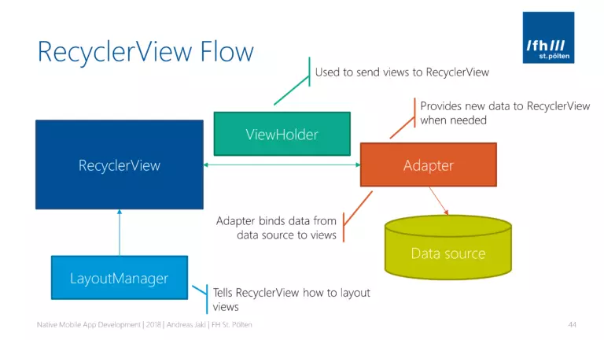
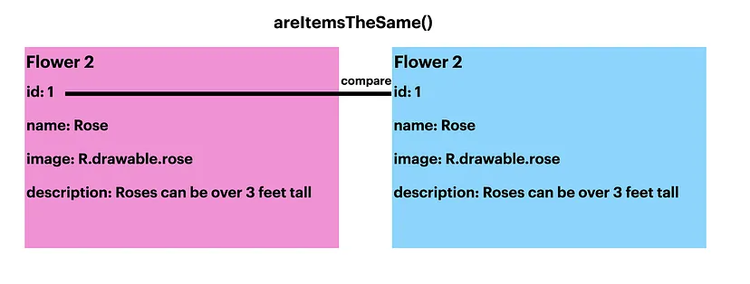
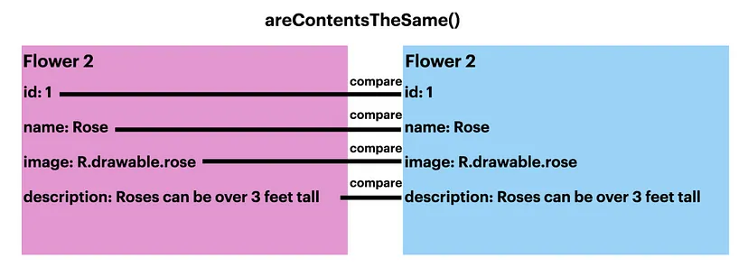

- [RecyclerView](#recyclerview)
  - [Ưu điểm](#ưu-điểm)
  - [Các thành phần](#các-thành-phần)
    - [RecyclerView.ViewHolder](#recyclerviewviewholder)
    - [RecyclerView.Adapter](#recyclerviewadapter)
    - [RecyclerView.LayoutManager](#recyclerviewlayoutmanager)
    - [RecyclerView.ItemAnimator](#recyclerviewitemanimator)
    - [Tái sử dụng](#tái-sử-dụng)
  - [Adapter và ListAdapter](#adapter-và-listadapter)
    - [ListAdapter](#listadapter)
    - [DiffUtil](#diffutil)
  - [RecyclerView Multiple View Type](#recyclerview-multiple-view-type)

# RecyclerView
- RecyclerView là một tiện ích (widget) trong Android, được cung cấp bởi Android Jetpack, và nó được sử dụng để hiển thị danh sách dữ liệu dạng danh sách (list) hoặc lưới (grid). Điểm nổi bật của RecyclerView là tính linh hoạt và hiệu năng cao hơn so với các tiện ích trước đây như ListView và GridView.
- RecyclerView cho phép hiển thị một tập dữ liệu lớn mà không cần tạo sẵn tất cả các view cho mỗi mục dữ liệu, thay vào đó nó duy trì số lượng view giới hạn và tái sử dụng chúng khi người dùng cuộn danh sách. Điều này giúp tiết kiệm tài nguyên và cải thiện hiệu năng của ứng dụng khi xử lý dữ liệu lớn.
- RecyclerView được sử dụng cùng với một Adapter để cung cấp dữ liệu cho các view trong danh sách. Adapter chịu trách nhiệm tạo các view và liên kết chúng với dữ liệu từ tập dữ liệu của ứng dụng.
- RecyclerView hỗ trợ cả hiển thị danh sách theo chiều dọc (Vertical RecyclerView) và theo chiều ngang (Horizontal RecyclerView), cũng như cách hiển thị dưới dạng lưới (Grid RecyclerView) và danh sách dạng bản đồ (Staggered Grid RecyclerView).
- Với tính linh hoạt và hiệu năng cao, RecyclerView là một thành phần quan trọng giúp xây dựng giao diện người dùng dựa trên danh sách dữ liệu một cách hiệu quả trong các ứng dụng Android.

## Ưu điểm
- Ưu điểm:
    - **Hiệu suất tốt**: RecyclerView được thiết kế để tái sử dụng các phần tử danh sách thông qua View Holder Pattern. Điều này giúp giảm việc tạo và hủy bỏ View liên tục, giúp tối ưu hóa hiển thị dữ liệu và tiết kiệm tài nguyên hệ thống.
    - **Linh hoạt và mở rộng**: RecyclerView cung cấp kiến trúc mô-đun giúp bạn tuỳ chỉnh cách hiển thị dữ liệu dễ dàng. Bạn có thể tạo các loại giao diện người dùng phức tạp và tùy chỉnh các trình xử lý sự kiện một cách linh hoạt.
    - **Hỗ trợ cho Animation**: RecyclerView hỗ trợ dễ dàng các hiệu ứng và hoạt hình khi thêm, xóa hoặc cập nhật các phần tử trong danh sách. Điều này giúp cải thiện trải nghiệm người dùng và làm cho ứng dụng trở nên sống động hơn.
    - **Quản lý cụm dữ liệu tự động**: RecyclerView hỗ trợ tính năng phân trang tự động thông qua các Adapter và LayoutManager. Điều này giúp hiển thị các phần tử dữ liệu theo cụm và giúp ứng dụng xử lý mượt mà các tập dữ liệu lớn.
    - **Tương thích ngược với ListView**: RecyclerView được tối ưu hóa để hỗ trợ tốt cả trên thiết bị cũ và mới, điều này giúp bạn tăng tương thích ngược và đảm bảo ứng dụng hoạt động trơn tru trên nhiều thiết bị Android.
    - **Đa dạng các kiểu view:** Hỗ trợ hiển thị nhiều loại view khác nhau trong cùng một RecyclerView bằng cách sử dụng Multiple View Types.
## Các thành phần 



- 4 thành phần của **RecyclerView**:
    - `RecyclerView.Adapter`
    - `RecyclerView.LayoutManager`
    - `RecyclerView.ViewHolder`
    - `RecyclerView.ItemAnimator`

- **RecyclerView**: Là một ViewGroup chứa các thành phần hiển thị tương ứng với dữ liệu
### RecyclerView.ViewHolder
  - `RecyclerView.ViewHolder` là một **abstract class** dùng để giữ các view của một phần tử trong **RecyclerView**.
  - Khi sử dụng **RecyclerView**, bạn cần tạo một lớp con kế thừa từ `RecyclerView.ViewHolder`. Lớp con này sẽ chứa các view liên quan đến giao diện của một phần tử.

### RecyclerView.Adapter
- **Recycle View** sẽ bao gồm một loại adapter mới, nó hoạt động tương tự với các loại adapter bạn đã sử dụng trước đó nhưng có một vài điểm khác biệt như yêu cầu `ViewHolder`. Và bạn sẽ phải `override` lại 3 phương thức chính:
    - `getItemCount()` : Số lượng item trong danh sách.
    - `onCreateViewHolder()` : Tạo một **ViewHolder** mới để hiển thị phần tử danh sách. Trong phương thức này, **Adapter** trả về bố cục **xml**.
    - `BindViewHolder()` : Mỗi khi **ViewHolder** được tạo trước đó được sử dụng lại, **RecyclerView** sẽ bảo **Adapter** cập nhật dữ liệu của nó.
### RecyclerView.LayoutManager
- `RecyclerView.LayoutManager` là một lớp trừu tượng (abstract class) dùng để quyết định cách **RecyclerView** hiển thị các phần tử trong danh sách hoặc lưới. **LayoutManager** quản lý việc sắp xếp và định vị các view của các phần tử trong **RecyclerView**, cho phép tuỳ chỉnh kiểu hiển thị và hướng cuộn của danh sách.
- Khi sử dụng **RecyclerView**, bạn cần cung cấp một **LayoutManager** cho nó để xác định cách sắp xếp và hiển thị dữ liệu:
    - **LinearLayoutManager**: là **LayoutManager** mặc định của **`RecyclerView`**. Nó hiển thị các phần tử trong danh sách theo chiều dọc hoặc ngang, tùy thuộc vào hướng cuộn của danh sách (có thể đặt hướng cuộn là **VERTICAL** hoặc **HORIZONTAL)**.
    - **GridLayoutManager**: **LayoutManager** này hiển thị các phần tử trong một lưới với số cột cố định (có thể đặt số cột cho lưới và hướng cuộn của danh sách).
    - **StaggeredGridLayoutManager**: Đây là một biến thể của **GridLayoutManager**, nó giúp hiển thị các phần tử trong một lưới với các cột có chiều cao khác nhau. Các phần tử có thể có chiều cao khác nhau, tạo ra hiệu ứng lưới không đều.
    - Ngoài ra có thể tạo các **LayoutManager** tùy chỉnh của riêng mình bằng cách kế thừa từ `RecyclerView.LayoutManager`. Điều này cho phép bạn triển khai các loại bố cục hiển thị phức tạp và tuỳ chỉnh hướng cuộn của danh sách theo ý muốn.

### RecyclerView.ItemAnimator

- `RecyclerView.ItemAnimator` là một lớp dùng để thêm hiệu ứng khi thay đổi các phần tử trong **RecyclerView**. Khi bạn thêm, xóa hoặc cập nhật các phần tử trong **RecyclerView**, **ItemAnimator** sẽ xử lý các hiệu ứng chuyển động của các phần tử này, giúp tạo ra các hoạt hình mượt mà và sống động.
- Khi bạn cập nhật dữ liệu trong `RecyclerView.Adapter` và gọi các phương thức như `notifyItemInserted()`, `notifyItemRemoved()`, `notifyItemChanged()`, `notifyItemMoved()`..., **RecyclerView** sẽ thông báo cho **ItemAnimator** để xác định hiệu ứng chuyển động cụ thể cho từng sự kiện.
- Một số **ItemAnimator**:
    - **DefaultItemAnimator**: là **ItemAnimator** mặc định được sử dụng khi bạn không cung cấp bất kỳ **ItemAnimator** nào. Nó cung cấp các hiệu ứng mặc định khi thêm, xóa và cập nhật các phần tử.
    - **FadeInAnimator**: **ItemAnimator** này áp dụng hiệu ứng mờ dần khi thêm phần tử.
    - **SlideInLeftAnimator** và **SlideInRightAnimator**: Đây là các **ItemAnimator** cho phép phần tử được thêm vào với hiệu ứng trượt vào từ phía trái hoặc phải.
    - **ScaleInAnimator**: **ItemAnimator** này áp dụng hiệu ứng phóng to khi thêm phần tử.
- Để sử dụng **ItemAnimator**, bạn cần gán **ItemAnimator** đã chọn vào **RecyclerView** thông qua phương thức `setItemAnimator()`.

### Tái sử dụng
- Khi mới khởi tạo **RecyclerView**, các item hiện hữu trên UI lúc này được gọi là **visible view**.
- Khi người dùng cuộn lên, các item phía dưới tuy không hiện hữu trước đó những đã được khởi tạo (gọi là **scrapped view**) sẽ được hiển thị lên UI (**dirty view**) mà không cần phải khởi tạo lại (hiệu suất được đảm bảo).
- Khi cuộn lên, các item phía trên cùng sẽ bị khuất đi, chúng sẽ trở thành **scrapped view** cùng với các item phía dưới cùng.

## Adapter và ListAdapter
- Có nhiều phương thức được sử dụng để thông báo khi có thay đổi nguồn dữ liệu trong **Adapter:**
    - `notifyItemChanged(int pos)` -> Thông báo khi dữ liệu ở 1 vị trí được thay đổi.
    - `notifyItemInserted(int pos)` -> Thông báo khi dữ liệu ở 1 vị trí được thêm mới.
    - `notifyItemRemoved(int pos)` -> Thông báo khi dữ liệu ở 1 vị trí bị gỡ bỏ.
    - `notifyDataSetChanged()` -> Thông báo khi dữ liệu bị thay đổi.
- Nhưng trong một số trường hợp bạn có danh sách lớn, mà thực hiện nhiều thao tác phức tạp trên đó không dễ gì để biết phần tử nào cần thông báo cho **RecyclerView** biết mà cập nhật hiển thị cho đúng , lúc đó nếu gọi `notifyDataSetChanged()` để cho biết toàn bộ dữ liệu đã đổi thì hiệu suất hoạt động của ứng dụng thấp làm giảm trải nghiệm người dùng.

- `Adapter:` `Adapter` là một lớp trung gian giữa dữ liệu và `RecyclerView.` Nó có nhiệm vụ kết nối dữ liệu từ nguồn (như một danh sách hoặc cơ sở dữ liệu) với các view mà RecyclerView hiển thị. Bạn cần triển khai phương thức `onCreateViewHolder`, `onBindViewHolder`, và `getItemCount` khi sử dụng Adapter.
- `ListAdapter:` `ListAdapter` là một phiên bản nâng cao của Adapter, được giới thiệu để đơn giản hóa việc quản lý danh sách dữ liệu trong RecyclerView. `ListAdapter` tích hợp sẵn cơ chế tính toán sự khác biệt `(DiffUtil)` giữa danh sách cũ và mới để cập nhật giao diện chỉ khi cần thiết, giúp tối ưu hóa hiệu năng khi làm việc với các danh sách lớn hoặc thay đổi liên tục.

### ListAdapter
- **ListAdapter** ra đời  giúp cho đơn giản hóa code cần thiết để làm việc với **RecyclerView** và có thể tự động lưu trữ list Item cũ và sử dụng **DiffUtil** để chỉ update những items có sự thay đổi.
- **ListAdapter** lấy dữ liệu bằng phương pháp có tên là `submitList()`, gửi danh sách để so sánh với danh sách hiện tại và hiển thị. Điều này có nghĩa là bạn không còn phải ghi đè `getItemCount()`vì **ListAdapter**quản lý danh sách.
- Trong **Adapter**,  `onBindViewHolder()`bây giờ có thể sử dụng `getItem()`để lấy các mục từ danh sách dữ liệu theo vị trí đã cho.

```Kotlin
  override fun onBindViewHolder(holder: ViewHolder, position: Int) {
        holder.onBind(getItem(position))
   }
```
### DiffUtil
- Về cơ bản **DiffUtil** tìm điểm khác nhau giữa 2 list và cung cấp output là list cập nhật, nó được sử dụng để thông báo cập nhật cho một adapter của ***RecyclerView***. Về cơ bản **DiffUtil** vẫn sử dụng các method của `RecyclerView.Adapter` để thông báo cho adapter cập nhật dư liệu như:
    - `notifyItemChange()`
    - `notifyItemMoved()`
    - `notifyItemInserted()`
- Sử dụng thuật toán của **Eugene W. Myers** để tính số cập nhật tối thiểu.
- `DiffUtil.Callback` là một lớp trừu tượng và được **DiffUtil** sử dụng làm lớp gọi lại trong khi tính toán sự khác biệt giữa hai danh sách.
- `DiffUtil.Callback` yêu cầu chúng ta `override` 2 hàm để thực hiện việc so sánh:
    - `areItemsTheSame(int oldItemPosition, int newItemPosition)` **:** Kiểm tra xem các mục riêng lẻ của danh sách có giống nhau không. Điều này có thể được thực hiện thông qua việc kiểm tra id chúng.
    

    - `areContentsTheSame(int oldItemPosition, int newItemPosition) `: Kiểm tra xem nội dung của dữ liệu danh sách có giống nhau không. Phương thức này được gọi bởi `DiffUtil` chỉ khi areItemsTheSame trả về `true`.
    
    

=> `getChangePayload(int oldItemPosition, int newItemPosition)` : Nếu areItemTheSame trả về true và areContentsTheSame trả về false, DiffUtil gọi phương thức này để trả về sự thay đổi.
- Ngoài ra còn 1 số hàm:
    - `getOldListSize()` **:** Trả về kích thước của danh sách cũ.
    - `getNewListSize()` **:** Trả về kích thước của danh sách mới.

## RecyclerView Multiple View Type
- RecyclerView hỗ trợ hiển thị nhiều loại view khác nhau trong cùng một danh sách thông qua việc sử dụng nhiều kiểu ViewHolder khác nhau. Bạn có thể xác định loại view cần hiển thị cho mỗi item bằng cách override phương thức `getItemViewType(int position)` trong Adapter. Điều này rất hữu ích khi bạn cần hiển thị các loại dữ liệu khác nhau trong một danh sách duy nhất, như các danh sách chứa cả tiêu đề, hình ảnh, và văn bản.