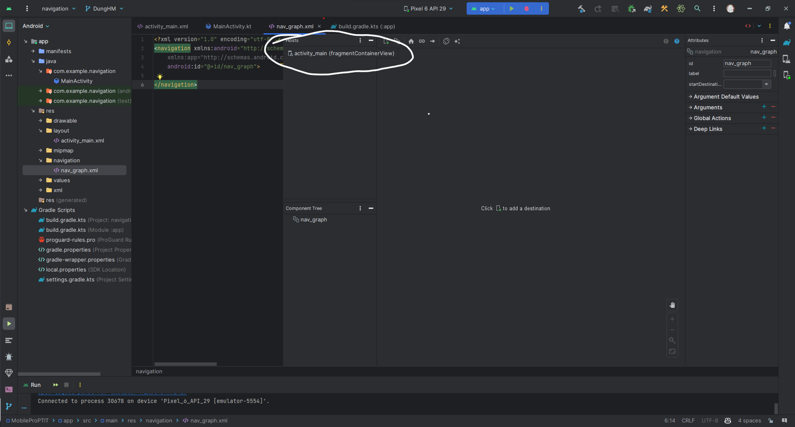

- [Navigation](#navigation)
  - [Navigation](#navigation-1)

# Navigation
## [Navigation](https://yellowcodebooks.com/2021/05/26/thong-thao-jetpack-phan-3-navigation/)

[Tham Khảo](https://yellowcodebooks.com/2021/06/09/thong-thao-jetpack-phan-4-navigation-tap-2/)
[Tham Khảo](https://yellowcodebooks.com/2021/06/24/thong-thao-jetpack-phan-5-navigation-tap-3/)


- Là một thư viện giúp chúng ta có thể dễ dàng nắm bắt, điều khiển đường đi của các Fragment. Chúng ta quản lý được một kịch bản đường đi của các Fragment, biết chúng bắt đầu từ Fragment nào, đi tiếp qua Fragment nào, kết thúc ở Fragment nào,… một cách trực quan bằng giao diện.
- **Lợi ích:**
    - Giúp bạn có một công cụ quản lý các tương tác giữa các Fragment.
    - Ngoài ra còn được *“miễn phí”* luôn các xử lý của việc nhấn ***back*** của người dùng (ngày xưa hệ thống cũng căn cứ vào back stack để giúp chúng ta rồi nhưng nhờ ***Navigation*** mà nay việc back này sẽ hợp lý hơn).
    - Có các resource cũng như các chuyển động theo chuẩn Android .
    - Một điều khá hay là ***Navigation*** này cũng sẽ hỗ trợ tốt cho deep linking.
    - Chúng ta có sẵn ***Navigation UI***, thành phần này giúp ***Navigation*** có thể làm việc tốt với các thể loại giao diện được xây dựng sẵn như ***Toolbar***, ***Navigation Drawers*** hay ***Bottom Navigation***.
    - Được hỗ trợ ***Safe Args*** giúp truyền dữ liệu qua các thành phần bên trong ***Navigation*** được an toàn hơn.
    - Có được sự cộng tác tốt với ***ViewModel***.
- Navigation được chia làm 3 phần: Navigation Graph, NavHost, NavController
### Navigation Graph
- Đây là một `resource XML` mới mà `Android` đã định nghĩa ra, nó giúp `Android Studio` vẽ lên một mô hình các màn hình. Mỗi một màn hình này được gọi với cái tên khá rõ ràng là `destination`. Các `destination` này có thể được liên kết với nhau bởi các `action`, mỗi `action` như vậy có thể cho chúng ta thông tin về đường đi trực quan giữa các `destination` với nhau.
- Các thành phần chính:
    - **Destination**: Đây là mỗi màn hình hoặc thành phần của ứng dụng mà bạn muốn điều hướng đến. Mỗi **Destination** có một ID duy nhất và có thể là **Fragment**, **Activity** hoặc một View trong layout.
    - **Action**: Đây là các hành động mà người dùng có thể thực hiện để chuyển đổi giữa các màn hình. Các hành động xác định từ **Destination** nguồn đến **Destination** đích. Mỗi hành động có một ID duy nhất và có thể chứa dữ liệu để truyền qua các màn hình.
    - **NavGraph**: Là khung chứa chứa tất cả các **Destination** và **Actions** của ứng dụng. **NavGraph** có thể là một **NavGraph** cha chứa nhiều **NavGraph** con, giúp bạn tổ chức ứng dụng của mình thành các phần nhỏ hơn dễ quản lý.
    - **Start Destination**: Đây là màn hình mà ứng dụng sẽ hiển thị khi khởi động ban đầu hoặc sau khi đặt lại điều hướng.
- Khi sử dụng `Navigation Graph` có thể xác định cách người dùng chuyển đổi giữa các màn hình bằng cách sử dụng hành động. Điều này giúp tạo ra một luồng điều hướng dễ dàng để theo dõi và duy trì, cũng có thể sử dụng `Safe Args` để truyền dữ liệu giữa các màn hình một cách an toàn.
- Hãy xem một `Navigation Graph` của một ứng dụng có `6 destination` và `5 action`


### NavHost
- **Navigation Host** là một khung chứa (**container**) được sử dụng để hiển thị các màn hình (**Fragments** hoặc **Activities**) trong ứng dụng dựa trên hành động điều hướng được xác định trong **Navigation Graph**.
- **Navigation Host** thường được sử dụng để hiển thị các màn hình **Fragment**, tạo điều kiện cho việc điều hướng một cách dễ dàng và linh hoạt.
- Có 2 loại **Navigation Host** chính:
    - **NavHostFragment**: là một **Fragment** đặc biệt được sử dụng làm **Navigation Host**, có thể thêm **NavHostFragment** vào layout của màn hình và liên kết nó với một **Navigation Graph**. **NavHostFragment** sẽ hiển thị các **Fragments** theo hành động điều hướng từ **Navigation Graph**.
    - **NavHostActivity**: là một **Activity** đặc biệt được sử dụng làm **Navigation Host**, có thể tạo một **NavHostActivity** và liên kết nó với một **Navigation Graph**. **NavHostActivity** sẽ hiển thị các **Activities** theo hành động điều hướng từ **Navigation Graph**.
### NavController
- Một đối tượng được xây dựng ra để giúp chúng ta điều khiển việc qua lại giữa các `destination` bên trong `NavHost`. Bởi vì dù có `Navigation Graph` giúp diễn đạt các `destination` lẫn `action`, có `NavHost` để hiển thị `destination` nào lên màn hình rồi, nhưng không có các dòng lệnh giúp thực thi các thay đổi hiển thị này thì không được, và `NavController` cung cấp cho chúng ta các công cụ để làm chuyện đó.
- Các phương thức chính:

| Phương thức | Chức năng |
| --- | --- |
| navigate() | Thực hiện một hành động điều hướng |
| onSupportNavigateUp() | Xử lý việc điều hướng khi người dùng ấn nút "Back" trên thiết bị |
| getCurrentDestination() | Trả về màn hình hiện tại đang được hiển thị trong Navigation Graph |
| addOnDestinationChangedListener() | Khai báo một listener lắng nghe sự kiện khi có sự thay đổi trong điều hướng |

### Cách sử dụng
#### Bước 1: Thêm thư viện
```Kotlin
// Kotlin
    implementation(libs.navigation.fragment.ktx)
    implementation(libs.androidx.navigation.navigation.ui.ktx)

    // Feature module Support
    implementation(libs.androidx.navigation.dynamic.features.fragment)

    // Testing Navigation
    androidTestImplementation(libs.androidx.navigation.testing)

    // Jetpack Compose Integration
    implementation(libs.androidx.navigation.compose)
```
#### Bước 2: Thêm vào Navigation Graph
- Tại thư mục `res`, Chọn `New` / `Android Resource File`
- Điền tên: nav_graph
- Trong `Resource Type`, chọn `Navigation`
- Giao diện sẽ như sau


Có  3 phần riêng biệt giúp chúng ta dễ dàng thao tác hơn.

- ***Destination panel***: là một thanh chứ đựng các ***destination***. ***Destination*** là gì thì mình có nói sơ qua ở phần trước rồi. Các ***destination*** bên trong Destination panel được chia ra thành hai nhóm, ***HOST*** và ***GRAPH***. Giao diện của mỗi nhóm này sẽ hơi khác với Android Studio của chúng ta một xíu, nhưng nó vẫn là một. Còn ý nghĩa của chúng là gì thì lát nữa trong quá trình tạo các ***destination*** chúng ta sẽ cùng tìm hiểu nhé. Nhưng dù cho các ***destination*** được chia nhóm như thế nào đi chăng nữa thì chúng cũng sẽ được vẽ vào bên trong vùng thứ 2 được nói đến tiếp theo đây.
- ***Graph Editor***: đây có thể nói là tinh túy của ***Navigation Graph***, một nơi giúp vẽ ra sự tương quan giữa các thành phần bên trong ***Navigation Graph*** này. Nên nhớ là editor dành cho resource này cũng có 3 tab giúp chúng ta dễ dàng chuyển đổi giữa việc xem cấu trúc của file theo dạng ***Code***, dạng ***Design*** hay dạng hỗn hợp ***Split*** nhé .
    

- ***Attributes***: nơi chứa đựng các tham số định nghĩa cho từng thành phần được chọn bên trong Graph Editor. Cụ thể các tham số này sẽ được mình nói rõ hơn khi tạo các thành phần tương ứng.

#### Bước 3: Thêm NavHost Vào Activity
```XML
<?xml version="1.0" encoding="utf-8"?>
<LinearLayout xmlns:android="http://schemas.android.com/apk/res/android"
    xmlns:app="http://schemas.android.com/apk/res-auto"
    xmlns:tools="http://schemas.android.com/tools"
    android:id="@+id/main"
    android:layout_width="match_parent"
    android:layout_height="match_parent"
    tools:context=".MainActivity">

    <androidx.fragment.app.FragmentContainerView
        android:id="@+id/fragmentContainerView"
        android:name="androidx.navigation.fragment.NavHostFragment"
        android:layout_width="match_parent"
        android:layout_height="match_parent"
        android:layout_weight="1"
        app:defaultNavHost="true"
        app:navGraph="@navigation/nav_graph" />

</LinearLayout>
```

- ***androidx.fragment.app.FragmentContainerView***: đây là một layout mới, được thiết kế ra để chứa đựng các Fragment.
- ***android:name***: định nghĩa rằng layout trên đây đang chứa thành phần ***NavHostFragment***. Nó giống như khi bạn khai báo fragment tĩnh vào trong một layout.
- ***android:navGraph***: thuộc tính giúp hệ thống biết ***NavHostFragment*** này chứa đựng ***nav_graph***.
- ***app:defaultNavHost***: thuộc tính này giúp hệ thống chặn nút system back cho chúng ta. System back là nút back của thiết bị. Bởi vì ***NavHostFragment*** của chúng ta sẽ chứa đựng rất nhiều ***destination*** trong đó, cũng giống như một trang Web chứa nhiều page con vậy, một khi người dùng đã đi qua các page, hay các ***destination***, rồi nhấn nút back của thiết bị, chúng ta mong muốn các ***destination*** trước đó sẽ được hiển thị trở lại. Khi đó cờ của thuộc tính này là ***true*** sẽ giúp ứng dụng của chúng ta phản ứng theo kịch bản như vậy. Còn nếu bạn khai báo là ***false***, khi nhấn back của thiết bị ở bất cứ ***destination*** con nào, cả một ***NavHost*** cũng sẽ trở về trạng thái trước đó (có thể khiến ứng dụng bị đóng luôn).

#### Bước 4: Thêm Destination Vào Navigation Graph
- Lúc bấy giờ nếu quay lại tab ***Design*** của ***Navigation Graph*** đang hiển thị `nav_graph`. Bạn sẽ thấy thông tin trong ***Destination panel*** thể hiện rằng `activity_main` chính là `Host` (là nơi chứa chấp)`nav_graph` này.



- Bước tiếp theo đây chúng ta sẽ xây dựng một kịch bản các ***destination*** ngay trên ***Navigation Graph*** này. Nếu như hướng dẫn trên editor, bạn hãy tìm và click lên icon có hình . Bạn sẽ thấy một popup sau xuất hiện.


- Đây là nơi mà chúng ta lựa chọn các ***destination*** nào sẽ được thêm vào. Và vì do chúng ta không có bất kỳ một ***Fragment*** hay ***destination*** nào sẵn có trong project hết nên popup này mới trống trơn như vậy. Bạn có thể chọn ***Create new destination*** để được dẫn đến các chọn lựa tạo một ***destination*** mong muốn. Hoặc bạn có thể chọn ***placeholder*** để tạo trước một ***destination*** giữ chỗ, rồi sau đó sẽ khai báo ***destination*** cụ thể cho ***placeholder*** này sau. Nhưng với mình thì mình nghĩ bạn nên đóng popup này lại, chúng ta chỉ làm quen với nó thôi. Chúng ta sẽ lần lượt tạo các Fragment cần thiết, rồi sẽ quay lại popup này, khi đó mọi chuyện sẽ dễ dàng hơn rất nhiều nhé.
- Tạo các Fragment và lần lượt thêm chúng vào nav_graph


- Lưu ý: Đó là luôn có một ***destination*** sẽ được đánh dấu với biểu tượng hình ngôi nhà, chỗ tiêu đề của nó. Mặc định ***destination*** được thêm vào đầu tiên sẽ được đánh dấu với biểu tượng này. Trong trường hợp này chính là ***homeFragment***.


- Bạn hoàn toàn có thể chỉ định ***destination*** khác sẽ là ngôi nhà, bằng cách chọn click một ***destination*** trong ***Navigation Editor*** rồi nhấn vào icon  ở phía trên editor này. Việc đánh dấu với icon này trên một ***destination***, là nhằm chỉ định rằng đây chính là ***start destination***. Một ***start destination*** sẽ là ***destination*** đầu tiên được nhìn thấy khi ứng dụng của chúng ta được mở lên, và cũng sẽ là ***destination*** cuối cùng mà người dùng sẽ nhìn thấy trước khi ứng dụng kết thúc (khi người dùng nhấn lần lượt các nút back).
- Có thể chỉnh sửa bằng code `app:startDestination="@id/"` thay vì kéo thả =))
```XML
<?xml version="1.0" encoding="utf-8"?>
<navigation xmlns:android="http://schemas.android.com/apk/res/android"
    xmlns:app="http://schemas.android.com/apk/res-auto"
    xmlns:tools="http://schemas.android.com/tools"
    android:id="@+id/nav_graph"
    app:startDestination="@id/homeFragment">

    <fragment
        android:id="@+id/homeFragment"
        android:name="com.example.navigation.HomeFragment"
        android:label="fragment_home"
        tools:layout="@layout/fragment_home" />
    <fragment
        android:id="@+id/profileFragment"
        android:name="com.example.navigation.ProfileFragment"
        android:label="fragment_profile"
        tools:layout="@layout/fragment_profile" />
    <fragment
        android:id="@+id/signInFragment"
        android:name="com.example.navigation.SignInFragment"
        android:label="fragment_sign_in"
        tools:layout="@layout/fragment_sign_in" />
    <fragment
        android:id="@+id/signUpFragment"
        android:name="com.example.navigation.SignUpFragment"
        android:label="fragment_sign_up"
        tools:layout="@layout/fragment_sign_up" />
</navigation>
```

- Chú ý một số thuộc tính:
    - `name`: tên class của Fragment
    - `label`: label cho fragment này, khi kết hợp với 1 bottomNav chẳng hạn thì nó sẽ dùng luôn cái label này
    - `app:startDestination:` thuộc tính này nằm ở ***navigation***, giúp hệ thống biết được ***destination*** nào chính là ***start destination***. Chính là ***destination*** có icon hình ngôi nhà mà bạn đã thấy bên tab ***Design*** trên kia.
    - `tools:layout:` sẽ chỉ định layout của Fragment được dùng hiển thị lên ở dạng xem trước bên tab ***Design***. Nếu bạn thay đổi layout nào khác cho bất kỳ ***destination*** nào ở bên đây, bạn sẽ thấy sự khác biệt bên tab ***Design***. Tuy nhiên mình không khuyến khích bạn sửa nhé, chỉ vọc chơi nếu thích rồi trả lại như cũ thôi.
#### Bước 5: Sử Dụng NavControlle
- **Gọi Ra Một NavController:**
    - Fragment.findNavController()
    - View.findNavController()
    - Activity.findNavController(viewId: **Int**)
- Dùng ***NavController*** Để Di Chuyển Đến ***Destination***
- ***Cách 1 – Di Chuyển Trực Tiếp Trên Navigation Graph***
```Kotlin
binding.btnViewProfile.setOnClickListener {
      findNavController().navigate(R.id.profileFragment)
}
```
- ***Cách 2 – Di Chuyển Bằng Action***
    - Mở tab design, click vào khung 1 fragment sẽ hiện cái chấm chấm. Kéo cái chấm chấm đấy đến đích mình cần
    


- Khi làm như vậy bên code sẽ xuất hiện thêm 1 id mới

```XML

<fragment
        android:id="@+id/homeFragment"
        android:name="com.example.navigation.HomeFragment"
        android:label="fragment_home"
        tools:layout="@layout/fragment_home" >
        <action
            android:id="@+id/action_homeFragment_to_profileFragment" 
            app:destination="@id/profileFragment" />
  </fragment>
```

- Và có thể chuyển màn hình bằng cách dùng ID đấy
```Kotlin
binding.btnViewProfile.setOnClickListener {
    findNavController().navigate(R.id.action_homeFragment_to_profileFragment)
}
```

### Truyền Data Qua Lại Giữa Các Destination
#### Cách 1 – Truyền Dữ Liệu Theo Bundle
- Tạo bundle giống Fragment 
```Kotlin
//Ở login_fragment
view.findViewById<Button>(R.id.btnViewProfile)?.setOnClickListener {
    val bundle = bundleOf(
        "name" to "My Name",
    )
    findNavController().navigate(R.id.action_homeFragment_to_profileFragment, bundle)
}

//Ở profile_fragment
override fun onViewCreated(view: View, savedInstanceState: Bundle?) {
    super.onViewCreated(view, savedInstanceState)

    val name = arguments?.getString("name")
    view.findViewById<TextView>(R.id.tvWelcome)?.text = getString(R.string.welcome, "$name")
}
```
#### Cách 2 – Sử Dụng Safe Args
- Trước khi sử dụng cần thêm thư viện
```XML
// Cho build.gradle project
buildscript {
    repositories {
        google()
    }
    dependencies {
        val nav_version = "2.7.7"
        classpath("androidx.navigation:navigation-safe-args-gradle-plugin:$nav_version")
    }
}

//Cho build.gradle module
plugins {
    id("androidx.navigation.safeargs")
}
```
- Sau khi khai báo các bước trên đây, hệ thống sẽ căn cứ vào project của chúng ta mà sẽ tạo ra một số lớp tương ứng.
- ***Safe Args*** là một cách thức truyền dữ liệu mới dùng trong ***Navigaton*** này. Sở dĩ gọi là ***Safe Args*** là vì đây là một kiểu truyền dữ liệu được đảm bảo ***type-safety***, tức là an toàn về kiểu dữ liệu.
- ***Safe Args*** là viết tắt của từ ***Safe Arguments***. ***Arguments*** sẽ thay thế ***Bundle*** (về mặt tên gọi thôi chứ thực ra chúng là một). Việc thay thế như thế nào thì trước hết chúng ta hãy cùng tạo một argument cho giá trị ***name*** nào.

- Trước hết bạn phải đảm bảo ***login_nav_graph*** đang được mở với tab ***Design***. Nhấn chọn vào profileFragment. Nhìn sang khung Attributes, tìm đến phần Arguments, xổ thành phần này ra, sau đó nhấn vào dấu + để bắt đầu thêm một argument.

- Cứ mỗi một ***destination*** mà có một ***action*** “dính” tới nó. Tức là một mũi tên từ nó trỏ ra. Sẽ có thêm một lớp mới tạo ra, với tên lớp là sự kết hợp giữa ***tên lớp của destination*** cộng với từ ***“Directions”***. Như vậy trong project của chúng ta giờ đây sẽ có thêm một lớp: ***HomeFragmentDirections***, vì chúng ta chỉ mới khai báo một ***action*** đi ra từ ***destination homeFragment*** thôi. Lớp này sẽ chứa đựng các phương thức chính là các action được định nghĩa bên trong ***destination*** này 
- Mỗi một phương thức ***action*** trên đây có tham số đầu vào chính là các argument cần truyền qua ***destination*** khác. Tên của phương thức này cũng chính là tên ***action***. Như vậy với việc khai báo một action với tên ***(id) là action_homeFragment_to_profileFragment***, chúng ta sẽ có phương thức kèm theo với tên ***actionHomeFragmentToProfileFragment()***, tham số truyền vào chính là một kiểu ***String*** có tên ***nameArg***.
- Cứ mỗi một ***destination*** mà có một ***argument*** “dính” tới nó. Tức là đây là ***destination*** nhận dữ liệu. Sẽ có thêm một lớp mới tạo ra, với tên lớp là sự kết hợp giữa tên lớp của ***destination*** cộng với từ “Args”. Như vậy trong project của chúng ta giờ đây sẽ có thêm một lớp: ***ProfileFragmentArgs***.

```Kotlin
//Bên chuyển
override fun onViewCreated(view: View, savedInstanceState: Bundle?) {
    super.onViewCreated(view, savedInstanceState)

    view.findViewById<Button>(R.id.btnViewProfile)?.setOnClickListener {
        val action = HomeFragmentDirections.actionHomeFragmentToProfileFragment(nameArg = "My Name")
        findNavController().navigate(action)
    }
}

// Bên nhận
val args: ProfileFragmentArgs by navArgs()

// ...

override fun onViewCreated(view: View, savedInstanceState: Bundle?) {
    super.onViewCreated(view, savedInstanceState)

    val name = args.nameArg
    view.findViewById<TextView>(R.id.tvWelcome)?.text = getString(R.string.welcome, "$name")
}
```

### Backstack
- Việc chuyển qua chuyển lại giữa các destination, đương nhiên sẽ được quản lý bởi Android thông qua 1 backstack.
- Destination đầu tiên được khởi tạo trong `NavHost` sẽ được tự động đặt vào trong stack khi mở app. Các destination sau, cứ mỗi cái được thêm thì sẽ được cho vào đỉnh stack.
- Ấn `Back` (nút vật lý/ảo của Android) hay `Up` (nút back của riêng app, nằm ở top-left) sẽ gọi `NavController.navigateUp()` và `NavController.popBackStack()` sẽ pop cái đỉnh của stack ra.
- `NavController.popBackStack()` trả về Boolean cho biết việc pop đỉnh có đc thực hiện thành công hay không. Đôi lúc nó sẽ là false, ví dụ như khi chúng ta ấn Back tại Start Destination. Ta sẽ cần phải sử dụng finish khi này:

```Kotlin
if (!navController.popBackStack()) {
    // Call finish() on your Activity
    finish()
}
```
- popUpTo và popUpToInclusive:
    - Khi cần pop nhiều hơn là 1 destination thì sao ? Ví dụ sau khi người dùng login thành công, chúng ta cần phải pop toàn bộ các destination liên quan tới việc login, không cho phép người dùng back về nữa.
    - Sử dụng: `app:popUpTo` để set destination mà ta cần giữ lại, và xoá đi hết tất cả các destination từ nó trở đi.
    - Nếu muốn xoá triệt để cả cái destination được sd ở `popUpTo`, gán thuộc tính: `app:popUpToInclusive="true"`


- Flow: A -> B -> C -> A
- Tại C chúng ta implement Action như sau:

```xml
<action
    android:id="@+id/action_c_to_a"
    app:destination="@id/a"
    app:popUpTo="@+id/a"
    app:popUpToInclusive="true"/>
```

- Với popUpTo chúng ta đã tiến hành xoá B và C, đồng thời còn xoá luôn cả A
- Nếu ở đây chúng ta không `popUpToInclusive="true"`, sẽ tồn tại tới 2 instance A trong BackStack.

## BottomNavigation

### Bước 1: Thêm dependency
// build.gradle (app)
dependencies {
    // ...
    implementation 'com.google.android.material:material:<version>'// ...
}
​
### B2: Thêm BotNavView vào layout
```XML
<?xml version="1.0" encoding="utf-8"?>
<RelativeLayout xmlns:android="http://schemas.android.com/apk/res/android"
    xmlns:app="http://schemas.android.com/apk/res-auto"
    xmlns:tools="http://schemas.android.com/tools"
    android:layout_width="match_parent"
    android:layout_height="match_parent"
    tools:context=".MainActivity">


    <androidx.fragment.app.FragmentContainerView
        android:id="@+id/fragmentContainerView"
        android:name="androidx.navigation.fragment.NavHostFragment"
        android:layout_width="0dp"
        android:layout_height="match_parent"
      
        app:defaultNavHost="true"
        app:navGraph="@navigation/nav_graph" />
    <com.google.android.material.bottomnavigation.BottomNavigationView
        android:id="@+id/bottom_navigation"
        android:layout_width="match_parent"
        android:layout_height="wrap_content"
        android:layout_alignParentBottom="true"
        app:menu="@menu/bottom_navigation_menu" />

</RelativeLayout>
```
### B3: Vẽ menu cho BotNavView
```XML
<!-- res/menu/bottom_navigation_menu.xml -->
<menu xmlns:android="http://schemas.android.com/apk/res/android">
    <item
        android:id="@+id/page_1"
        android:enabled="true"
        android:icon="@drawable/baseline_home_24"
        android:title="Home"/>
    <item
        android:id="@+id/page_2"
        android:enabled="true"
        android:icon="@drawable/baseline_man_24"
        android:title="User"/>
</menu>
```

### B4.1: Sử dụng onItemSelected (trường hợp đơn giản, không cần kết nối với một NavController)**

```kotlin
BottomNavigationView.setOnNavigationItemSelectedListener { item ->
    when(item.itemId) {
        R.id.item1 -> {
            // Respond to navigation item 1 click
            true
        }
        R.id.item2 -> {
            // Respond to navigation item 2 click
            true
        }
        else -> false
    }
}
```

Ngoài ra khi reselect: có `setOnNavigationItemReselectedListener`

### B4.2: Kết nối với NavController (trường hợp tổng quát)
```Kotlin
// MainActivity.kt
private fun setUpBottomNav() {

    /** 
    *   Trong MainActivity, có 2 thành phần là BottomNav và một cái container.
    *   Đầu tiên là lấy ra navController của container kia bằng cú pháp dưới:
    */
    navController =
        binding.navHostFragmentContainer.getFragment<NavHostFragment>().navController
    
    // Sau đó setupWithNavController(controller) trên BotNav
    binding.bottomNavigation.setupWithNavController(navController)

    // BONUS: Đây là hàm xử lý cho phép chúng ta ẩn đi thanh BotNav trong 1 số trường hợp cụ thể
    navController.addOnDestinationChangedListener { _, destination, _ ->
        if (destination.id == R.id.editUserFragment) {
            binding.bottomNavigation.visibility = View.GONE
        } else {
            binding.bottomNavigation.visibility = View.VISIBLE
        }
    }
}

// Ta có thể đặt title cho AppBar bằng label được cung cấp bên trong file Nav Graph thông qua cách sau
private fun setUpAppBar() {
    setupActionBarWithNavController(
        navController,
        // thêm một ý nhỏ là khi chuyển sang Item mới, sẽ xuất hiện một nút Back đầu thanh AppBar, để loại bỏ nó ta sẽ thêm vào một AppBarConfig:
        AppBarConfiguration(
            setOf(
                R.id.homeFragment,
                R.id.playFragment,
                R.id.settingFragment,
                R.id.editUserFragment
            )
        )
    )
}
```

## TabLayout
- Là một UI Component giúp chia một Layout ra làm nhiều Tab. Ví dụ như là Facebook có một số Tab như News Feed, Friends, Noti..


- **Tại sao sử dụng TabLayout**
    - Cho phép ta thêm một Tab programmatically, tức là không cần phải fixed cứng là cái TabLayout này có bao nhiêu Tab Con bên trong
    - Kết hợp với một `ViewPager2`: Một cái container cung cấp animation chuyển Tab rất smooth.
### Cách sử dụng, kết hợp với ViewPager2
- **Cố định số TabItem (Fixed)**
  - Bên trong TabLayout có thể bao gồm nhiều TabItem:
```XML
    <!-- MainActivity.xml -->
 <com.google.android.material.tabs.TabLayout
         android:layout_height="wrap_content"android:layout_width="match_parent">

     <com.google.android.material.tabs.TabItem
             android:text="@string/tab_text"/>

     <com.google.android.material.tabs.TabItem
             android:icon="@drawable/ic_android"/>

 </com.google.android.material.tabs.TabLayout>
 ```

- **Không cố định (Non-fixed)**
  - B1: Thêm TabLayout và ViewPager2 vào file layout
```XML
<!-- fragment_play.xml -->
<LinearLayout
    android:layout_width="match_parent"
    android:layout_height="match_parent"
    android:orientation="vertical">

    <com.google.android.material.tabs.TabLayout
        android:layout_width="match_parent"android:layout_height="wrap_content"/>

    <androidx.viewpager2.widget.ViewPager2
        android:layout_width="match_parent"android:layout_height="0dp"android:layout_weight="1" />

</LinearLayout>
```
​
  - B2: Viết Adapter quản lý TabLayout này
```Kotlin
// PlayFragment.kt
class PlayFragmentAdapter(fragment: Fragment) : FragmentStateAdapter(fragment) {
        override fun getItemCount(): Int = 2

        override fun createFragment(position: Int): Fragment {
            return when (position) {
                0 -> FavoriteFragment()
                1 -> ...
                2 -> ...
                else -> MyMusicFragment()
            }
        }
    }
```

  - B3: Liên kết Adapter với ViewPager, liên kết TabLayout với ViewPager

```Kotlin
// PlayFragment.kt
override fun onViewCreated(view: View, savedInstanceState: Bundle?) {
        super.onViewCreated(view, savedInstanceState)

        linkViewPagerWithTabLayout()
    }

    private fun linkViewPagerWithTabLayout() {
        binding.viewPager.adapter = PlayFragmentAdapter(this)

        // Sử dụng TabLayoutMediator để kết nối 2 thằng với nhau
        TabLayoutMediator(binding.tabLayout, binding.viewPager) { tab, position ->
            when (position) {
                0 -> tab.text = "Favourite"else -> tab.text = "My Music"
            }
        }.attach()
    }
```

### Chú ý:
- Số lượng TabItem chỉ nên từ 3 - 5 tab
### ViewPager2
- ViewPager2 được sử dụng để tạo giao diện trượt qua các nội dung khác nhau, chẳng hạn như các màn hình **Fragment** hoặc **Views**. Nó là phiên bản cải tiến và thay thế cho **ViewPager** trong **Android Support Library**, mang lại nhiều cải tiến và tính năng mới.
- **ViewPager2** có một số ưu điểm so với **ViewPager** trước đây, bao gồm:
    - **Hỗ trợ RecyclerView**: **ViewPager2** được xây dựng dựa trên RecyclerView, cho phép bạn sử dụng các tính năng mạnh mẽ của RecyclerView như Adapter, LayoutManager và Animation.
    - **Vertical Orientation (Hướng dọc)**: **ViewPager2** hỗ trợ chế độ trượt theo chiều dọc một cách dễ dàng, trong khi **ViewPager** gốc không hỗ trợ điều này.
    - **NotifyDataSetChanged() tự động**: Khi cập nhật dữ liệu trong **Adapter** của **ViewPager2**, không cần phải gọi **`notifyDataSetChanged()`** như khi sử dụng **ViewPager**. **ViewPager2** tự động xử lý cập nhật dữ liệu.
    - **Tích hợp với FragmentStateAdapter**: **ViewPager2** được thiết kế để hoạt động tốt với **`FragmentStateAdapter`**, giúp quản lý **Fragment** và vòng đời của chúng một cách hiệu quả.