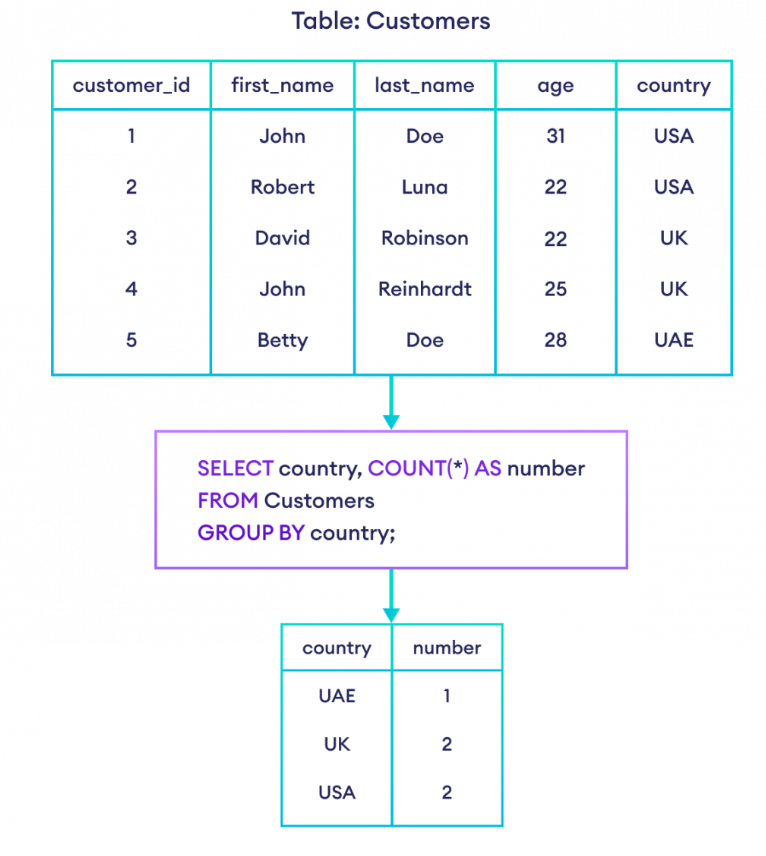

# Database
## CSDL là gì, CSDL quan hệ là gì?
- **Cơ sở dữ liệu** là một bộ sưu tập dữ liệu có hệ thống, được lưu trữ bằng điện tử. Nó có thể chứa bất kỳ loại dữ liệu nào, bao gồm từ, số, hình ảnh, video và tệp. 
- ***Cơ sở dữ liệu quan hệ*** là một loại cơ sở dữ liệu lưu trữ cung cấp quyền truy cập vào các điểm dữ liệu có liên quan đến nhau. Cơ sở dữ liệu quan hệ dựa trên mô hình dữ liệu quan hệ, một cách trực quan, đơn giản để biểu diễn dữ liệu trong bảng.
- ***Trong cơ sở dữ liệu quan hệ***, ***mỗi hàng*** trong bảng là một bản ghi với một `ID` duy nhất được gọi là khóa. Các cột của bảng chứa các thuộc tính của dữ liệu và mỗi bản ghi thường có một giá trị cho mỗi thuộc tính, giúp dễ dàng thiết lập mối quan hệ giữa các điểm dữ liệu.
### Cơ sở dữ liệu quan hệ bao gồm những thành phần nào?
#### Table: Bảng dữ liệu
- Đây là thành phần chính trong cơ sở dữ liệu quan hệ. Ở bảng dữ liệu sẽ chứa các thông tin như:


- ***Với:***
  - ***Field (Cột/Trường):*** là trường dữ liệu thể hiện các thuộc tính của bảng. Chẳng hạn như: tên, địa chỉ…vv.
  - ***Row (dòng):*** là dòng dữ liệu gồm các thông tin dữ liệu liên quan với nhau gọi là bảng record ( bảng ghi).
  - ***Cell (ô):*** là các ô giao giữa các dòng và cột là nơi để chứa các dữ liệu.
  - ***Primary Key (Khóa chính):*** là một hoặc nhiều trường được gộp lại để định nghĩa bảng ghi. Không được trùng và cũng không được để trống. Lấy ví dụ đơn giản để bạn hình dung giá trị 1 của trường customer ID thể hiện cho tất cả dữ liệu của dòng đầu tiên. Hay nói gọn là tất cả các giá trị của dòng đầu tiên là thuộc trường customer ID = 1.
> Khóa chính có thể có hoặc không trong bảng nhưng để thuận tiện và dễ dàng quản lý thường người ta sẽ đinh nghĩa khóa chính cho bảng.

#### Relationship: Mối quan hệ


- ***Thì:***
    - ***Foreign Key (Khóa ngoại):*** sẽ là trường ở bảng invoice này nhưng lại là khóa chính ở bảng customer kia, tạo nên một mối quan hệ giữa hai bảng với nhau.
    - ***Relationship (Mối quan hệ):*** sự kết nối giữa hai bảng để xác định mối liên quan giữa các trường dữ liệu. Cụ thể ví dụ như sau: để biết khách hàng mã số 1 đã mua những đơn hàng nào thì bạn cần xác định vào các mối quan hệ trên. Biểu hiện ở 3 dạng sau:
      - ***Mối quan hệ 1-1:*** Mỗi bảng ghi chỉ có một và một bảng tướng ứng mà thôi

      - ***Mối quan hệ 1-n:*** Mối quan hệ này khá phổ biến trong cơ sở dữ liệu. Trong mối quan hệ này thì 1 bảng ghi ở bảng này có thể có nhiều bảng ghi tương ứng ở bảng kia.

      - ***Mối quan hệ n-n:*** Trong mối quan hệ này thì 1 bảng ghi ở bảng này có thể có nhiều bảng ghi tương ứng ở bảng kia và ngược lại.

Đây là mô hình hóa để hiểu hơn về các mối quan hệ.


## SQL là gì?
- ***Ngôn ngữ truy vấn có cấu trúc (SQL)*** là một ngôn ngữ lập trình phục vụ việc lưu trữ và xử lý thông tin trong cơ sở dữ liệu quan hệ.
- ***Cơ sở dữ liệu quan hệ*** lưu trữ thông tin dưới dạng bảng có các hàng và cột đại diện cho những thuộc tính dữ liệu và nhiều mối quan hệ khác nhau giữa các giá trị dữ liệu. 
- Bạn có thể sử dụng các câu lệnh SQL để lưu trữ, cập nhật, loại bỏ, tìm kiếm và truy xuất thông tin từ cơ sở dữ liệu. Bạn cũng có thể sử dụng SQL để duy trì và tối ưu hóa hiệu suất cơ sở dữ liệu.

### Một hệ thống SQL gồm những thành phần gì?
- ***Bảng SQL***: Bảng SQL là phần tử cơ bản của cơ sở dữ liệu quan hệ. Bảng cơ sở dữ liệu SQL bao gồm các hàng và cột. Kỹ sư cơ sở dữ liệu tạo ra các mối quan hệ giữa nhiều bảng cơ sở dữ liệu để tối ưu hóa không gian kho lưu trữ dữ liệu.


- ***Câu lệnh SQL:*** Câu lệnh SQL, hoặc truy vấn SQL, là các lệnh hướng dẫn hợp lệ mà hệ thống quản lý cơ sở dữ liệu quan hệ hiểu được. Nhà phát triển phần mềm xây dựng các câu lệnh SQL bằng nhiều phần tử ngôn ngữ SQL khác nhau. Phần tử ngôn ngữ SQL là các thành phần như mã định danh, biến và điều kiện tìm kiếm tạo thành một câu lệnh SQL đúng.

```SQL
Giả sử câu lệnh SQL sau sử dụng lệnh SQL INSERT để lưu trữ Đệm thương hiệu A có giá 499 USD vào bảng có tên Mattress_table với các cột tên brand_name và cost:

INSERT INTO Mattress_table (brand_name, cost)

VALUES(‘A’,’499’);
```
- ***Quy trình được lưu trữ:*** là tập hợp bao gồm một hoặc nhiều câu lệnh SQL được lưu trữ trong cơ sở dữ liệu quan hệ. 
  - Nhà phát triển phần mềm sử dụng các quy trình được lưu trữ để cải thiện hiệu quả và hiệu suất. 
  - Ví dụ: họ có thể tạo một quy trình được lưu trữ để cập nhật bảng bán hàng thay vì viết cùng một câu lệnh SQL trong nhiều ứng dụng khác nhau. 

### MySQL
- MySQL là một hệ thống quản lý cơ sở dữ liệu quan hệ nguồn mở do Oracle cung cấp. Nhà phát triển có thể tải xuống và sử dụng 
- MySQL mà không phải trả phí cấp phép. Họ có thể cài đặt MySQL trên nhiều hệ điều hành hoặc máy chủ đám mây khác nhau. 
- MySQL là một hệ thống cơ sở dữ liệu phổ biến cho các ứng dụng web. 

#### SQL so với MySQL
- Ngôn ngữ truy vấn có cấu trúc (SQL) là một ngôn ngữ tiêu chuẩn để tạo và thao tác với cơ sở dữ liệu. 
- MySQL là một chương trình cơ sở dữ liệu quan hệ sử dụng các truy vấn SQL. 
- Các lệnh SQL được quy định theo tiêu chuẩn quốc tế, còn phần mềm MySQL thì được nâng cấp và cải tiến liên tục.

## Database là gì? Table là gì?
### Database
- ***Database*** là cơ sở dữ liệu, là một bộ sưu tập dữ liệu được tổ chức bày bản và thường được truy cập từ hệ thống máy tính hoặc tồn tại dưới dạng tập tin trong hệ quản trị cơ sở dữ liệu. 
- ***Database*** còn có thể được lưu trữ trên thiết bị có chức năng ghi nhớ như: thẻ nhớ, đĩa cứng, CD…
#### Vai trò của Database
- Chúng giúp người dùng thành công trong việc kết nối các dữ liệu.
- Người dùng có thể truy cập hệ cơ sở dữ liệu nhanh chóng và dễ dàng hơn.
- Database chính là cơ sở nguồn để người dùng có thể truy xuất ra những thông tin cần thiết.
- Đặc điểm chính của Database chính là truy xuất ra những thông tin, dữ liệu bằng nhiều phương thức khác nhau.
- Các nội dung truy xuất được đảm bảo toàn vẹn dữ liệu ở mức độ cao.
- Đồng thời, nguồn thông tin khi xuất ra hoàn toàn không bị trùng lặp, nếu có thì xác suất cũng rất thấp. 
- Một cơ sở dữ liệu Database cho phép nhiều người dùng đồng thời truy cập trong cùng một thời gian.

#### Các mô hình Database phổ biến hiện nay
- ***Cơ sở dữ liệu Database dạng File:*** Database dạng File là dạng thường gặp nhất và cũng là mô hình phổ biến nhất hiện nay.
  - Cơ sở dữ liệu dạng File thường gặp nhất chính là `*.mdb` Foxpro.
  - Bên cạnh đó, cơ sở dữ liệu này còn bao gồm những định dạng khác như text, dạng file ascii, dạng file *.dbf…
- ***Cơ sở dữ liệu Database quan hệ:*** Đây cũng là một trong những mô hình dữ liệu được sử dụng rộng rãi nhất hiện nay.
  - Ở mô hình này, các thực thể khác nhau, tức các nguồn dữ liệu khác nhau sẽ cùng được quy hợp, lưu trữ cùng một bảng dữ liệu và các dữ liệu này phải có quan hệ với nhau. 
  -  Một vài cơ sở dữ liệu nổi tiếng có hỗ trợ Database quan hệ có thể kể đến như: Oracle, MS SQL Server, MySQL…
-  ***Cơ sở dữ liệu hướng đối tượng:*** Hệ cơ sở dữ liệu này cũng là một bảng dữ liệu thuần. Tuy nhiên, Database bổ sung thêm các trường hợp hướng đối tượng khác như: hành vi đối tượng nhằm thể hiện hành vi của đối tượng.
   -  Các đối tượng này cũng được phân cấp rất rõ ràng, mỗi cấp được gọi là một lớp dữ liệu.
   -  Hiểu một cách đơn giản hơn, chúng là tập hợp các nhóm đối tượng trong cùng một bảng và được thể hiện bằng dòng dữ liệu.
   -  Hiểu một cách đơn giản hơn, chúng là tập hợp các nhóm đối tượng trong cùng một bảng và được thể hiện bằng dòng dữ liệu.
-  ***Database bán cấu trúc:*** Cơ sở dữ liệu Database bán cấu trúc có thể lưu trữ nhiều dạng dữ liệu khác nhau. Và các thông tin, dữ liệu này thường được lưu trữ dưới định dạng XML. 
   - Ở mô hình này, các thông tin mô tả dữ liệu và đối tượng đều được trình bày trong các thẻ tag.
   - Nhờ vào ưu điểm nổi bật này, hệ cơ sở dữ liệu vừa được mở rộng, vừa tiện lợi giúp người dùng có thể dễ dàng truy xuất những thông tin cần thiết. 
   - Theo các chuyên gia nghiên cứu, Database bán cấu trúc có thể sẽ là hướng đi mới đầy tiềm năng trong các lĩnh vực ứng dụng công nghệ dữ liệu.

### Table
- Bảng là thành phần cơ bản nhất trong một cơ sở dữ liệu, và hầu hết các thao tác trong cơ sở dữ liệu như thêm, sửa, xóa, và truy vấn dữ liệu đều được thực hiện trên các bảng.
- Một ***bảng (table)*** là một cấu trúc dữ liệu được tổ chức dưới dạng lưới gồm các ***hàng (rows)*** và ***cột (columns)***. 
- Mỗi bảng lưu trữ một tập hợp các dữ liệu liên quan và tương tự như một bảng tính (spreadsheet) trong Excel.
- Ngoài ra bảng sẽ lưu thông tin mối quan hệ của các bảng với nhau.
- Một CSDL có thể được tạo từ nhiều bảng.
- ***Cấu trúc của Table***
  - ***Cột (Column):***
    - Mỗi cột trong bảng đại diện cho một thuộc tính của dữ liệu, ví dụ: `Tên, Tuổi, Địa chỉ, Ngày sinh, v.v.`
    - Mỗi cột có một tên duy nhất và một kiểu dữ liệu `(ví dụ: số nguyên, chuỗi văn bản, ngày tháng, v.v.).`
  - ***Hàng (Row):***
    - Mỗi hàng đại diện cho một bản ghi (record) trong bảng.
    - Một hàng chứa các giá trị dữ liệu tương ứng cho mỗi cột. Ví dụ, một hàng có thể chứa thông tin về một sinh viên cụ thể như `Nguyễn Văn A, 20, Hà Nội, 2004-01-01.`

- Ví dụ về 1 mảng `SinhVien`

| MaSV | HoTen        | NgaySinh   | GioiTinh | Lop    |
| ---- | ------------ | ---------- | -------- | ------ |
| 1    | Nguyễn Văn A | 2000-01-01 | Nam      | CNTT01 |
| 2    | Trần Thị B   | 2000-02-02 | Nữ       | CNTT01 |
| 3    | Phạm Văn C   | 2000-03-03 | Nam      | CNTT02 |

- ***Các Thuộc Tính của Bảng:***
  - ***Khóa chính (Primary Key):*** Cột hoặc tập hợp các cột có giá trị duy nhất để xác định một bản ghi trong bảng. Ví dụ, cột MaSV trong bảng SinhVien có thể là khóa chính.
  - ***Khóa ngoại (Foreign Key):*** Một cột hoặc tập hợp các cột liên kết bảng này với bảng khác, thường để thực thi mối quan hệ giữa các bảng.

### Cách tạo database, table trong MySQL
```SQL
CREATE DATABASE <Tên DB>; // Tạo DB
USE <Tên DB vừa tạo>;
CREATE TABLE <Tên bảng> (
    <field1> <kiểu dữ liệu> PRIMARY KEY, // Xác định Primary key
    <field1> <kiểu dữ liệu> ,
    <field1> <kiểu dữ liệu> ,
    <field1> <kiểu dữ liệu> ,
    <field1> <kiểu dữ liệu> ,
);

ví dụ

CREATE DATABASE QuanLySinhVien;
CREATE DATABASE QuanLySinhVien;
CREATE TABLE SinhVien (
    MaSV INT PRIMARY KEY,
    HoTen NVARCHAR(100),
    NgaySinh DATE,
    GioiTinh NVARCHAR(10),
    Lop NVARCHAR(50)
);

```
## INSERT, UPDATE, DELETE để thao tác với dữ liệu
- Câu lệnh ***INSERT*** được dùng để thêm dữ liệu mới vào bảng trong cơ sở dữ liệu.

```SQL
INSERT INTO table_name (column1, column2, column3, ...)
VALUES (value1, value2, value3, ...);

Giả sử bạn có một bảng students với các cột id, name, và age, câu lệnh sau sẽ thêm một sinh viên mới vào bảng:

INSERT INTO students (id, name, age)
VALUES (1, 'John Doe', 20);
```
- Câu lệnh ***UPDATE*** được dùng để cập nhật dữ liệu hiện có trong bảng.

```SQL
UPDATE table_name
SET column1 = value1, column2 = value2, ...
WHERE condition;

UPDATE students
SET age = 21
WHERE id = 1;
```
- Phần ***WHERE*** xác định các bản ghi nào sẽ được cập nhật. Nếu bỏ qua ***WHERE***, tất cả các bản ghi trong bảng sẽ bị thay đổi.


- Câu lệnh ***DELETE*** được dùng để xóa dữ liệu từ bảng.

```SQL
DELETE FROM table_name
WHERE condition;

DELETE FROM students
WHERE id = 1;
```

> Khi sử dụng UPDATE và DELETE, bạn nên cẩn thận với câu lệnh WHERE để tránh cập nhật hoặc xóa nhầm các bản ghi.

> Nên sử dụng câu lệnh SELECT trước khi thực hiện UPDATE hoặc DELETE để kiểm tra các bản ghi sẽ bị ảnh hưởng.

- Nếu muốn xóa tất cả bản ghi trong bảng ***DELETE FROM <Tên bảng>***;

- Nếu muốn xóa toàn bộ bảng (bao gồm cả cấu trúc bảng): ***DROP TABLE <Tên bảng>;***

## câu lệnh SELECT để truy vấn đọc dữ liệu: cú pháp cơ bản, các điều kiện: WHERE, LIMIT, ORDER BY

- Câu lệnh ***SELECT*** là một trong những câu lệnh quan trọng và được sử dụng nhiều nhất trong SQL để truy vấn và đọc dữ liệu từ các bảng trong cơ sở dữ liệu. 

```SQL
SELECT column1, column2, ... <Tên cột, hoặc tất cả *>
FROM table_name;

// Lọc theo điều kiện
SELECT column1, column2, ...
FROM table_name
WHERE condition;
```

- Câu lệnh ***ORDER BY*** được sử dụng để sắp xếp kết quả truy vấn theo một hoặc nhiều cột.

```SQL
SELECT column1, column2, ...
FROM table_name
ORDER BY column1 [ASC|DESC], column2 [ASC|DESC], ...;
```

- Câu lệnh ***LIMIT*** được sử dụng để giới hạn số lượng bản ghi được trả về từ một truy vấn.

```SQL
SELECT column1, column2, ...
FROM table_name
LIMIT number;
```
- Kết hợp các điều kiện ***WHERE, ORDER BY, và LIMIT***
```SQL
SELECT * FROM employees
WHERE department = 'Sales'
ORDER BY salary DESC
LIMIT 3;
```
## Điều kiện GROUP BY và HAVING, Các loại JOIN 
### [GROUP BY và HAVING](https://blog.tomorrowmarketers.org/group-by-having-sql/)
[Tham Khảo 2](https://quantrimang.com/hoc/menh-de-group-by-trong-sql-server-147832)
- ***GROUP BY*** dùng để nhóm các dòng dữ liệu theo 1 hoặc nhiều đối tượng.
- ***GROUP BY*** thường được sử dụng với các hàm tổng hợp như ***COUNT(), MAX(), MIN(), SUM(). AVG()***



- Syntax của ***GROUP BY***
```SQL
SELECT colom_name(s)
FROM table_name
WHERE condition
GROUP BY column_name(s)
```
- ***GROUP BY*** thực hiện theo thứ tự
  - `Chia nhóm`: tập dữ liệu được chia thành các hàng theo 1 hoặc nhiều đối tượng
  - `Thực hiện các phép tổng hợp`: Ví dụ tính giá trị trung bình/min/max hoặc trả về giá trị duy nhất của nhóm đối tượng đó
  - `Trả về kết quả theo nhóm`: Tất cả các kết quả đầu ra này được kết hớp trong một bảng duy nhất.
```SQL
Đếm số lượng nhân viên trong mỗi bộ phận:
SELECT department, COUNT(*) AS num_employees
FROM employees
GROUP BY department;

Tính tổng lương của mỗi bộ phận:

SELECT department, SUM(salary) AS total_salary
FROM employees
GROUP BY department;

```
- ***Câu lệnh HAVING***
  - ***HAVING*** được sử dụng để lọc kết quả sau khi đã thực hiện ***GROUP BY***. 
  - Điều này tương tự như ***WHERE***, nhưng ***WHERE***được sử dụng để lọc dữ liệu trước khi nhóm, trong khi ***HAVING*** được sử dụng sau khi nhóm.

```SQL
SELECT column1, aggregate_function(column2)
FROM table_name
WHERE condition
GROUP BY column1
HAVING condition;
```
- Ví dụ Chỉ lấy các bộ phận có hơn 5 nhân viên:
```SQL
SELECT department, COUNT(*) AS num_employees
FROM employees
GROUP BY department
HAVING COUNT(*) > 5;

Tính tổng lương của mỗi bộ phận và chỉ hiển thị các bộ phận có tổng lương trên 20000:

SELECT department, SUM(salary) AS total_salary
FROM employees
GROUP BY department
HAVING SUM(salary) > 20000;
```
### Kết hợp GROUP BY và HAVING với ORDER BY
- Bạn có thể kết hợp **GROUP BY**, **HAVING**, và **ORDER BY** để nhóm dữ liệu, lọc kết quả, và sau đó sắp xếp kết quả theo một thứ tự nhất định.
- Đếm số lượng nhân viên trong mỗi bộ phận, chỉ lấy các bộ phận có hơn 5 nhân viên và sắp xếp theo số lượng nhân viên giảm dần:

```SQL
SELECT department, COUNT(*) AS num_employees
FROM employees
GROUP BY department
HAVING COUNT(*) > 5
ORDER BY num_employees DESC;
```

### Các loại JOIN
- ***JOIN*** là phép kết nối dữ liệu từ nhiều bảng lại với nhau, nối 2 bảng, 3 bảng.. với nhau. Khi bạn cần truy vấn các cột dữ liệu từ nhiều bảng khác nhau để trả về trong cùng một tập kết quả , bạn cần dùng ***JOIN***. 2 bảng kết nối được với nhau khi có 1 trường chung giữa 2 bảng này.
- ***INNER JOIN (Hoặc JOIN):*** Trả về tất cả các hàng khi có ít nhất một giá trị ở cả hai bảng

```SQL
SELECT column_name(s)
FROM table1
INNER JOIN table2
ON table1.column_name = table2.column_name;

INNER JOIN nhiều table

SELECT column_list
FROM table1
INNER JOIN table2 ON join_condition1
INNER JOIN table3 ON join_condition2

```

- ***LEFT OUTER JOIN (Hoặc LEFT JOIN):*** Trả lại tất cả các dòng từ bảng bên trái, và các dòng đúng với điều kiện từ bảng bên phải


```SQL
SELECT column_name(s)
FROM table1
LEFT JOIN table2
ON table1.column_name = table2.column_name;

LEFT JOIN cũng có thể join nhiều table

SELECT column_list
FROM table1
LEFT JOIN table2 ON join_condition1
LEFT JOIN table3 ON join_condition2
```
- ***RIGHT OUTER JOIN (Hoặc RIGHT JOIN):*** Trả lại tất cả các hàng từ bảng bên phải, và các dòng thỏa mãn điều kiện từ bảng bên trái


```SQL
SELECT column_name(s)
FROM table1
RIGHT JOIN table2

ON table1.column_name = table2.column_name;

RIGHT JOIN cũng có thể join nhiều table
SELECT column_list
FROM table1
RIGHT JOIN table2 ON join_condition1
RIGHT JOIN table3 ON join_condition2
```

- ***FULL OUTER JOIN (Hoặc OUTER JOIN):*** Trả về tất cả các dòng đúng với 1 trong các bảng.

```SQL
SELECT column_name(s)
FROM table1
FULL OUTER JOIN table2
ON table1.column_name = table2.column_name
WHERE condition;
```
- ***Ví dụ***
***`Bảng employees`***

| id  | name    | department_id | manager_id |
| --- | ------- | ------------- | ---------- |
| 1   | Alice   | 1             | 3          |
| 2   | Bob     | 2             | 3          |
| 3   | Charlie | NULL          | NULL       |
| 4   | David   | 1             | 3          |

***`Bảng departments`***

| id  | name       |
| --- | ---------- |
| 1   | HR         |
| 2   | IT         |
| 3   | Management |

- **INNER JOIN**
```SQL
SELECT employees.name AS Employee, departments.name AS Department
FROM employees
INNER JOIN departments ON employees.department_id = departments.id;
```
**Kết quả:**
| Employee | Department |
| -------- | ---------- |
| Alice    | HR         |
| Bob      | IT         |
| David    | HR         |

- **LEFT JOIN (LEFT OUTER JOIN)**
```SQL
SELECT employees.name AS Employee, departments.name AS Department
FROM employees
LEFT JOIN departments ON employees.department_id = departments.id;
```

| Employee | Department |
| -------- | ---------- |
| Alice    | HR         |
| Bob      | IT         |
| Charlie  | NULL       |
| David    | HR         |

- **RIGHT JOIN (RIGHT OUTER JOIN)**
```SQL
SELECT employees.name AS Employee, departments.name AS Department
FROM employees
RIGHT JOIN departments ON employees.department_id = departments.id;
```

| Employee | Department |
| -------- | ---------- |
| Alice    | HR         |
| Bob      | IT         |
| David    | HR         |
| NULL     | Management |

- **FULL OUTER JOIN**

```SQL
SELECT employees.name AS Employee, departments.name AS Department
FROM employees
FULL OUTER JOIN departments ON employees.department_id = departments.id;
```

| Employee | Department |
| -------- | ---------- |
| Alice    | HR         |
| Bob      | IT         |
| Charlie  | NULL       |
| David    | HR         |
| NULL     | Management |