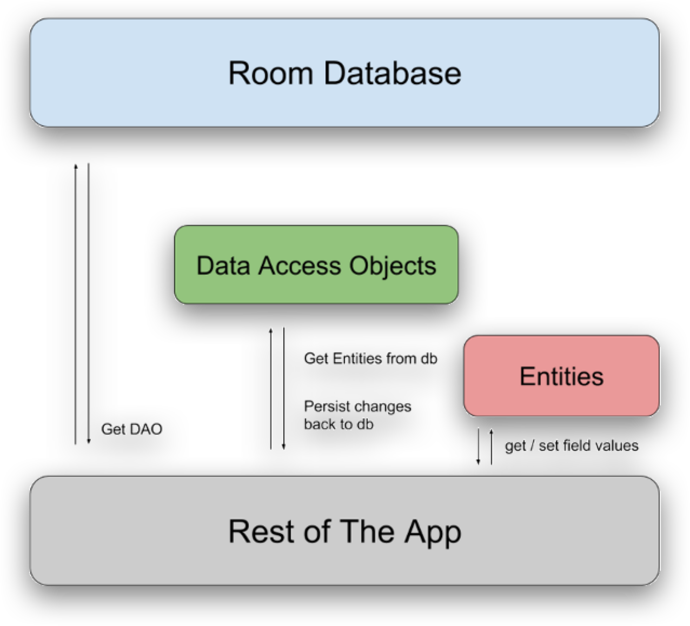

- [RoomDatabase](#roomdatabase)
  - [So sánh SQLite và MySQL](#so-sánh-sqlite-và-mysql)
    - [Kiến trúc và Triển khai:](#kiến-trúc-và-triển-khai)
    - [Hiệu năng và Khả năng mở rộng:](#hiệu-năng-và-khả-năng-mở-rộng)
    - [Tính năng và Hỗ trợ:](#tính-năng-và-hỗ-trợ)
    - [Sử dụng và Ứng dụng:](#sử-dụng-và-ứng-dụng)
    - [Bảo mật:](#bảo-mật)
  - [Room database là gì? Cách tạo Room Database trong Android](#room-database-là-gì-cách-tạo-room-database-trong-android)
    - [Các thành phần trong Room](#các-thành-phần-trong-room)
      - [Entity](#entity)
      - [DAO](#dao)
      - [RoomDatabase](#roomdatabase-1)
    - [Cách sử dụng](#cách-sử-dụng)
      - [Tạo Entity](#tạo-entity)
      - [Tạo DAO](#tạo-dao)
      - [Tạo RoomDatabase](#tạo-roomdatabase)

# RoomDatabase
## So sánh SQLite và MySQL
- ***SQLite*** và ***MySQL*** đều là hệ quản trị cơ sở dữ liệu quan hệ (RDBMS) phổ biến, nhưng chúng có những điểm khác biệt quan trọng về cách thức hoạt động, ứng dụng và tính năng.
### Kiến trúc và Triển khai:
- ***SQLite***
  - ***SQLite*** là một thư viện phần mềm cung cấp một cơ sở dữ liệu quan hệ dạng nhúng, tức là toàn bộ cơ sở dữ liệu được lưu trữ trong một tệp duy nhất trên hệ thống tệp của máy tính. 
  - Không cần cài đặt một máy chủ cơ sở dữ liệu riêng biệt; ứng dụng có thể trực tiếp sử dụng SQLite thông qua các hàm API.
  - ***SQLite*** phù hợp với các ứng dụng nhỏ gọn, di động, hoặc khi cần cơ sở dữ liệu đơn giản mà không cần các tính năng phức tạp của một hệ quản trị cơ sở dữ liệu lớn.
- ***MySQL:***
    - ***MySQL*** là một hệ quản trị cơ sở dữ liệu máy chủ (server-based), nơi dữ liệu được lưu trữ trên một máy chủ riêng biệt và ứng dụng giao tiếp với cơ sở dữ liệu thông qua một giao thức mạng.
    - ***MySQL*** yêu cầu cài đặt một máy chủ cơ sở dữ liệu và thường được sử dụng trong các ứng dụng web hoặc doanh nghiệp, nơi cần quản lý lượng dữ liệu lớn và nhiều người dùng truy cập đồng thời.
    - ***MySQL*** có khả năng mở rộng và hỗ trợ nhiều tính năng nâng cao như replication, clustering, và bảo mật.

### Hiệu năng và Khả năng mở rộng:
- ***SQLite:***
    - ***SQLite*** hiệu quả cho các ứng dụng nhỏ với lượng dữ liệu không quá lớn và số lượng truy cập đồng thời hạn chế.
    - ***SQLite*** không thích hợp cho các ứng dụng yêu cầu xử lý lượng dữ liệu lớn hoặc có nhiều người dùng truy cập đồng thời, vì nó không hỗ trợ đồng thời một cách mạnh mẽ như MySQL.

- ***MySQL:***
    - ***MySQL*** có khả năng mở rộng cao, phù hợp cho các ứng dụng lớn với nhiều người dùng truy cập đồng thời và lượng dữ liệu lớn.
    - ***MySQL*** hỗ trợ các tính năng tối ưu hóa và cấu hình phức tạp, giúp cải thiện hiệu năng trong các tình huống tải cao.
### Tính năng và Hỗ trợ:
- ***SQLite:***
    - ***SQLite*** hỗ trợ phần lớn các tính năng SQL cơ bản nhưng thiếu một số tính năng nâng cao như stored procedures, triggers phức tạp, và người dùng hay quyền hạn phức tạp.
    - Do ***SQLite*** là cơ sở dữ liệu đơn tệp, việc sao lưu và di chuyển dữ liệu rất đơn giản.

- ***MySQL:***
    - ***MySQL*** hỗ trợ đầy đủ các tính năng SQL, bao gồm stored procedures, triggers, views, và hỗ trợ nhiều kiểu dữ liệu phức tạp.
    - ***MySQL*** cũng cung cấp các công cụ quản trị mạnh mẽ, bảo mật tốt hơn, và các cơ chế sao lưu, phục hồi dữ liệu hiệu quả.
### Sử dụng và Ứng dụng:
- ***SQLite:***
    - Thường được sử dụng trong các ứng dụng di động (như iOS, Android), các ứng dụng máy tính để bàn nhỏ, hoặc các hệ thống nhúng.
    - Thích hợp cho việc phát triển và thử nghiệm, nơi sự đơn giản và dễ sử dụng được ưu tiên.

- ***MySQL:***

    - Phổ biến trong các ứng dụng web, hệ thống quản lý nội dung (CMS) như WordPress, Drupal, và các ứng dụng thương mại điện tử.
    - Thích hợp cho các ứng dụng doanh nghiệp yêu cầu tính nhất quán, độ tin cậy và khả năng mở rộng cao.
### Bảo mật:
- ***SQLite:***
    - ***SQLite*** không có mô hình người dùng hoặc quyền hạn phức tạp như MySQL. Bảo mật chủ yếu dựa trên quyền truy cập hệ thống tệp của hệ điều hành.

- ***MySQL:***
    - ***MySQL*** có mô hình bảo mật phức tạp, hỗ trợ nhiều người dùng với các quyền hạn khác nhau. Nó cũng hỗ trợ mã hóa dữ liệu và kết nối SSL.
>***SQLite*** phù hợp cho các dự án nhỏ, di động, hoặc các ứng dụng không yêu cầu quản lý dữ liệu phức tạp.
***MySQL*** phù hợp cho các hệ thống lớn, yêu cầu hiệu suất cao, bảo mật mạnh mẽ, và khả năng mở rộng.

## Room database là gì? Cách tạo Room Database trong Android
- ***Room*** là một bộ các thư viện, bao bọc lấy cơ sở dữ liệu SQLite. 
- Nó giúp bạn có khả năng truy cập vào cơ sở dữ liệu này một cách dễ dàng hơn bao giờ hết, mà vẫn không ảnh hưởng gì đến sức mạnh vốn có của SQLite.

### Các thành phần trong Room
#### Entity
- Khi làm việc với ***Room*** chúng ta sẽ không làm việc với ***Table*** thay vào đó dùng ***Entiny*** để thay thế.
- Về mặt sử dụng thì ***Entity*** là một lớp, nhưng khi biên dịch ***Room*** sẽ dựa vào mỗi lớp ***Entity*** mà bạn đã định nghĩa để tạo ra các ***Table*** tương ứng. Các thuộc tính bên trong lớp ***Entity*** chính là các cột của ***Table*** đó.

#### DAO
- Viết tắt của chữ `Data Access Object`
- Đây là một đối tượng chịu trách nhiệm làm việc chính với các `Entity` trong cơ sở dữ liệu.
- Đối tượng này sẽ giúp bạn định nghĩa các phương thức tương tác với các Entity, chẳng hạn như, `insert(), getAll(), delete(),….`
- `DAO` sẽ cung cấp cho chúng ta các annotation hoặc các kiểu viết câu truy vấn sao cho gọn gàng, nhanh chóng, và dễ quản lý nhất có thể.

#### RoomDatabase
- ***Room Database*** sẽ bao bọc lấy cơ sở dữ liệu. Nó giúp khởi tạo một “cửa ngõ” để ứng dụng bắt đầu can thiệp với cơ sở dữ liệu.
- ***Room Database*** chúng ta có thể khai báo ra các ***Entity*** cần dùng, các ***DAO*** liên quan đến các ***Entity***. Và nơi đây cũng là nơi định nghĩa phiên bản của cơ sở dữ liệu của ứng dụng.
- Toàn bộ mối tương quan giữa `Room Database, DAO và Entity` được mô tả trong mô hình dưới đây.



- Ứng dụng sẽ thông qua ***Room Database*** để khai báo ra một thể hiện của cơ sở dữ liệu, đồng thời khai báo các ***Entity*** sẽ dùng, mỗi ***Entity*** sẽ có một ***DAO*** để quản lý. Ứng dụng sẽ sử dụng các ***DAO*** này để mà đọc, ghi, xóa, sửa gì đó trên các ***Entity***. Phần bên dưới cơ sở dữ liệu thì Room sẽ lo liệu.
### Cách sử dụng

- ***Thêm thư viện***
```Kotlin
//Module project
id("com.google.devtools.ksp") version "1.9.10-1.0.13" apply false
    
//Module app
id ("com.google.devtools.ksp") version "1.9.10-1.0.13"
//
val room_version = "2.6.1"
    
implementation("androidx.room:room-runtime:$room_version")
annotationProcessor("androidroom:room-compiler:$room_version")
    
// To use Kotlin annotation processing tool (kapt)
kapt("androidx.room:room-compiler:$room_version")
// To use Kotlin Symbol Processing (KSP)
ksp("androidx.room:room-compiler:$room_version")
    
// optional - Kotlin Extensions and Coroutines support foRoom
implementation("androidx.room:room-ktx:$room_version")
    
// optional - RxJava2 support for Room
implementation("androidx.room:room-rxjava2:$room_version")
    
// optional - RxJava3 support for Room
implementation("androidx.room:room-rxjava3:$room_version")
    
// optional - Guava support for Room, including Optional anListenableFuture
implementation("androidx.room:room-guava:$room_version")
    
// optional - Test helpers
testImplementation("androidroom:room-testing:$room_version")
    
// optional - Paging 3 Integration
implementation("androidx.room:room-paging:$room_version")

```

- ***RoomDatabase*** phải là một lớp abstract. Sau đó nó phải kế thừa từ lớp ***RoomDatabase***. Bên trong lớp này bạn phải xây dựng các phương thức abstract để lấy về các ***DAO*** đã khai báo

#### Tạo Entity
- [Annotation Entity](https://developer.android.com/training/data-storage/room/defining-data)

```Kotlin
@Entity(tableName = "note_table")
data class Note(
    @PrimaryKey(autoGenerate = true) val id : Int,
    val title : String,
    val description : String,
)
```
- ***@Entity*** – Bạn phải khai báo annotation này trước mỗi Entity để `Room` hiểu rằng đây là một `Entity`, và vì vậy nó sẽ giúp tạo ra một `Table` bên trong cơ sở dữ liệu. 
- Trong khi sử dụng annotation @Entity này, chúng ta cũng sẽ sử dụng đến thuộc tính tableName để chỉ định tên của Table
- `@PrimaryKey` – Annotation này giúp chúng ta định nghĩa thuộc tính nào là khóa chính của Table

#### Tạo DAO
- [Annotation DAO](https://developer.android.com/training/data-storage/room/accessing-data#anatomy)
- ***DAO*** sẽ giúp ứng dụng ghi dữ liệu vào cho ***Entity Note*** . - Tương tự như ***Entity***, ***DAO*** cũng dùng đến các annotation để giúp giảm thiểu code

#### Tạo RoomDatabase

- ***RoomDatabase*** phải là một lớp abstract. Sau đó nó phải kế thừa từ lớp ***RoomDatabase***. Bên trong lớp này bạn phải xây dựng các phương thức abstract để lấy về các Dao đã khai báo
