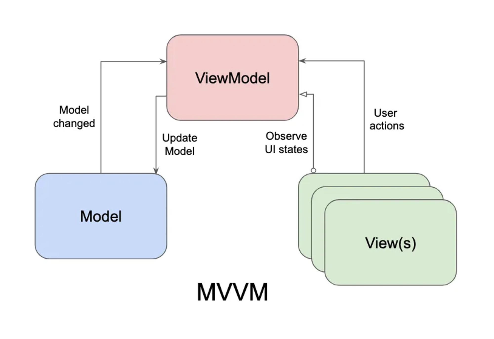
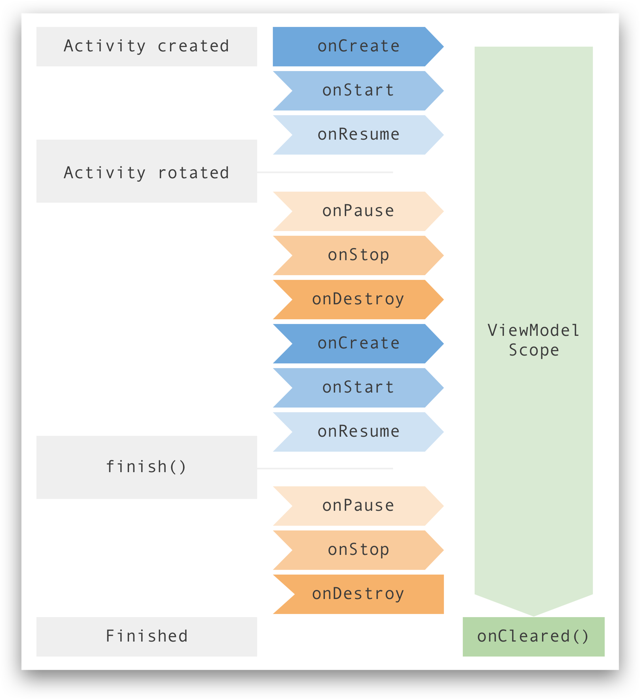

- [MVVM Architecture](#mvvm-architecture)
  - [MVVM](#mvvm)

# MVVM Architecture

## MVVM
- Kiến trúc ***MVVM (Model-View-ViewModel)*** là một mô hình kiến trúc phổ biến trong phát triển ứng dụng Android. Nó giúp tách biệt mạnh mẽ giữa các thành phần logic, dữ liệu và giao diện người dùng, từ đó tạo ra mã dễ quản lý, kiểm thử và bảo trì hơn. 



- Các thành phần trong kiến trúc **MVVM**:
    - **Model**: Đại diện cho dữ liệu và logic liên quan đến dữ liệu. **Model** thường đảm nhận trách nhiệm lấy dữ liệu từ nguồn dữ liệu như **database**, **API** hoặc bất kỳ nguồn dữ liệu nào khác, sau đó cung cấp dữ liệu cho **ViewModel** để hiển thị lên giao diện người dùng.
    - **View**: Đại diện cho giao diện người dùng. Nó không nên chứa **business logic** hay truy vấn dữ liệu trực tiếp. Thay vào đó, nó tập trung vào việc hiển thị dữ liệu và tương tác với người dùng. **View** có thể là các thành phần như **Activity**, **Fragment** hoặc **custom View**.
    - **ViewModel**: **ViewModel** là lớp trung gian giữa **Model** và **View**. Nhiệm vụ chính của **ViewModel** là cung cấp dữ liệu và hành vi cho giao diện người dùng. **ViewModel** không biết gì về **View** cụ thể mà nó đang phục vụ, điều này giúp tái sử dụng **business logic** và dữ liệu giữa các giao diện khác nhau. **ViewModel** thường xử lý các yêu cầu từ **View** và cập nhật dữ liệu trong **Model** khi cần.
- Lợi ích của kiến trúc **MVVM**:
    - **Tách biệt logic và giao diện**: **MVVM** giúp tách biệt rõ ràng giữa **business logic** và giao diện người dùng, tạo điều kiện cho việc phát triển độc lập và kiểm thử hiệu quả hơn.
    - **Dễ Unit Test**: Kiểm thử dễ dàng hơn bằng cách kiểm tra **ViewModel** mà không cần tạo giao diện người dùng.
    - **Tái sử dụng mã**: **ViewModel** có thể được tái sử dụng giữa các giao diện khác nhau, giúp giảm sự trùng lặp và tăng tính hiệu quả.
    - **Quản lý trạng thái**: **MVVM** giúp quản lý trạng thái ứng dụng một cách hiệu quả hơn bằng cách giữ logic liên quan đến trạng thái trong **ViewModel**.
- Để triển khai kiến trúc **MVVM** trong ứng dụng Android cần sử dụng **ViewModel** và **LiveData** (hoặc **DataBinding**).

## ViewModel

### [ViewModel là gì](https://developer.android.com/topic/libraries/architecture/viewmodel?hl=vi)
- ***ViewModel*** là một phần trong ***Android Architechture Component***. ***ViewModel*** thực chất chỉ là một lớp được cung cấp bởi hệ thống, nó được tạo ra nhằm mục đích giúp bạn quản lý các dữ liệu của UI, ***đảm bảo các dữ liệu này luôn được bảo toàn trong quá trình sống của UI đó.***

### Lợi ích khi sử dụng ViewModel

- Như bạn cũng biết, một trong những bug kinh điển nhất của Android, đó là việc Activity sẽ bị hủy và khởi tạo lại (callback [*onDestroy()*](https://yellowcodebooks.com/2017/10/19/android-bai-28-vong-doi-cua-mot-activity/#onDestroy) được gọi trước và [*onCreate()*](https://yellowcodebooks.com/2017/10/19/android-bai-28-vong-doi-cua-mot-activity/#onCreate) lại được gọi lại sau đó) khi người dùng xoay màn hình. Hiện tượng khởi tạo này của UI được gọi là ***Configuration Change***. Điều này làm cho các dữ liệu hiển thị lên UI của ứng dụng bị reset lại, và hiển nhiên người dùng sẽ thấy mọi thông tin của họ đã cất công nhập vào bỗng biến mất, ngay sau khi màn hình thiết bị xoay ngang/dọc.
- Có một số cách khắc phục :
    - Sử dụng callback [*onSaveInstanceState()*](https://developer.android.com/reference/android/app/Activity.html#onSaveInstanceState(android.os.Bundle)) để lưu trữ dữ liệu rồi sau đó khôi phục lại nó ở lần gọi ***onCreate()*** kế tiếp.
    - Khai báo thuộc tính ***android:configChanges*** trong thẻ ***Activity*** của M*anifest*, để tránh việc hệ thống hủy và khởi tạo lại Activity đó, khi đó bạn có thể bảo toàn được dữ liệu, hoặc có thể thiết lập lại dữ liệu này trong phương thức [*onConfigurationChanged()*](https://developer.android.com/guide/topics/resources/runtime-changes).

> Tuy nhiên cả hai kỹ thuật này cũng chỉ hỗ trợ bạn lưu trữ các dữ liệu nhỏ, nếu dữ liệu cần lưu trữ và khôi phục lại quá lớn, nó có thể làm chậm ứng dụng. Mặt khác, kỹ thuật thứ hai trên đây còn có một nguy hiểm tiền ẩn nữa, đó là việc ngăn không cho Activity khởi tạo lại sẽ làm mất đi khả năng hỗ trợ Alternative Resource của hệ thống.

### Khi nào nên sử dụng ViewModel

- Ngoài việc lưu trữ và đảm bảo tính toàn vẹn của dữ liệu khi xoay màn hình . Thì ***ViewModel*** còn dùng để bảo toàn dữ liệu cho một số trường hợp nào đó mà UI (Activity hay Fragment) bị reset lại giống như là người dùng vừa xoay màn hình vậy. Ngoài ra thì ***ViewModel*** còn dùng như mà một dữ liệu dùng chung giữa các Fragment, hay dùng với cơ sở dữ liệu khi có sự kết hợp của ***LiveData***
- Quan sát vòng đời của ViewModel trong UI mà nó được chỉ định để bảo vệ dữ liệu như sau:



- Theo như sơ đồ trên, có thể nhìn thấy *“đời sống”* của một ***ViewModel*** (thanh màu xanh lá cây bên phải) sẽ bắt đầu khi ***Activity created***, trải qua các trạng thái ***onCreate***, ***onStart***, ***onResume*** (các trạng thái này cũng chính là các [*callback*](https://yellowcodebooks.com/2017/10/19/android-bai-28-vong-doi-cua-mot-activity/#Lam_Quen_Voi_Cac_Callback) tương ứng của Activity). Sau đó dù cho ***Activity rotated*** (xoay màn hình), với các trạng thái ***onPause***, ***onStop***, ***onDestroy***, ***onCreate***, ***onStart***, ***onResume***, mà ***ViewModel*** vẫn còn sống. Cho đến khi ***finish()***, thì ở các trạng thái ***onPause***, ***onStop***, ***onDestroy*** sau lần gọi đó vẫn chứng kiến ***ViewModel*** còn hoạt động, cho đến khi kết thúc sự kiện ***onDestroy*** thì ***ViewModel*** mới kết thúc sứ mệnh bảo vệ dữ liệu cho Activity này mà thôi.

### Cách sử dụng
### Cách 1
- Tạo lớp kế thừa AndroidViewModel(application)

```Kotlin
class NoteViewModel (application: Application) : AndroidViewModel(application) {
    val readAllData : LiveData<List<Note>>
    private val repository: NoteRepository

    init {
        val noteDAO = NoteDatabase.getDatabase(application).noteDao()
        repository = NoteRepository(noteDAO)
        readAllData = repository.allNote
    }
    fun addNote(note: Note) {
        viewModelScope.launch(Dispatchers.IO) {
            repository.addNote(note)
        }
    }
    fun updateNote(note: Note) {
        viewModelScope.launch(Dispatchers.IO) {
            repository.updateNote(note)
        }
    }
    fun deleteNote(note: Note) {
        viewModelScope.launch(Dispatchers.IO) {
            repository.deleteNote(note)
        }
    }
    suspend fun findNoteById(id: Int) : Note {
        return repository.findNoteById(id)
    }
}
```

- Trong activity hay Fragment tương ứng:

```Kotlin
private lateinit var noteViewModel: NoteViewModel
....
noteViewModel = ViewModelProvider(this).get(NoteViewModel::class.java)

```

### Cách 2

```Kotlin
class NoteViewModel(private val repository: NoteRepository) : ViewModel() {

    val allNotes: LiveData<List<Note>> = repository.allNote

    fun insert(note: Note) = viewModelScope.launch {
        repository.addNote(note)
    }

    fun update(note: Note) = viewModelScope.launch {
        repository.updateNote(note)
    }

    fun delete(note: Note) = viewModelScope.launch {
        repository.deleteNote(note)
    }
}

class NoteViewModelFactory(private val repository: NoteRepository) : ViewModelProvider.Factory {
    override fun <T : ViewModel> create(modelClass: Class<T>): T {
        if (modelClass.isAssignableFrom(NoteViewModel::class.java)) {
            @Suppress("UNCHECKED_CAST")
            return NoteViewModel(repository) as T
        }
        throw IllegalArgumentException("Unknown ViewModel class")
    }
}
```
Trong activity hoặc Fragment tương ứng
```Kotlin
private val noteViewModel: NoteViewModel by viewModels{
        NoteViewModelFactory((requireActivity().application as Application).repository)
    }
```

## LiveData
### LiveData là gì
- ***LiveData*** là một lớp, nó dùng để truyền tải các thông điệp về dữ liệu, dựa trên mô hình của ***Observer***

> ***Mô hình Observer*** là mô hình được xây dựng với ý tưởng sẽ có một đối tượng trung tâm (còn được gọi là Subject), đối tượng trung tâm này nắm danh sách các đối tượng quan sát khác (đối tượng quan sát chính là các Observer). Để rồi khi có bất kỳ thay đổi nào với trạng thái của đối tượng trung tâm đó, nó sẽ thông báo ngay cho các đối tượng quan sát được biết.
> 
- Với việc ***LiveData*** cũng dựa trên mô hình của ***Observer***, nó cũng sẽ có các Subject, và các Subject này cũng sẽ có trách nhiệm thông báo các sự thay đổi trạng thái đến các đối tượng quan sát khác. Cụ thể hơn, các Subject khi này là các ***ViewModel***, còn các đối tượng giám sát khi này là các thành phần của ứng dụng (Activity, Fragment hay Service)

> ***LiveData*** hơn hẳn ***Observer*** truyền thống ở chỗ nó hiểu rõ vòng đời của các *Thành phần của ứng dụng*, những tín hiệu mà Subject của ***LiveData*** truyền đến chỉ khi nào vòng đời của các *Thành phần* quan sát đó đang ở trong trạng thái hoạt động mà thôi.

- **LiveData:** Chỉ có thể quan sát dữ liệu mà không thay đổi nó được.
- **MutableLiveData:**
    - Có thể thay đổi được và là ****1 **subclass** của **LiveData.**
    - Sử dụng các phương thức `postValue()` và `setValue()`.
- **MediatorLivedata**: Quan sát các source và phản ứng với sự kiện `onChange()` . Cho chúng ta quyền kiểm soát khi nào chúng ta muốn thực hiện một hành động cụ thể

### Khi nào cần sử dụng LiveData

- Khi xây dựng các ứng dụng Android, chúng ta sẽ phải đụng chạm rất nhiều đến các tình huống mà ***Observer*** mang đến, tức là UI của ứng dụng sẽ cần được thông báo việc thay đổi của dữ liệu mà nó đang hiển thị, để mà có sự chỉnh sửa và cập nhật đúng đắn nhất.
- Điều này gắn liền với khái niệm *“thời gian thực”*. Có nghĩa là người dùng sẽ mong muốn nhìn thấy ngay tức khắc sự thay đổi trên giao diện của ứng dụng, ngay khi ở đâu đó, dữ liệu liên quan đến giao diện này cũng bị thay đổi.

### Cách sử dụng

- Để các dữ liệu có thể cập nhật thời gian thực đến các Observer, chúng ta sẽ biến chúng thành các Subject

```kotlin
class CounterViewModel : ViewModel() {

    var counter : MutableLiveData<Int> = MutableLiveData()
    init {
        counter.value = 0
    }
}
```

> ***MutableLiveData***. ***MutableLiveData*** cũng là ***LiveData,*** nhưng nó được bổ sung việc cho phép cập nhật sửa chữa giá trị cho các ***LiveData***. Khi này ***MutableLiveData*** chính là các lớp bảo trợ cho việc thay đổi giá trị kiểu ***Int***, giúp các thuộc tính khi này trở thành các Subject trong ***mô hình Observer***.
> 
- Tiếp đến, để sử dụng các giá trị counter trong ViewModel ta sẽ không sử dụng trực tiệp đến các giá trị của chúng mà phải thông qua phương thức value

```kotlin
binding.txtNumber.text = viewModel.counter.value.toString()
```

- Chúng ta cần phải đăng ký cho một Activity hay một Fragment nào đấy sử dụng counter kia là một Observer

```kotlin
class SummaryFragment : Fragment() {
    private lateinit var binding : FragmentSummaryBinding
    private lateinit var viewModel : CounterViewModel
    override fun onCreateView(
        inflater: LayoutInflater, container: ViewGroup?,
        savedInstanceState: Bundle?
    ): View{
        binding = FragmentSummaryBinding.inflate(inflater, container, false)
        viewModel = ViewModelProviders.of(requireActivity())[CounterViewModel::class.java]
        viewModel.counter.observe(viewLifecycleOwner) {
            binding.txtSummary.text = it.toString()
        }
        return binding.root
    }
}
```

Hoặc dùng `private  val viewModel : CounterViewModel by activityViewModels()`

## Unidirectional Data Flow
- ***Unidirectional Data Flow (UDF)*** trong Android là một kiến trúc phổ biến để quản lý trạng thái và dữ liệu trong ứng dụng. 
- ***UDF*** giúp đảm bảo rằng dữ liệu chỉ chảy theo một hướng, giúp giảm thiểu sự phức tạp và lỗi phát sinh do các trạng thái không đồng bộ hoặc khó quản lý.
- Trong ***UDF***, dữ liệu thường di chuyển qua các bước sau: ***State, Action, Reducer, và Effect.***

### State
- ***State*** đại diện cho trạng thái của UI hoặc một phần UI. ***State*** được quản lý trong ViewModel và có thể là một data class chứa các thuộc tính thể hiện trạng thái hiện tại.

```Kotlin
data class NotetState(
    val notes: List<Note> = emptyList(),
    val isLoading: Boolean = false,
    val errorMessage: String? = null
)
