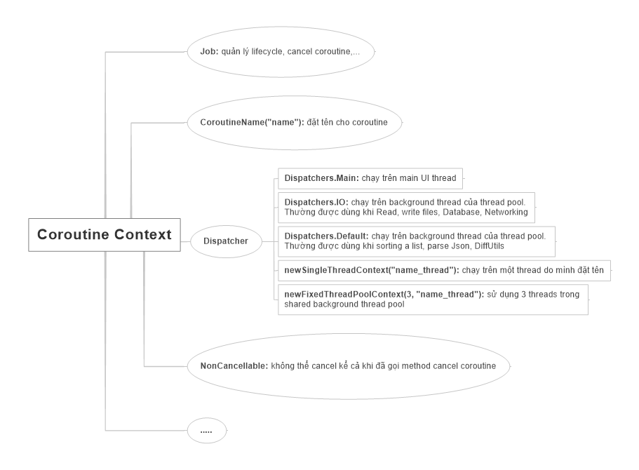

- [Lập trình bất đồng bộ](#lập-trình-bất-đồng-bộ)
  - [Lập trình bất đồng bộ là gì?](#lập-trình-bất-đồng-bộ-là-gì)
    - [Cách hoạt động](#cách-hoạt-động)
    - [Lợi ích của lập trình bất đồng bộ](#lợi-ích-của-lập-trình-bất-đồng-bộ)
    - [Nhược điểm](#nhược-điểm)
  - [Thread? Kotlin coroutine? So sánh sự khác biệt của chúng?](#thread-kotlin-coroutine-so-sánh-sự-khác-biệt-của-chúng)
    - [Thread](#thread)
      - [Cách sử dụng Thread trong Kotlin](#cách-sử-dụng-thread-trong-kotlin)
      - [Một số phương thức quan trọng trong Thread](#một-số-phương-thức-quan-trọng-trong-thread)
      - [Khi nào nên dùng Thread](#khi-nào-nên-dùng-thread)
  - [Coroutines](#coroutines)
    - [Cách sử dụng coroutines](#cách-sử-dụng-coroutines)
    - [Hàm suspend](#hàm-suspend)
    - [Sử dụng async để nhận kết quá](#sử-dụng-async-để-nhận-kết-quá)
    - [Chuyển đổi ngữ cảnh với withContext](#chuyển-đổi-ngữ-cảnh-với-withcontext)
  - [Blocking - non-blocking, normal function - suspend function](#blocking---non-blocking-normal-function---suspend-function)
    - [Blocking - non-blocking](#blocking---non-blocking)
    - [Normal Function và Suspend Function](#normal-function-và-suspend-function)
  - [Coroutine scope, Job, Dispatcher](#coroutine-scope-job-dispatcher)
    - [Coroutine scope](#coroutine-scope)
      - [Coroutine Context](#coroutine-context)
      - [Toán thử plus (+) để thêm các element vào coroutineContext](#toán-thử-plus--để-thêm-các-element-vào-coroutinecontext)
      - [Default Context](#default-context)
        - [Default Dispatcher](#default-dispatcher)
        - [Default Job](#default-job)
        - [Default CoroutineScope](#default-coroutinescope)
      - [withContext()](#withcontext)
    - [Các loại Dispatcher trong Coroutine](#các-loại-dispatcher-trong-coroutine)
      - [Dispatchers and threads](#dispatchers-and-threads)
      - [Unconfined dispatcher](#unconfined-dispatcher)
        - [Đặc điểm](#đặc-điểm)
    - [Job](#job)
      - [Đặc điểm](#đặc-điểm-1)
      - [Cách sử dụng Job](#cách-sử-dụng-job)
        - [Phương thức khác](#phương-thức-khác)
  - [lauch, async, await](#lauch-async-await)
    - [lauch](#lauch)
    - [async](#async)
      - [Lazy async](#lazy-async)
    - [await](#await)


[Tham khảo về async, await, awaitAll](https://makb.medium.com/mastering-asynchronous-programming-with-kotlin-coroutines-a-guide-to-async-await-and-awaitall-a52d5c65e994)
# Lập trình bất đồng bộ
## Lập trình bất đồng bộ là gì?
- Lập trình bất đồng bộ **(asynchronous programming)** là một kỹ thuật lập trình cho phép một chương trình thực hiện các công việc khác trong khi chờ đợi một tác vụ dài hạn (như yêu cầu mạng, đọc/ghi tệp, xử lý dữ liệu lớn, v.v.) hoàn thành.
- Điều này giúp chương trình tránh việc bị **"đóng băng"** hoặc chờ đợi một cách đồng bộ khi thực hiện những tác vụ có thể mất nhiều thời gian.

### Cách hoạt động
- Khi một tác vụ bất đồng bộ được gọi, nó thường trả về một promise (trong JavaScript) hoặc một future (trong các ngôn ngữ khác như Python, Java). 
- Chương trình có thể tiếp tục chạy mà không cần chờ tác vụ đó kết thúc, và khi tác vụ hoàn thành, một hàm callback hoặc một cơ chế xử lý được kích hoạt để xử lý kết quả hoặc lỗi.
  - **JavaScript:** Sử dụng *`async/await`* hoặc các phương thức như *`Promise.then()`* để quản lý lập trình bất đồng bộ.
  - **Python:** Sử dụng từ khóa *`async và await`* cùng với các thư viện như *`asyncio.`*
  - Java/Kotlin: Có thể sử dụng *`CompletableFuture`* hoặc *`Coroutines`* trong Kotlin để quản lý các tác vụ bất đồng bộ.
### Lợi ích của lập trình bất đồng bộ
- **Hiệu suất cao hơn:** Tăng khả năng phản hồi và hiệu quả của ứng dụng, đặc biệt là khi xử lý I/O hoặc mạng.
- **Tối ưu hóa tài nguyên:** Giảm thiểu việc lãng phí tài nguyên trong khi chờ đợi các tác vụ hoàn thành.
### Nhược điểm
- **Khó quản lý:** Việc viết và duy trì mã bất đồng bộ có thể khó hơn so với mã đồng bộ vì cần phải xử lý các callback, promise, hoặc các trạng thái khác nhau.
- **Debugging phức tạp:** Các lỗi và tình huống cần debug có thể khó xác định hơn do luồng chương trình không tuyến tính.

## Thread? Kotlin coroutine? So sánh sự khác biệt của chúng?
### Thread
- **Thread** là một đơn vị xử lý cơ bản trong một tiến trình (process) giúp thực hiện các tác vụ song song. 
- Mỗi ứng dụng chạy trên máy tính thường là một tiến trình và có thể có nhiều thread thực thi các tác vụ khác nhau đồng thời. 
- `Trong Kotlin (và Java), thread` thường được sử dụng để thực hiện các `tác vụ song song` hoặc `không đồng bộ` để tăng hiệu suất và cải thiện trải nghiệm người dùng
#### Cách sử dụng Thread trong Kotlin
- `Kotlin` hỗ trợ việc sử dụng `Thread` thông qua các lớp và cú pháp từ Java. - Mặc dù `coroutines` được khuyến khích hơn vì hiệu quả và dễ quản lý, vẫn có thể tạo và sử dụng `thread` một cách thủ công nếu cần thiết.

```Kotlin
fun main() {
    // Tạo một thread mới
    val thread = Thread {
        for (i in 1..5) {
            println("Thread đang chạy: $i")
            Thread.sleep(500) // Tạm dừng thread trong 500ms
        }
    }

    thread.start() // Bắt đầu thread

    // Luồng chính tiếp tục chạy song song
    println("Luồng chính đang chạy")
}
```
> **Thread { ... }:** Tạo một đối tượng Thread với một Runnable được truyền dưới dạng lambda.
> **thread.start():** Bắt đầu thực thi thread.
> **Thread.sleep(500):** Tạm dừng thread hiện tại trong 500ms.
> Khi thread mới chạy, nó hoạt động song song với luồng chính (main), in ra các thông báo độc lập.
#### Một số phương thức quan trọng trong Thread
- `start():` Bắt đầu thực thi thread.
- `join():` Chờ thread hoàn thành trước khi tiếp tục luồng hiện tại.
- `sleep(time: Long):` Tạm dừng thread hiện tại trong khoảng thời gian time tính bằng milliseconds.
- `isAlive:` Kiểm tra xem thread có đang chạy hay không.

```Kotlin
fun main() {
    val thread = Thread {
        println("Thread bắt đầu")
        Thread.sleep(2000)
        println("Thread hoàn tất")
    }

    thread.start()
    thread.join() // Chờ thread hoàn thành trước khi tiếp tục

    println("Luồng chính tiếp tục sau khi thread hoàn tất")
}
```
> **thread.join()** làm luồng chính chờ cho đến khi thread hoàn thành trước khi tiếp tục. Điều này hữu ích khi bạn cần đồng bộ hóa hoặc bảo đảm rằng một thread nhất định hoàn thành trước khi thực hiện bước tiếp theo.

#### Khi nào nên dùng Thread
- Khi cần xử lý song song các tác vụ như tải file lớn, xử lý dữ liệu, hoặc các tác vụ tốn thời gian khác.
- Tuy nhiên, việc sử dụng `thread` trực tiếp có thể khó quản lý trong các ứng dụng phức tạp, đặc biệt là khi số lượng `thread` lớn, vì vậy nên sử dụng `coroutines` trong Kotlin để có code dễ đọc, nhẹ hơn, và quản lý hiệu quả hơn.

## Coroutines
- `Coroutines` trong Kotlin là một giải pháp mạnh mẽ để thực hiện lập trình bất đồng bộ và song song. 
- `Coroutines` giúp quản lý các tác vụ dài mà không cần dùng đến thread riêng biệt cho mỗi tác vụ, giúp tối ưu hóa hiệu suất và giảm thiểu việc chặn luồng chính.
### Cách sử dụng coroutines
- `Kotlin` cung cấp các builder để khởi tạo coroutines như `launch`, `async`, và `runBlocking`. Một hàm `suspend` cho phép tạm dừng thực thi của coroutine mà không chặn luồng hiện tại.
- Ví dụ sử dụng `launch` và `suspend` function trong Kotlin:

```Kotlin
import kotlinx.coroutines.*

fun main() = runBlocking { // Tạo một phạm vi coroutine, chặn luồng chính cho đến khi hoàn thành
    println("Start - ${Thread.currentThread().name}")
    
    // Khởi chạy một coroutine không chặn luồng chính
    launch {
        delay(1000L) // Tạm dừng coroutine trong 1 giây mà không chặn luồng
        println("Coroutine chạy sau 1 giây - ${Thread.currentThread().name}")
    }
    
    println("Luồng chính tiếp tục chạy")
    delay(2000L) // Đảm bảo chương trình chạy đủ lâu để coroutine hoàn thành
    println("End - ${Thread.currentThread().name}")
}
```
> **runBlocking:** Tạo một phạm vi coroutine, chặn luồng chính cho đến khi tất cả các coroutine trong phạm vi hoàn thành.
>**launch:** Khởi chạy một coroutine mới mà không chặn luồng chính. Đây là cách để thực hiện các tác vụ chạy nền.
>**delay:** Tạm dừng coroutine trong khoảng thời gian chỉ định (không chặn luồng).
### Hàm suspend
- Hàm `suspend` là một hàm có thể bị tạm dừng và tiếp tục. 
- Nó chỉ có thể được gọi từ một `coroutine` hoặc một hàm `suspend` khác.
```Kotlin
suspend fun fetchData(): String {
    delay(1000L) // Giả lập việc lấy dữ liệu tốn thời gian
    return "Dữ liệu đã được lấy"
}

fun main() = runBlocking {
    val result = fetchData() // Gọi hàm `suspend` trong phạm vi coroutine
    println(result)
}
```
>**fetchData()** là một hàm suspend có thể tạm dừng, giúp thực hiện tác vụ bất đồng bộ mà không chặn luồng hiện tại.

### Sử dụng async để nhận kết quá
- **async** là coroutine builder trả về một đối tượng **Deferred**, cho phép nhận kết quả khi gọi **await()**.
- **Deferred** là một interface đại diện cho một giá trị kết quả của một tác vụ bất đồng bộ, cho phép lấy kết quả này sau khi tác vụ hoàn thành
- Ví dụ với `async` và `await`:
```Kotlin
import kotlinx.coroutines.*

fun main() = runBlocking {
    val deferred = async {
        fetchData() // Hàm `suspend`
    }
    
    println("Đang chờ kết quả...")
    val result = deferred.await() // Chờ kết quả từ coroutine
    println("Kết quả: $result")
}
```
>**async:** Khởi chạy một coroutine và trả về một Deferred, có thể lấy kết quả qua await().
>**await:** Tạm dừng coroutine hiện tại cho đến khi Deferred hoàn thành và trả về kết quả.

### Chuyển đổi ngữ cảnh với withContext
- **withContext** cho phép chuyển đổi ngữ cảnh của coroutine sang một **CoroutineDispatcher** khác như `Dispatchers.IO`.
```Kotlin
suspend fun readFile(): String = withContext(Dispatchers.IO) {
    // Mô phỏng việc đọc dữ liệu từ file
    delay(1000L)
    "Dữ liệu từ file đã được đọc"
}

fun main() = runBlocking {
    val data = readFile()
    println(data)
}
```

>**Dispatchers.IO:** Dùng để thực hiện các tác vụ I/O, tối ưu hóa việc sử dụng luồng cho các công việc như đọc/ghi file, gọi API, v.v.
>**withContext:** Chuyển coroutine sang một dispatcher cụ thể.
## Blocking - non-blocking, normal function - suspend function
### Blocking - non-blocking
**Blocking**
- Khi một tác vụ **blocking** chạy, nó chặn luồng hiện tại cho đến khi tác vụ hoàn tất.
- Tất cả các công việc khác trên luồng này đều phải đợi cho đến khi tác vụ này hoàn thành.
- Ví dụ điển hình của **blocking** là khi thực hiện một tác vụ I/O (như đọc tệp hoặc gọi mạng) và khiến luồng chính phải đợi đến khi dữ liệu sẵn sàng, điều này có thể gây ra lag hoặc treo ứng dụng.
```Kotlin
fun blockingFunction() {
    Thread.sleep(1000) // Chặn luồng trong 1 giây
    println("Tác vụ đã hoàn tất")
}

fun main() {
    println("Bắt đầu")
    blockingFunction() // Chặn luồng chính
    println("Kết thúc")
}
```
**Non-Blocking**
- Khi một tác vụ **non-blocking** chạy, nó không chặn luồng hiện tại. Luồng có thể tiếp tục thực thi các tác vụ khác mà không phải đợi tác vụ này hoàn thành.
- **Non-blocking** rất hữu ích trong lập trình bất đồng bộ vì nó tối ưu hóa tài nguyên và cải thiện hiệu suất.
```Kotlin
import kotlinx.coroutines.*

suspend fun nonBlockingFunction() {
    delay(1000) // Tạm dừng mà không chặn luồng
    println("Tác vụ đã hoàn tất")
}

fun main() = runBlocking {
    println("Bắt đầu")
    launch { nonBlockingFunction() } // Không chặn luồng chính
    println("Kết thúc")
}
```
### Normal Function và Suspend Function
**Normal Function (Hàm thông thường)**
- Một **normal function** là một hàm chạy và hoàn thành trong luồng hiện tại.
- Hàm này không thể tạm dừng hoặc chuyển đổi luồng giữa chừng.
- Normal functions chỉ có thể chạy theo kiểu đồng bộ (blocking).

**Suspend Function (Hàm có thể tạm dừng)**
- Một **suspend function** là một hàm được đánh dấu với từ khóa `suspend`.
- Nó có thể tạm dừng giữa chừng mà không chặn luồng hiện tại và có thể chỉ được gọi từ một coroutine hoặc một hàm suspend khác.
- `Suspend function` thường được sử dụng cho các tác vụ bất đồng bộ, chẳng hạn như gọi API hoặc truy cập cơ sở dữ liệu.
```Kotlin
suspend fun suspendFunction() {
    delay(1000) // Tạm dừng mà không chặn luồng
    println("Đây là một hàm suspend")
}

fun main() = runBlocking {
    println("Bắt đầu")
    suspendFunction() // Gọi suspend function từ coroutine
    println("Kết thúc")
}
```
**Khi nào nên sử dụng cái nào?**
- **Normal Function:** Dùng khi không cần xử lý bất đồng bộ hoặc khi tác vụ thực hiện nhanh.
- **Suspend Function:** Dùng khi xử lý các tác vụ lâu hơn (như gọi mạng hoặc xử lý dữ liệu), giúp tránh chặn luồng và tận dụng tối đa khả năng bất đồng bộ.

## Coroutine scope, Job, Dispatcher
### Coroutine scope
- **Coroutine Scope** là phạm vi nơi các coroutines tồn tại, giúp quản lý vòng đời của chúng.
- Khi một **Coroutine Scope** bị hủy (cancelled), tất cả các `coroutine`s bên trong nó cũng sẽ bị hủy.
- Các **coroutine builders** như `launch` và `async` cần một `Coroutine Scope` để khởi chạy coroutines.
#### Coroutine Context 
- Mỗi **coroutine** trong Kotlin đều có một context được thể hiện bằng một instance của interface **CoroutineContext**.
- **Context** này là một tập các element cấu hình cho **coroutine**.
- Các loại element trong **coroutine context** gồm:
  - **Job:** nắm giữ thông tin về lifecycle của coroutine
  - **Dispatcher:** Quyết định thread nào mà coroutine sẽ chạy trên đó. Có các loại dispatcher sau:
    - **Dispatchers.Main:** chạy trên main UI thread
    - **Dispatchers.IO:** chạy trên background thread của thread pool. Thường được dùng khi Read, write files, Database, Networking
    - **Dispatchers.Default:** chạy trên background thread của thread pool. Thường được dùng khi sorting a list, parse Json, DiffUtils
    - **newSingleThreadContext("name_thread"):** chạy trên một thread do mình đặt tên
    - **newFixedThreadPoolContext(3, "name_thread"):** sử dụng 3 threads trong shared background thread pool

- **Job** và **Dispatcher** là 2 element chính trong CoroutineContext. Ngoài ra còn một số element khác như:
  - **CoroutineName("name"):** đặt tên cho coroutine
  - **NonCancellable:** không thể cancel kể cả khi đã gọi method cancel coroutine


#### Toán thử plus (+) để thêm các element vào coroutineContext
- Khi tạo một `coroutine`, bạn có thể kết hợp nhiều `CoroutineContext` bằng cách sử dụng toán tử `+`.
- Ví dụ: Có thể kết hợp `Dispatcher` với một `Job` để quản lý luồng và kiểm soát vòng đời coroutine.
- Các element thường dùng với toán tử `+`
  - **Dispatcher:** Chỉ định luồng mà coroutine sẽ chạy trên đó (ví dụ Dispatchers.IO).
  - **Job:** Quản lý vòng đời của coroutine.
  - **CoroutineName:** Tên định danh của coroutine, giúp dễ dàng theo dõi trong quá trình debug.
- Ví dụ về cách sử dụng toán tử `+` để kết hợp ``Dispatcher, Job, và CoroutineName` trong `CoroutineContext`:
```Kotlin
import kotlinx.coroutines.*

fun main() = runBlocking {
    // Tạo một Job riêng cho coroutine
    val job = Job()
    
    // Tạo một CoroutineContext với Dispatcher, Job, và CoroutineName
    val customContext = Dispatchers.IO + job + CoroutineName("CustomCoroutine")

    // Khởi chạy coroutine với customContext
    launch(customContext) {
        println("Chạy trên luồng: ${Thread.currentThread().name}")
        delay(1000)
        println("Hoàn thành công việc")
    }

    // Hủy job sau 500ms
    delay(500)
    job.cancel()  // Hủy coroutine

    //Chạy trên luồng: DefaultDispatcher-worker-1
    //Thông báo "Hoàn thành công việc" sẽ không được in, vì coroutine bị hủy giữa chừng.
}
```
#### Default Context
- Trong `Kotlin Coroutines`, `Default Context`không phải là một khái niệm cụ thể, nhưng có một số hành vi mặc định xảy ra khi một `CoroutineContext` không được chỉ định rõ ràng. 
- Đây là cách các coroutine hoạt động nếu không cung cấp `Dispatcher`, `Job`, hoặc các `CoroutineContext` khác.
##### Default Dispatcher
- Khi tạo một `coroutine` mà không chỉ định `Dispatcher (như Dispatchers.Default, Dispatchers.IO, v.v.)`, `coroutine` sẽ sử dụng `Dispatchers.Default` làm `Dispatcher` mặc định.
- `Dispatchers.Default` là một nhóm các luồng tối ưu, thường sử dụng cho các tác vụ tính toán (CPU-bound). Nó tạo các luồng dựa trên số lõi CPU của thiết bị để tối ưu hóa hiệu suất.
```Kotlin
import kotlinx.coroutines.*

fun main() = runBlocking {
    launch { // Không chỉ định Dispatcher, sẽ dùng Dispatchers.Default
        println("Đang chạy trên: ${Thread.currentThread().name}")
    }
}

//launch không chỉ định Dispatcher, nên coroutine sẽ chạy trên Dispatchers.Default.
//Kết quả sẽ là "Đang chạy trên: DefaultDispatcher-worker-1" hoặc tên luồng tương tự.
```
##### Default Job
- Khi bạn tạo một `coroutine` mà không chỉ định Job, một Job mới sẽ được tạo mặc định và gắn vào coroutine.
- `Job` này sẽ tự động được hủy khi phạm vi `(CoroutineScope)` của nó bị hủy hoặc kết thúc.
- Nếu `coroutine` được khởi chạy trong một `CoroutineScope` có sẵn (như `runBlocking hoặc GlobalScope`), Job của `coroutine` đó sẽ được liên kết với phạm vi đó.
##### Default CoroutineScope
- Nếu không cung cấp một phạm vi `(CoroutineScope)`, một phạm vi sẽ được tạo mặc định trong những ngữ cảnh như `runBlocking `hoặc `GlobalScope.`
- Ví dụ, `GlobalScope.launch` sẽ sử dụng phạm vi `GlobalScope` và chạy `coroutine `trong phạm vi của ứng dụng.
- Trong trường hợp của `runBlocking`, `coroutine` chạy trên luồng hiện tại và đợi đến khi hoàn thành trước khi tiếp tục thực hiện mã ngoài `runBlocking.`
- Ví dụ về phạm vi mặc định với GlobalScope:
```Kotlin
import kotlinx.coroutines.*

fun main() {
    GlobalScope.launch {
        delay(1000L)
        println("Chạy trong GlobalScope")
    }
    println("Kết thúc hàm main")
    Thread.sleep(2000L) // Đợi coroutine hoàn thành trước khi chương trình kết thúc
}

//GlobalScope.launch sẽ tạo một coroutine trên phạm vi GlobalScope.
//"Kết thúc hàm main" sẽ được in ngay lập tức.
//"Chạy trong GlobalScope" sẽ được in sau 1 giây.
```
#### withContext()
- Nó là một `suspend function` cho phép `coroutine` chạy code trong block với một `context` cụ thể do chúng ta quy định. 
```Kotlin
fun main() {
    newSingleThreadContext("thread1").use { ctx1 ->
        // tạo một context là ctx1 chứ chưa launch coroutine. 
        // ctx1 sẽ có 1 element là dispatcher quyết định coroutine sẽ chạy trên 1 thread tên là thread1
   		println("ctx1 - ${Thread.currentThread().name}")
        
   		newSingleThreadContext("thread2").use { ctx2 ->
             // tạo một context là ctx2 chứ vẫn chưa launch coroutine
             // ctx2 sẽ có 1 element là dispatcher quyết định coroutine sẽ chạy trên 1 thread tên là thread2
       		println("ctx2 - ${Thread.currentThread().name}")
            
            // bắt đầu chạy coroutine với context là ctx1
       		runBlocking(ctx1) {
                    // coroutine đang chạy trên context ctx1 và trên thread thread1
           			println("Started in ctx1 - ${Thread.currentThread().name}")
                    
                    // sử dụng hàm withContext để chuyển đổi context từ ctx1 qua ctx2
           			withContext(ctx2) {
                        // coroutine đang chạy với context ctx2 và trên thread thread2
               			println("Working in ctx2 - ${Thread.currentThread().name}")
           			}
                    
                    // coroutine đã thoát ra block withContext nên sẽ chạy lại với context ctx1 và trên thread thread1
           			println("Back to ctx1 - ${Thread.currentThread().name}")
       		}
   		}
        
  		println("out of ctx2 block - ${Thread.currentThread().name}")
   	}
    
    println("out of ctx1 block - ${Thread.currentThread().name}")
}

ctx1 - main
ctx2 - main
Started in ctx1 - thread1
Working in ctx2 - thread2
Back to ctx1 - thread1
out of ctx2 block - main
out of ctx1 block - main
```
### Các loại Dispatcher trong Coroutine
#### Dispatchers and threads
```Kotlin
fun main() = runBlocking{
    launch {
        delay(1000L)
        println("Working in: ${Thread.currentThread().name}")
    }

    launch(Dispatchers.Default) {
        delay(2000L)
        println("Working in: ${Thread.currentThread().name}")
    }

    launch(newSingleThreadContext("My thread")){
        delay(3000L)
        println("Working in: ${Thread.currentThread().name}")
    }

    launch(Dispatchers.Unconfined){
        delay(4000L)
        println("Working in: ${Thread.currentThread().name}")
    }

    println("On which thread does this coroutine work?")

}

On which thread does this coroutine work?
Working in: main
Working in: DefaultDispatcher-worker-1
Working in: My thread
Working in: kotlinx.coroutines.DefaultExecutor
```
#### Unconfined dispatcher
- `Dispatchers.Unconfined` là một `Dispatcher` trong Kotlin Coroutines có hành vi đặc biệt: `nó không bị ràng buộc với bất kỳ luồng cụ thể nào`. Thay vào đó, `Dispatchers.Unconfined` sẽ bắt đầu coroutine trên luồng hiện tại và chuyển sang luồng khác nếu cần, dựa vào quá trình thực hiện công việc bên trong coroutine.
##### Đặc điểm
- **Không bị giới hạn bởi luồng cụ thể:**
  - Coroutine sử dụng **Dispatchers.Unconfined** sẽ bắt đầu chạy trên luồng hiện tại nơi nó được gọi.
  - Nếu coroutine gặp phải một `suspend function` (hàm tạm dừng) hoặc một điểm `suspension` (tạm dừng), nó có thể tiếp tục thực hiện trên một luồng khác sau khi `suspend` xong. 
- **Khác biệt so với Dispatchers.Main và Dispatchers.Default:**
  - `Dispatchers.Unconfined` không đảm bảo chạy trên luồng chính hoặc bất kỳ luồng cụ thể nào khác. Điều này khác với `Dispatchers.Main` (dùng cho cập nhật UI) và `Dispatchers.Default` (tối ưu cho tác vụ CPU-bound).
  - Vì không bị giới hạn, `Dispatchers.Unconfined `có thể gây ra các hành vi khó đoán trong trường hợp cần sự nhất quán về luồng.
- **Thích hợp cho các tác vụ đơn giản và ngắn hạn:**
  - **Dispatchers.Unconfined** không phù hợp cho các tác vụ cần chạy dài hạn hoặc các tác vụ yêu cầu tuân thủ luồng cụ thể như cập nhật giao diện. 
  - Thay vào đó, nó phù hợp cho các tác vụ nhỏ, độc lập hoặc các bài kiểm thử đơn giản.
```Kotlin
import kotlinx.coroutines.*

fun main() = runBlocking {
    launch(Dispatchers.Unconfined) {
        println("Coroutine chạy trên luồng: ${Thread.currentThread().name}")
        delay(1000)
        println("Coroutine tiếp tục chạy trên luồng: ${Thread.currentThread().name}")
    }

    launch(Dispatchers.Default) {
        println("Coroutine khác trên luồng Default: ${Thread.currentThread().name}")
        delay(1000)
        println("Coroutine trên Default tiếp tục trên: ${Thread.currentThread().name}")
    }
}

Coroutine chạy trên luồng: main
Coroutine khác trên luồng Default: DefaultDispatcher-worker-1
Coroutine tiếp tục chạy trên luồng: kotlinx.coroutines.DefaultExecutor
Coroutine trên Default tiếp tục trên: DefaultDispatcher-worker-1
```
> **Coroutine với Dispatchers.Unconfined:**
> - Ban đầu chạy trên luồng hiện tại (luồng của runBlocking).
> - Sau khi gặp delay(1000), coroutine sẽ chuyển sang một luồng khác (nếu cần), không nhất thiết phải là luồng ban đầu.

> **Coroutine với Dispatchers.Default:**
> - Sẽ luôn chạy trên một luồng từ Dispatchers.Default, không thay đổi luồng khi tiếp tục sau delay(1000).
- **Khi nào nên dùng Dispatchers.Unconfined?**
  - Khi bạn cần kiểm tra hành vi coroutine mà không quan trọng luồng.
  - Đối với các tác vụ đơn giản, độc lập không yêu cầu luồng cụ thể.
  - Trong các bài test đơn giản, khi bạn muốn tránh sử dụng nhiều Dispatcher khác nhau.

>**Lưu ý:** Hạn chế dùng `Dispatchers.Unconfined` trong các tác vụ yêu cầu đảm bảo tính nhất quán về luồng hoặc các tác vụ liên quan đến giao diện người dùng, vì hành vi của nó có thể gây ra lỗi khó lường trong các tình huống phức tạp.

### Job
- Trong `Kotlin Coroutines`, `Job` là một thành phần trong `CoroutineContext` chịu trách nhiệm quản lý vòng đời của một coroutine. 
- Job đóng vai trò giống như một nhiệm vụ (task) có thể hủy được, giúp quản lý và điều khiển coroutine khi nó đang chạy, hoặc khi muốn hủy nó. 
- Mỗi coroutine khi được khởi tạo sẽ có một Job tự động liên kết với nó.
#### Đặc điểm
- **Quản lý trạng thái của coroutine:** Job cho phép kiểm tra trạng thái của coroutine (đang chạy, hoàn thành, hoặc hủy).
- **Hủy coroutine:** Có thể hủy một Job, dẫn đến việc hủy coroutine liên kết với nó.
- **Liên kết với các coroutine con:** Một Job có thể chứa nhiều Job con và khi nó bị hủy, tất cả các Job con của nó cũng sẽ bị hủy.
#### Cách sử dụng Job
**Tạo Job:**
- Có thể tạo một Job khi khởi chạy coroutine thông qua `launch` hoặc `async`. Phương thức này sẽ trả về một Job giúp bạn quản lý vòng đời coroutine đó.
**Hủy Job:**
- Sử dụng **job.cancel()** để hủy Job. Khi hủy, coroutine sẽ dừng thực thi tại điểm hiện tại nếu nó đang chạy trên một luồng bị suspend.
**Kiểm tra trạng thái của Job:**
    - `job.isActive:` Kiểm tra xem coroutine có đang chạy không.
    - `job.isCompleted:` Kiểm tra xem coroutine đã hoàn thành chưa.
    - `job.isCancelled:` Kiểm tra xem coroutine đã bị hủy chưa.
```Kotlin
import kotlinx.coroutines.*

fun main() = runBlocking {
    // Tạo một coroutine và lấy `Job` của nó
    val job: Job = launch {
        repeat(5) { i ->
            println("Coroutine đang chạy lần $i ...")
            delay(500L)
        }
    }

    // Đợi một thời gian để coroutine thực hiện một phần công việc
    delay(1000L)

    // Hủy coroutine bằng cách hủy `Job`
    println("Hủy coroutine...")
    job.cancel()

    // Kiểm tra trạng thái của `Job`
    println("Job is active: ${job.isActive}")
    println("Job is cancelled: ${job.isCancelled}")
    println("Job is completed: ${job.isCompleted}")

//Coroutine đang chạy lần 0 ...
//Coroutine đang chạy lần 1 ...
//Hủy coroutine...
//Job is active: false
//Job is cancelled: true
//Job is completed: false
}
```

##### Phương thức khác
- `join()`: Đợi đến khi coroutine hoàn tất. Giống như `Thread.join()` trong Java.
- `cancelAndJoin()`: Hủy Job và đợi cho đến khi coroutine dừng hoàn toàn.
```Kotlin
fun main() = runBlocking {
    val job = launch {
        repeat(3) { i ->
            println("Coroutine đang chạy lần $i ...")
            delay(500L)
        }
    }

    // Đợi coroutine hoàn thành
    job.join()
    println("Coroutine đã hoàn tất")

    // Hoặc hủy và đợi cho đến khi hoàn tất
    val job2 = launch {
        repeat(3) { i ->
            println("Coroutine khác chạy lần $i ...")
            delay(500L)
        }
    }
    job2.cancelAndJoin()
    println("Coroutine đã bị hủy và dừng")

//Coroutine đang chạy lần 0 ...
//Coroutine đang chạy lần 1 ...
//Coroutine đang chạy lần 2 ...
//Coroutine đã hoàn tất
//Coroutine đã bị hủy và dừng
}
```
## lauch, async, await
### lauch
- `lauch{}` dùng để khởi chạy 1 coroutine nhưng kiểu trả về là `Job` cho phép quản lý vòng đời của `coroutine`
- **Sử dụng:** Thích hợp khi chỉ cần thực hiện một tác vụ bất đồng bộ mà không cần giá trị trả về.
```Kotlin
import kotlinx.coroutines.*

fun main() = runBlocking {
    val job = launch {
        delay(1000L) // tạm dừng trong 1 giây
        println("Coroutine đã hoàn thành!")
    }
    println("Coroutine đang chạy...")
    job.join() // chờ cho coroutine hoàn thành
}
```
### async
- `async` là một hàm dùng để khởi chạy một `coroutine` và trả về một đối tượng `Deferred<T>`, tương tự như Future trong Java. Deferred cho phép bạn nhận kết quả trả về từ coroutine sau khi nó hoàn thành.
- **Sử dụng:** Thích hợp khi bạn cần thực hiện một tác vụ bất đồng bộ và muốn lấy giá trị trả về từ nó.
```Kotlin
fun main() = runBlocking {
    val deferred = async {
        delay(1000L) // tạm dừng trong 1 giây
        "Kết quả trả về sau 1 giây"
    }

    println("Coroutine đang chạy...")
    val result = deferred.await() // chờ và lấy giá trị trả về
    println(result)
}
```
#### Lazy async
- `Lazy async` trong `Kotlin Coroutines` cho phép bạn khởi chạy một coroutine mà chỉ thực hiện khi cần thiết, tức là khi bạn gọi `start()` hoặc `await()` trên đối tượng `Deferred`.
-  Điều này rất hữu ích khi muốn trì hoãn việc thực hiện một tác vụ cho đến khi thật sự cần kết quả của nó.
-  Để khởi tạo một `coroutine async` ở chế độ lazy, bạn có thể sử dụng `async(start = CoroutineStart.LAZY)`. Điều này cho phép tạo một coroutine mà không thực thi nó ngay lập tức.
```Kotlin
fun main() = runBlocking {
    // Khởi tạo một Deferred ở chế độ lazy
    val deferred = async(start = CoroutineStart.LAZY) {
        println("Coroutine đang chạy...")
        delay(1000L) // giả lập một công việc tốn thời gian
        "Kết quả từ coroutine lazy"
    }

    println("Coroutine chưa chạy...")
    delay(2000L) // giả lập một công việc tốn thời gian (chờ coroutine chạy)
    // Gọi await() sẽ làm cho coroutine bắt đầu thực thi
    val result = deferred.await()
    println(result)
}
```
- **Thời gian khởi động:** Bằng cách sử dụng start(), bạn có thể khởi động coroutine ngay lập tức, điều này có thể làm giảm thời gian hoàn thành tổng thể nếu bạn muốn thực thi các tác vụ song song.
- **Sự đồng thời:** Dù có sử dụng start() hay không, nếu gọi await() trên các coroutine lazy, cả hai coroutine vẫn sẽ chạy đồng thời. Tuy nhiên, sự khác biệt là ở thời điểm khởi chạy và tổng thời gian thực thi.
### await
- `await` là một phương thức trên đối tượng `Deferred`. Nó được sử dụng để chờ cho coroutine hoàn thành và trả về kết quả của nó.
- `Sử dụng:` Chỉ có thể sử dụng trong một `coroutine` hoặc hàm `suspend`. Thích hợp khi bạn đã khởi chạy một coroutine bằng async và muốn lấy kết quả trả về.